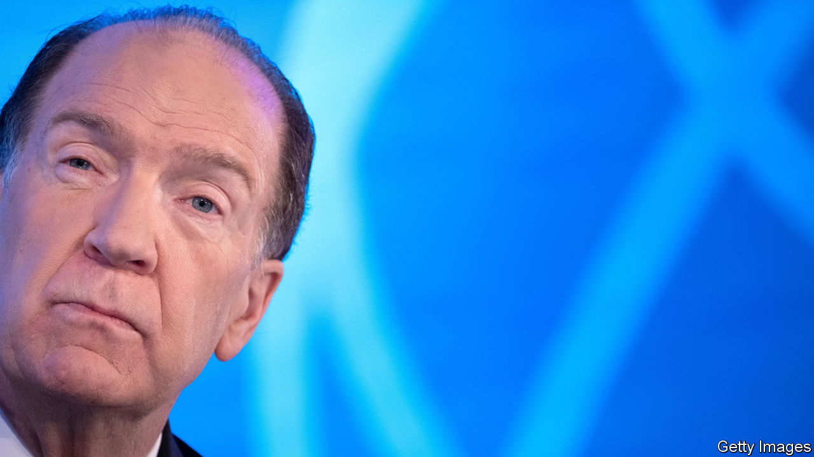

###### Multilateral mess

# The World Bank’s embattled chief steps down 

##### David Malpass’s record is better than his many critics will credit 

 

> Feb 16th 2023 

David Malpass’s presidency of the World Bank started and ended in controversy. When Donald Trump picked the former investment-bank economist and Treasury official in 2019, Mr Malpass was seen as someone who did not believe in multilateralism and might sabotage the bank. On February 15th, when he announced his intention to resign in June, he was dogged by comments in which he appeared to question climate change—a major focus for the lender. Between these dark clouds, though, Mr Malpass was a surprisingly effective leader. He helped stabilise a drifting institution and presided over a big expansion in its lending operations.

Mr Malpass’s exit will come nearly a year before his term is due to expire, hinting at differences between him and the bank’s leading shareholders, including, notably, his own country. Earlier this month Janet Yellen, America’s treasury secretary, said the bank needed to move more quickly to reform its operations: for example, changing the way it analyses global challenges such as climate change and stretching its balance-sheet in order to disburse more money. Ms Yellen’s comments had the makings of an ambitious new agenda for the bank—all the more reason for a new president, armed with a five-year term and strong backing from member countries, rather than a lame duck in his final year. Mr Malpass described his early departure as “an opportunity for a smooth leadership transition”.

Critics celebrated his exit. “This must be the first step toward true reform that places the climate crisis at the centre of the bank’s work,” said Al Gore, America’s former vice-president. Mr Malpass met with scorn last year when he dodged questions about whether the burning of fossil fuels causes global warming, saying he was “not a scientist”. His response had revived earlier concerns that Mr Trump’s appointee could not be trusted.

But his record was better than pessimists feared would be the case. His predecessor, Jim Yong Kim, had been bent on reinventing the bank, bringing in consultants, slashing costs and centralising its structure. Mr Malpass inherited an institution that was demoralised and in disarray. The calls for new reforms, which would involve taking on more responsibilities, reflect the fact that he has helped steer the bank back towards its pre-Kim identity.

In 2022 the World Bank’s commitments—a broad measure of the financing it provides—reached $115bn, nearly double the amount in 2019 when Mr Malpass took over. This expansion reflects the bank’s role in helping poor countries overcome the covid-induced recession and the energy-plus-food crisis following Russia’s invasion of Ukraine. Strikingly, the bank also doubled its climate finance, reaching nearly $32bn last year. Despite this tangible progress, Mr Malpass struggled to escape the impression that his heart was not really in it. “I see it more as a missed opportunity rather than a period during which there was major turmoil or the institution failed to deliver,” says Masood Ahmed, president of the Centre for Global Development, a think-tank in Washington.

America picks the World Bank’s president as part of an understanding with European governments, which choose the head of the imf. Possible candidates are believed to include Samantha Power, who runs the American agency for international development (usaid), and Raj Shah, a former head of usaid. Whoever succeeds Mr Malpass will do well to heed the lesson that carelessly chosen words can undermine good work. ■


