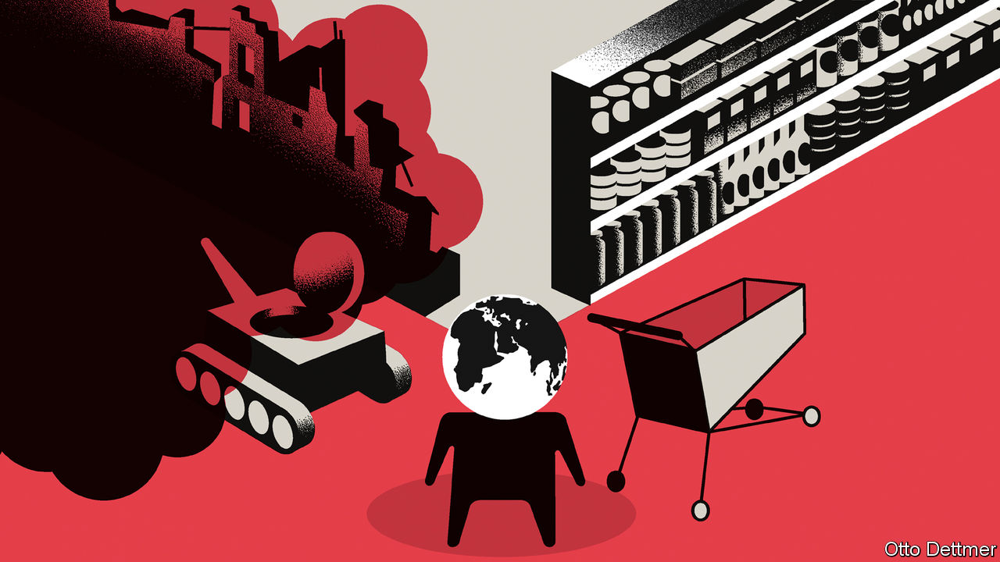

###### Free exchange

# The case for globalisation optimism 

##### Perhaps isolation is not inevitable, after all 

 

> Feb 16th 2023 

“We are suffering just now from a bad attack of economic pessimism,” wrote John Maynard Keynes in 1930, in the midst of a disintegrating global economy. He went on to describe the much better future the world could expect if it ever got its act together. Things are not so bleak today, but it is nevertheless hard to feel cheerful about globalisation’s prospects. America and China, which together account for nearly a quarter of world trade, are on ever-icier terms. Rules which fostered an era of rapid globalisation are being flouted into irrelevance. Perhaps most distressing is the sense that this film has played before. The 19th century saw its own period of breakneck globalisation. In the end, however, economic nationalism and great-power conflict destroyed the global trading system, and much else besides. A spiral towards catastrophe sometimes seems only a few stray balloons away.

The world has experience with cold war, but not between countries as economically intertwined as America and China. In a suspicious atmosphere, accidents happen. The habit of protecting and subsidising domestic firms—as both countries are now doing on a gargantuan scale—may prove difficult to break. All this means globalisation’s immediate prospects appear bleak. But looking on the bright side, as Keynes did, is a helpful reminder of the ways in which events often end up going better than expected. Where globalisation is concerned, demography, technological progress and the example of history itself could push the world in the direction of more, rather than less, integration. Globalisation’s prospects are brighter than most now appreciate.

Start with demographic change. History suggests that trade policy responds to the relative scarcity or abundance of factors of production, like labour. In the 19th century, countries with lots of land but few workers, like America and Australia, subsidised immigration. But as economic integration narrowed price and wage gaps across countries, and workers in once labour-scarce economies grew angry at slow pay growth, governments began erecting barriers to goods and people. Recent experience tells a similar story. Exposure to imports from labour-rich economies like China fuelled anti-trade sentiment. Americans have elected successive protectionist presidents after years of labour-market weakness, in which too many workers competed for too little work. 

Recently, though, the situation has begun to change. Unemployment rates are low across much of the rich world, and investment programmes intended to reshore production may further boost demand for workers, even as labour forces grow more slowly or shrink. Although robots may eventually help plug workforce gaps, rich countries looking to expand production will need to welcome foreign workers, or source goods and components through supply chains which tap abundant labour supplies in other economies. Either would deepen cross-border ties.

Technological change is another cause for optimism. In the 19th century, railways and telegraphs brought a sharp decline in transport and communication costs, and were at least as responsible for economic integration as cuts to tariff barriers. Over the past half-century, information technology and container shipping helped make the explosive growth of global supply chains possible. Today, privacy and national-security concerns have led to some balkanisation of digital-information flows. One might suppose governments will be more protective still of powerful new ai. 

But technology will facilitate trade in other ways. The transition to renewable energy sources will create new patterns of resource scarcity and abundance. Remote-work technologies have already reduced the cost of providing services across borders. In a context of labour scarcity, this sort of trade is likely to increase, whether or not domestic working arrangements return to patterns last seen before covid-19. In addition, continued improvements in machine translation and speech recognition will reduce the cost of trade in both goods and services among countries that speak different languages. Although the macroeconomic effects of progress in ai are difficult to predict, an ai-powered economic boom would probably be associated with large global flows of investment and capital goods. If productivity were to surge in the economies of ai leaders like America, such places might become more eager to export and more open to measures which liberalise trade.

Optimism is warranted, above all, because we learn from the past. The macroeconomic shocks in 2007-09 and 2020 could easily have sparked depressions, but did not because policymakers understood how to avoid the gravest errors of the 1930s. Covid took an awful toll, but advances in public health and medicine helped ensure that the pandemic was less deadly than the Spanish flu, in a world far more populous and connected than that of 1918. And whereas the leaders of a century ago could not anticipate the terrible cost of the detour taken in August 1914, those today are well aware of it. History will be different as a result.

All change

Those still feeling dour should take courage from recent experience. For all the considerable difficulties of the past decade or so, global trade as a share of gdp has only retreated a little from the peak it reached in 2008. Recent history demonstrates, moreover, that nothing in geopolitics is for ever—and trends which look inexorable come to an end. The cold war divided the world and then, suddenly, it did not. Supreme confidence in the inevitable spread of democracy was displaced by the worry that an authoritarian China would dominate the globe, which is now barely a worry at all. The stalemate between America and China will one day be old news, perhaps sooner than most currently think. 

Mistakes led the world to its current uncertain state, it is true. And more mistakes will certainly be made. But the past shows only what has gone wrong, not what will. It is by remembering this that we find the wisdom to do better. ■


