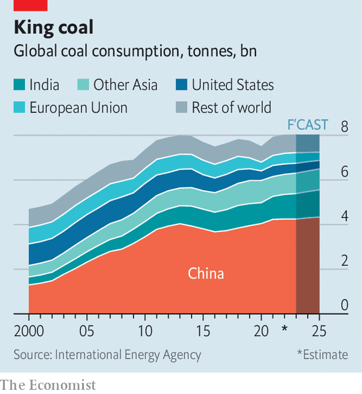
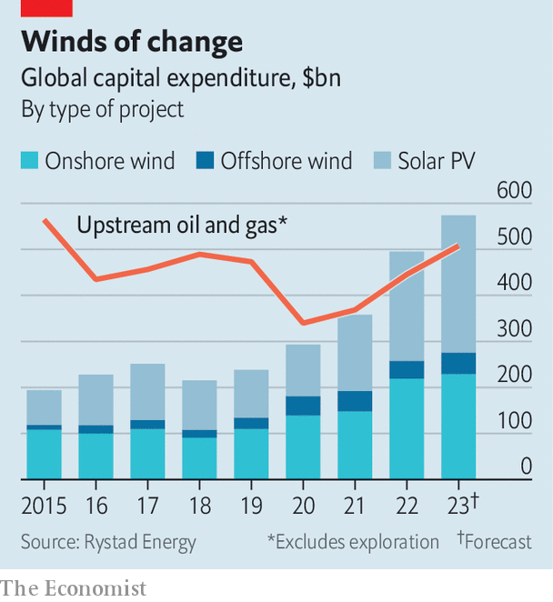

###### Going great guns

# War and subsidies have turbocharged the green transition 

##### They may have knocked as much as ten years off the timeline 

> Feb 13th 2023 

To many activists, Lutzerath, an abandoned hamlet in Germany, symbolises the nightmare of the global energy crisis. For months campaigners blocked the site’s demolition after Robert Habeck, the country’s energy minister, allowed a utility firm to mine for lignite—the dirtiest form of coal—under its graffitied houses. As a giant excavator swallowed its way closer, hundreds of police, unfazed by the pyrotechnics propelled at them, dragged protesters from their stations. Now the village is empty; its last buildings gone. Only bits of  (cables and roads) are left for the bucket-wheeled machine to gobble up. 

In their panic to keep the lights on, politicians across Europe and Asia are reopening coal mines, keeping polluting power plants alive and signing deals to import liquefied natural gas (lng). State-owned oil giants, such as the uae’s , are setting aside hundreds of billions of dollars to boost output, at the same time as private energy firms . Many governments are encouraging consumption of these dirty fuels by , to help citizens get through the winter. 

Yet the reality is that the return of brown fuels is a subplot in a much grander story. By making coal, gas and oil scarcer and dearer—prices remain well above long-run averages, despite recent falls—Russia’s invasion of Ukraine has given renewable power, which is mostly generated domestically, a significant strategic and economic edge. Indeed, even as Mr Habeck endorsed coal-mining last year, the Green politician set out plans to expand solar and wind energy, including in Lutzerath’s gusty Rhineland. All over the world officials are raising renewables targets and setting aside huge sums to bankroll a buildout. 

This complexity makes it difficult to discern whether the tumult in energy markets has aided or impeded the green transition. To assess the overall picture,  has looked at a range of factors, including fossil-fuel consumption, energy efficiency and renewables deployment. Our findings suggest that the crunch caused by the war in Ukraine may, in fact, have fast-tracked the transition by an astonishing five to ten years. 

 


As the battle at Lutzerath suggests, the main reason for alarm is that the world is burning more coal these days. Before the war, it seemed as if appetite for the fuel, having peaked in 2013, was in secular decline. Last year, however, consumption grew by 1.2%, surpassing 8bn tonnes for the first time in history. Sky-high gas prices have pushed utility firms in Europe and parts of Asia, notably Japan and South Korea, to use much more of the stuff. Politicians have prolonged the life of coal-fired plants, reopened closed ones and lifted production caps. This has led to a scramble for supply—one which has been exacerbated by Europe’s ban on Russian imports. In China and India production jumped by 8% and 11% respectively in 2022, pushing world output to a record high. 

The International Energy Agency (iea), an official forecaster, predicts that coal demand will remain high until 2025 (though it cautions that soothsaying is particularly difficult in current market conditions). Europe will receive less gas from Russia, and global lng supply is likely to stay tight, meaning coal will remain the bloc’s fallback option. India’s appetite will probably grow, adding to demand. But the rise will be tempered by an increase in the use of renewables—and beyond 2025 coal’s fortunes look dim. New lng projects in America, Qatar and elsewhere will kick in, providing relief to gas markets. 

 


Meanwhile, the world’s existing production capacity of both oil and gas is already close to being fully used. Russia cannot easily redirect gas exports; its oil rigs, lacking people and parts, may soon produce less than they do now. Although energy-hungry countries have been busy signing long-term deals to import lng, which will force them to import the fossil fuel for several more decades, volumes remain modest. Hydrocarbon firms are enjoying juicy profits, but investment in new projects is falling. Such investment remains well below levels of a decade ago, and a dollar seems to go less far nowadays: capital expenditure per barrel of output, a measure of exploration and production costs, has risen by 30% since 2017. Sustained demand amid slowly rising, perhaps even falling, supply should keep prices of both oil and gas high. 

Lofty prices have already led consumers and firms to reduce their reliance on fossil fuels. Last year the world economy became 2% less energy-intensive—measured by the amount of energy it uses to produce one unit of gdp—its fastest rate of improvement in a decade. Efforts to consume less are most apparent in Europe, which in recent months has been assisted by unusually mild temperatures. According to McKinsey, a consultancy, warm weather and greater energy efficiency mean the continent has used 6-8% less electricity this winter than in the previous one. And all over the world, capital is being mobilised on a vast scale to make the economy more frugal. Last year governments, households and firms together spent $560bn on energy efficiency. This money mainly went on two technologies: electric vehicles and heat pumps. Sales of the former almost doubled in both 2021 and 2022. 

Smoke signals

But efficiency can only make so much difference. People are also looking to alternative sources of energy, especially in Europe. From December 2021 to October 2022 contract prices for the continent’s wind and solar photovoltaic projects were on average 77% below wholesale power prices. At €257 per megawatt-hour (mwh), the average price in Germany in December, a typical solar plant takes less than three years to become profitable, against 11 years at €50 per mwh, the average spot price between 2000 and 2022. Globally, installations of rooftop solar panels, which households and firms use to trim bills, rose by half last year. A record 128gw of onshore-wind projects also broke ground, marking a 35% increase from the year before.

Such indicators only cover a fraction of the activity that has taken place since the war, because selecting a site, obtaining permits and designing large wind or solar farms can take many years. A more representative—and even more encouraging—metric is the amount of money flowing to new projects. Last year global capital expenditure on wind and solar assets grew from $357bn to $490bn, surpassing investment in new and existing oil and gas wells for the first time. Rystad Energy, a consultancy, reckons that investment will continue to rise over the next two years. The iea expects China to build renewable-generation capacity capable of supplying 1,000 terawatt-hours by 2025, equivalent to the total power generation of Japan today. More money is also being earmarked for nascent technologies, such as green hydrogen, which could help decarbonise activities that are hard to electrify. 

At the same time, the fuel squeeze has turbocharged clean-energy policy in the world’s biggest economies. America’s Inflation Reduction Act (ira) earmarks $369bn of subsidies for green tech; the European Commission plans to provide at least €250bn ($270bn) to clean-tech companies, and has decided to bring forward the target for doubling the eu’s installed solar capacity to 2025, from 2030. National ambitions have been supersized, too. In July Germany raised its target for the renewable share in power generation by 2030 to 80%, from 65%. China’s 14th five-year plan for energy, released in June, for the first time sets a goal for the share of renewables in power generation (of 33% by 2025). The country’s provincial governments are also increasingly offering green incentives. 

Much of the money will be spent inefficiently. The ira comes with a raft of “Made In America” stipulations. In response, the European Commission may well loosen state-aid rules. This industrial policy will compound an existing problem: that of cost inflation. Russia’s war lifted the price of metals such as aluminium, copper and steel, all of which are crucial for cables, turbines and panels. Although some  are now falling, costs are instead being pushed up by higher interest rates—a particular issue for developers of solar and wind farms, which require more capital upfront than regular power plants. High freight and power costs, as well as staffing shortages, add to the bill. Namit Sharma of McKinsey reckons that by 2030 the eu will have to quadruple the number of people developing, building and running green plants in order to meet its targets. 

 


All this means that developers at the top of the green supply chain are not making much money. Several offshore-wind giants have recently announced that they will carry out huge write-downs on projects. In theory, developers could pass higher costs on to consumers by bidding for potential projects at higher prices. But in practice miserly new national rules and auction designs make doing so difficult. This winter the eu adopted a windfall tax on renewable-energy generators, and a cap on wholesale power prices, in effect placing a ceiling on returns. Germany’s new offshore-wind-tender system makes bidders compete over how much they are willing to pay to run projects, a system known as “negative bidding”. Never-ending permitting wrangles dilute returns even further. 

In an alternative, less protectionist universe America’s and Europe’s vast spending plans would have an even bigger impact. But even in this fallen world, they are still momentous—sufficient, forecasters consulted by  estimate, to help accelerate the energy transition by five to ten years. The investment surge and tighter targets should create a huge amount of renewable-generation capacity. All told, the iea expects global renewable-energy capacity to rise by 2,400gw between 2022 and 2027, an amount equivalent to China’s entire installed power capacity today. That is almost 30% higher than the agency’s forecast in 2021, released before the war. Renewables are set to account for 90% of the increase in global generation capacity over the period. 

As green power is boosted and fossil-fuel use sags, the global economy is now expected to belch out much less carbon dioxide than had been predicted just 12 months ago. In part this is because emissions will not rise as high as they would have done had there not been a war. s&amp;p Global, a data firm, thinks that those from energy combustion will peak in 2028—at a level the world would still have been producing in 2032 without Vladimir Putin’s invasion of Ukraine. 

Earth, wind and fire

Once the decline starts, it is also likely to be more pronounced. Artem Abramov of Rystad says emissions from fossil-fuel use, which he had predicted would be stable until the late 2020s, or even the 2030s, are now set to slide from 2025. This is because the rush for fossil fuels is unlikely to last long or be large enough to counteract the renewables boom. Although recent progress falls short of limiting global warming to 1.5°C by 2100, models suggest the changes make a 2°C rise more achievable. 

For an illustration of the dynamics now at play, return to Germany. Lutzerath’s fate was sealed by a political bargain. The deal means that two coal plants which were due to be shut in 2022 will instead run until March 2024. In return, however, two bigger plants will be retired in 2030—eight years sooner than had been planned. ■


