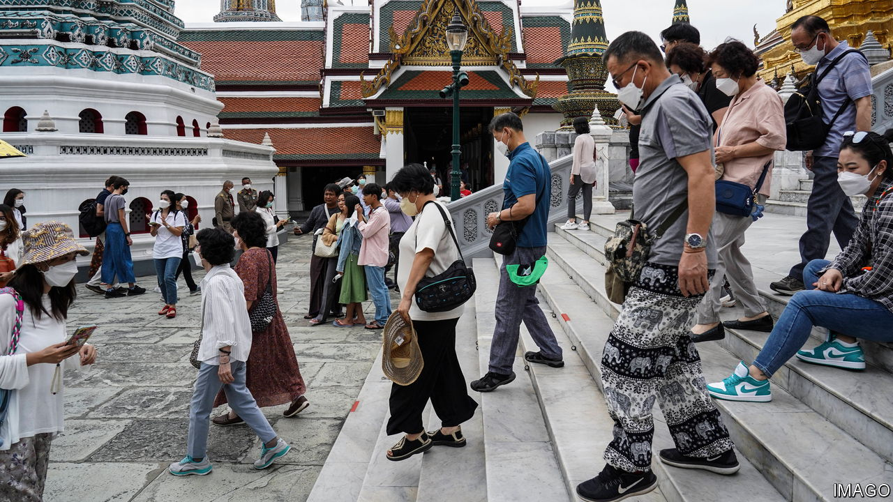

###### Mixing business with pleasure

# Why more Chinese tourism means more capital flight 

##### Many billions of dollars escape under the cover of holidays 

 

> Feb 16th 2023 

A railway tour of Laos, a trip to the far corner of Russia to see the Northern Lights, or a polar cruise in the Arctic. These are some of the adventurous options being marketed in China as the country reopens. The urge to travel seems strong: Ctrip, a travel agent, has reported a quadrupling of inquiries in the space of a month; students are searching more for study-abroad opportunities, too. In Macau, a gambling centre, two of the fanciest hotels are fully booked this month. If pre-pandemic patterns reassert themselves, China’s travel spending could increase by $160bn this year, according to Natixis, a bank. 

After three years of covid-19 restrictions, this wanderlust is understandable. But alongside the obvious motives—sun, sea, sand and study—is another unstated one: spiriting money out of the country. Capital controls limit the foreign currency Chinese citizens can buy. The movement of people across borders creates cover for the movement of money. In 2017, for example, China’s authorities reported how an individual from Tianjin got hold of 39 bank cards and withdrew more than C$2.4m ($1.8m) “in the name of studying abroad”. 

A paper published in 2017 by Anna Wong, then at America’s Federal Reserve, tried to calculate how much money was leaking out of China by this route. She examined a variety of sources in 20 popular destinations, including their balance of payments, their tallies of visitor numbers and surveys of how much a typical Chinese visitor spends. This allowed her to compare outbound spending reported in China’s balance of payments with its mirror image: inbound spending reported by countries of destination. In principle, the inbound and outbound measures should have matched. From 2014, though, a large gap emerged between the two. It reached $100bn in 2015, or 1% of China’s gdp. Ms Wong found a similarly large gap between China’s reported travel expenditure and the level predicted by an economic model, based on factors like the gdp of destination countries, their distances from the mainland and China’s own economic size.

Since then, policymakers have tightened the country’s capital controls and scrutinised transactions more closely. They have also revised past data, removing some illicit financial transactions from figures for travel spending. But a suspicious gap persists. China’s own figures for travel spending still exceed those derived from destination countries and global sources. In a report released on February 14th Natixis estimated that the gap was almost $68bn in 2020 (roughly 0.5% of China’s gdp), despite the sharp drop in travel. 

As China reopens, chances for circumventing capital controls will increase. The country’s currency is stable and growth this year looks likely to be strong, but Chinese households accumulated a large stash of deposits in the pandemic. The property market, historically a favoured destination for the country’s wealth, remains moribund. Thus many will be keen to diversify their assets. Most people travel to broaden their horizons. The Chinese also like to broaden their portfolios. ■


