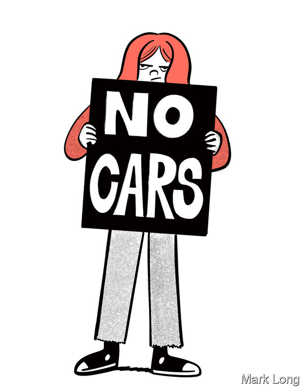

###### Driven away

# Throughout the rich world, the young are falling out of love with cars 

##### That could have big political ramifications 

 

> Feb 16th 2023 

For Adah Crandall, a high-school student in Portland, Oregon, a daily annoyance is family members asking when she is going to learn to drive. Ms Crandall, who is 16, has spent a quarter of her life arguing against the car-centric planning of her city. At 12 she attended a school next to a major road down which thousands of lorries thundered every day. When a teacher invited a speaker to talk about air pollution, she and her classmates were galvanised. Within a year, she was travelling to Salem, Oregon’s capital, to demand lawmakers pass stricter laws on diesel engines. 

Yet her family still nags her to get her driver’s licence. “[It’s] seen as this ticket to independence. It’s so glorified,” she says. Ms Crandall admits her life would be easier if she had access to a car—she would spend less time on buses, and could drive to the coast with her friends. But she hates the idea that she should have to. “Why in our society is our identity so tied to car use?” she asks. “If I choose to comply and get my driver’s licence it would be like giving in.”

Few technologies defined the 20th century more than the car. On the surface, the love affair with the personal automobile continues unabated into this century. The number of drivers on the world’s roads continues to rise almost everywhere. The distance driven by American motorists hit a new peak last year, according to data from the Federal Highway Administration. But there are hints that this is changing. People like Ms Crandall show why. Getting a driving licence was once a nearly universal rite of passage into adulthood. Now it is something that a growing minority of young people either ignore or actively oppose, into their 20s and beyond. 

That, in turn, is starting to create more support for a anti-car policies being passed in cities around the world. From New York to Norway, a growing number of cities and local politicians are passing anti-car laws, ripping out parking spaces, blocking off roads and changing planning rules to favour pedestrians over drivers. Anne Hidalgo, the socialist mayor of Paris, boasts of “reconquering” her city for its residents. 

Campaigners detect a sea change. Even a few years ago “there was a sense that we were the weirdos,” says Doug Gordon, a founder of “The War on Cars”, a podcast based in New York. Now, he says, “more and more elected officials are adopting positions that were [until recently] on the fringe.” After a century in which the car remade the rich world, making possible everything from suburbs and supermarkets to drive-through restaurants and rush-hour traffic jams, the momentum may be beginning to swing the other way.

Start with the demography, and in the country most shaped by the car. The average American driver goes much farther every year than most of his or her rich-world contemporaries: around 14,300 miles (23,000km) in 2022, which is about twice as far as the typical Frenchman. Nearly a century of road-building has resulted in sprawling cities, in which it is hard to get around in any other way. The city of Jacksonville, Florida, for instance, spreads across 875 square miles. With around 1m residents, that makes it only about twice as densely populated as the whole of England, only around 8% of which is classified as “urban”. 

In the suburbs I learned to drive

The Supreme Court said in 1977 that having a car was a “virtual necessity” for anyone living in America. By 1997, 43% of the country’s 16-year-olds had driving licences. But in 2020, the most recent year for which figures are available, the number had fallen to just 25%. Nor is it just teenagers. One in five Americans aged between 20 and 24 does not have a licence, up from just one in 12 in 1983. The proportion of people with licences has fallen for every age group under 40, and on the latest data, is still falling. And even those who do have them are driving less. Between 1990 and 2017 the distance driven by teenage drivers in America declined by 35%, and those aged 20-34 by 18%. It is entirely older drivers who account for still increasing traffic, as baby-boomers who grew up with cars do not give them up in retirement.

A similar trend is well-established in Europe. In Britain the proportion of teenagers able to drive has almost halved, from 41% to 21%, in the past 20 years. Across the countries of the European Union there are more cars than ever. Yet even before the covid-19 lockdowns emptied the roads, the average distance travelled by each one had fallen by more than a tenth since the turn of the millennium. (The exceptions were relatively new member states such as Poland.) Even in Germany, where the internal-combustion engine is an economic totem, drivers are pushing the brakes. 

The trend is especially strong in big cities. One study of five European capitals—Berlin, Copenhagen, London, Paris and Vienna—found the number of driving trips made by working people was down substantially since a peak in the 1990s. In Paris the number of trips made per resident has fallen below the levels of the 1970s.

No one is entirely sure why young adults are proving resistant to the charms of owning a set of wheels. The growth of the internet is one obvious possibility—the more you can shop online, or stream films at home, the less need there is to drive into town. One British report, led by Dr Kiron Chatterjee at the University of the West of England, and published in 2018, fingered a rise in insecure or poorly paid jobs, a decline in home ownership, and a tendency to spend longer in education. The rise of taxi apps such as Uber and Lyft has almost certainly contributed as well, as have higher insurance premiums for young drivers. Driving generally is more expensive. In America the average cost of owning a vehicle and driving 15,000 miles in it rose by 11% in 2022, to nearly $11,000.

Other reasons seem more cultural. One big motivator, at least for the most committed, is worries about climate change. Donald Shoup, a professor at the University of California, Los Angeles, who has campaigned against the excessive provision of free parking in America, says he is surprised by how climate change has spurred many young activists to start campaigning against development focused on cars (he had thought that local air pollution, or the cost, would have made the case instead). 

The falling popularity of cars among the under-40s chimes with the mood among city planners and urbanists, who have been arguing against cars for over two decades. Sometimes they have managed to get big, bold policies passed, such as the introduction of congestion-charging zones in the middle of London, Milan and Stockholm, under which drivers must pay a fee to enter. All three schemes have managed to cut traffic substantially and consistently. (A much-delayed and bitterly contested congestion-pricing scheme in New York could start later this year.)

So move your feet from hot pavement

But in most cases, the squeeze on motorists has been slower and more gradual. In Britain many local councils have begun to introduce “low-traffic neighbourhoods”, blocking off streets to discourage passing drivers from taking shortcuts between main roads. In 2020 Oslo, the Norwegian capital, finished removing almost all on-street parking spaces from its city centre. Paris’s drastic drop in traffic volume has been partly forced by policies brought in by Ms Hidalgo, who has removed parking, narrowed streets and turned a motorway that used to run along one bank of the Seine into a park. In 2021 she announced plans to redevelop the Champs-Élysées to reduce the space given over to cars by half, in favour of making room for pedestrians and urban greenery.

In America, New York has banned cars from Central Park, and experimented with banning them from some streets in Manhattan too. In the past few years dozens of American cities, including Minneapolis in 2018 and Boston in 2021, have removed rules that compel property developers to provide a certain amount of free parking around their buildings. California has removed such rules across the whole state, at least for buildings that are relatively close to public transport. 

 


In the past, such changes have often been imposed from above. Increasingly they are finding favour with at least some voters. “Chicago for 80 years has been: cars first, everyone else dead last,” says Daniel La Spata, an “alderman” (or city council member) in the north-west of the city. Now, he says, cycling activists are playing a big role in the city’s local elections. In Oxford, in England, residents in favour of one traffic-reduction scheme manned barricades to stop irate drivers pushing the barriers aside. Ms Hidalgo won a second term as mayor in 2020 on a platform that included plans to turn Paris into a “15-minute city”, a fashionable idea in which each  would have its own shops, sports facilities, schools and the like within a short walk or bike ride. 

As the example in Oxford shows, not everyone is keen. In Hackney, in north London, the council had to install special vandalism-proof screens on the cameras that spot motorists who break the rules. One local councillor received death threats. Chats on Nextdoor, a neighbourhood-focused social-media app, are full of angry disputes and diatribes about the measures. In Oslo the plan to remove parking spots was denounced by one politician as a “Berlin Wall against motorists”, and a local trade group said it would lead to a “dead town”. (So far, it has not.) 

Political opposition could put the brakes on the growth of anti-car policies. In New York it is suburban politicians, whose constituents are more dependent on cars, who have resisted the new congestion charge. In Berlin the centre-right Christian Democrats have campaigned in local elections on a platform of protecting the freedom to drive. Another worry is that as city centres freed from cars become more attractive, they also become more expensive—pushing some, especially families, out to suburbs where they need cars after all. In America housing in the most walkable neighbourhoods now costs 34% more than it does in sprawling places, according to one study. New technology might change things too. Electric cars may blunt climate-change concerns. They are cheaper to run than fossil-fuelled vehicles, which could encourage more driving. 

But in the parts of Europe where anti-car policies have been in place for the longest, they appear to have worked like a ratchet. Giulio Mattioli, a transport professor at Dortmund University, notes that almost nowhere in the world that has removed a big road, or pedestrianised a shopping street, has decided to reverse course. “Once people see [the benefits], they generally don’t want to go back.” Several studies, including Dr Chatterjee’s, have concluded that driving habits that are formed in youth seem to persist, with those who begin to drive later continuing to drive less, even into their 40s. If that pattern holds, the 21st century might just see the car’s high-water mark. ■


