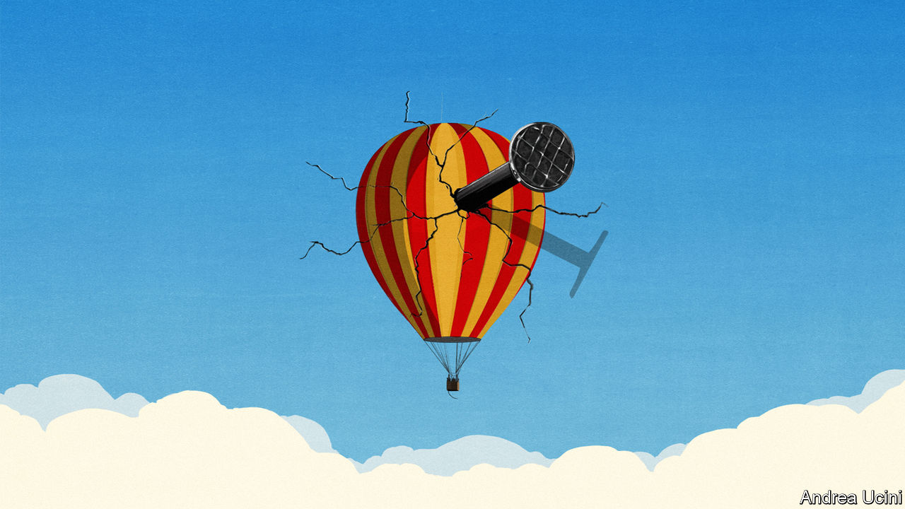

###### Still aloft

# Inflation will be harder to bring down than markets think 

##### Investors are betting on good times. The likelier prospect is turbulence 

 

> Feb 16th 2023 

Given how woefully stock and bond portfolios have performed over the past year or so, you may not have noticed that financial markets are floating high on optimism. Yet there is no other way to describe today’s investors, who since the autumn have increasingly bet that inflation, the world economy’s biggest problem, will  without much fuss. The result, many think, will be cuts in interest rates towards the end of 2023, which will help the world’s major economies—and most importantly America—avoid a recession. Investors are pricing stocks for a Goldilocks economy in which companies’ profits grow healthily while the cost of capital falls. 

In anticipation of this welcome turn of events the s&amp;p 500 index of American stocks has risen by nearly 8% since the start of the year. Companies are valued at about 18 times their forward earnings—low by post-pandemic standards, but at the high end of the range that prevailed between 2002 and 2019. And in 2024 those earnings are expected to surge by almost 10%. 

It is not just American markets that have jumped. European stocks have risen even more, thanks partly to a warm winter that has curbed energy prices. Money has poured into emerging economies, which are enjoying the twin blessings of China abandoning its zero-covid policy and a cheaper dollar, the result of expectations of . 

This is a rosy picture. Unfortunately, as we explain this week, it is probably misguided. The world’s battle with inflation is far from over. And that means markets could be in for a nasty correction.

For a sign of what has got investors’ hopes up, look at America’s latest consumer-price figures, released on February 14th. They showed less inflation over the three months to January than at any time since the start of 2021. Many of the factors which first caused inflation to take off have dissipated. Global supply chains are no longer overwhelmed by surging demand for goods, nor disrupted by the pandemic. As demand for garden furniture and games consoles has cooled, goods prices are falling and there is a glut of microchips. The oil price is lower today than it was before Russia invaded Ukraine a year ago. The picture of falling inflation is repeated around the world: the headline rate is falling in 25 of the 36 mainly rich countries in the oecd. 

Yet fluctuations in headline inflation often mask the underlying trend. Look into the details, and it is easy to see that the inflation problem is not fixed. America’s “core” prices, which exclude volatile food and energy, grew at an annualised pace of 4.6% over the past three months, and have started gently accelerating. The main source of inflation is now the services sector, which is more exposed to labour costs. In America, Britain, Canada and New Zealand wage growth is still much higher than is consistent with the 2% inflation targets of their respective central banks; pay growth is lower in the euro area, but rising in important economies such as Spain.

That should not be a surprise, given the strength of labour markets. Six of the g7 group of big rich countries enjoy an unemployment rate at or close to the lowest seen this century. America’s is the lowest it has been since 1969. It is hard to see how underlying inflation can dissipate while labour markets stay so tight. They are keeping many economies on course for inflation that does not fall below 3-5% or so. That would be less scary than the experience of the past two years. But it would be a big problem for central bankers, who are judged against their targets. It would also blow a hole in investors’ optimistic vision.

Whatever happens next, market turbulence seems likely. In recent weeks bond investors have begun moving towards a prediction that central banks do not cut interest rates, but instead keep them high. It is conceivable—just—that rates stay high without seriously denting the economy, while inflation continues to fall. If that happens, markets would be buoyed by robust economic growth. Yet persistently higher rates would inflict losses on bond investors, and continuing elevated risk-free returns would make it harder to justify stocks trading at a large multiple of their earnings.

It is far more likely, however, that high rates will hurt the economy. In the modern era central banks have been bad at pulling off “soft landings”, in which they complete a cycle of interest-rate rises without an ensuing recession. History is full of examples of investors wrongly anticipating strong growth towards the end of a bout of monetary tightening, only for a  to strike. That has been true even in conditions that are less inflationary than today’s. Were America the only economy to enter recession, much of the rest of the world would still be dragged down, especially if a flight to safety strengthened the dollar.

There is also the possibility that central banks, faced with a stubborn inflation problem, do not have the stomach to tolerate a recession. Instead, they might allow inflation to run a little above their targets. In the short run that would bring an economic sugar rush. It might also bring benefits in the longer run: eventually interest rates would settle higher on account of higher inflation, keeping them safely away from zero and giving central banks more monetary ammunition during the next recession. For this reason, many economists think the ideal inflation target is above 2%.

Yet managing such a regime shift without wreaking havoc would be an enormous task for central banks. They have spent the past year emphasising their commitment to their current targets, often set by lawmakers. Ditching one regime and establishing another would be a once-in-a-generation policymaking challenge. Decisiveness would be key; in the 1970s a lack of clarity about the goals of monetary policy led to wild swings in the economy, hurting the public and investors alike. 

Back to Earth 

So far central bankers in the rich world are showing no signs of reversing course. But even if inflation falls or they give up fighting it, policymakers are unlikely to execute a flawless pivot. Whether it is because rates stay high, recession strikes or policy enters a messy period of transition, investors have set themselves up for disappointment. ■


