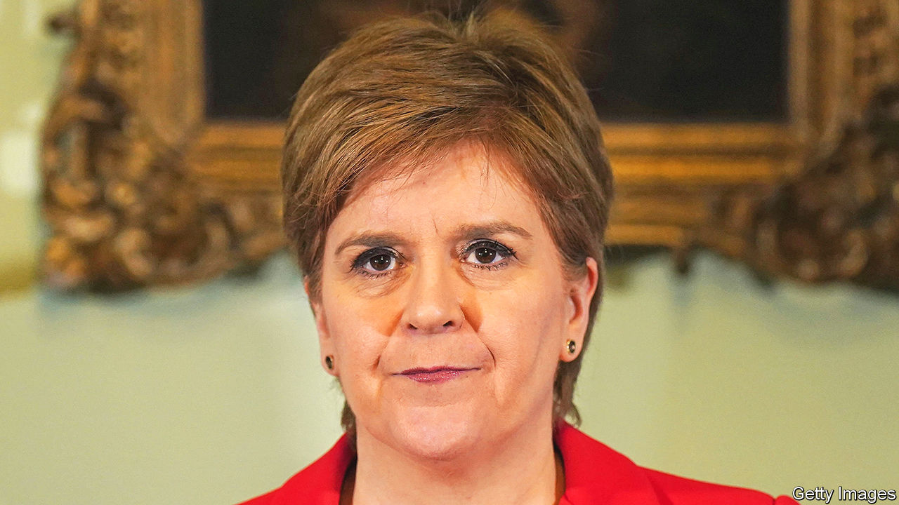

###### Peak populism

# Nicola Sturgeon’s resignation is part of Britain’s great moderation 

##### Pragmatism is taking hold north and south of the border 

 

> Feb 15th 2023 

The image of Britain as a land of phlegmatic common sense has taken a beating in the past ten years. This is a country that voted to leave the European Union without any coherent plan to make the best of it; whose two main parties offered the electorate the choice of Boris Johnson or Jeremy Corbyn in 2019; and whose union has frayed in the face of successful nationalist movements in Scotland and Northern Ireland. 

If one definition of populism is offering simplistic answers to complex questions, British politics has suffered as bad a case as anywhere in the rich world. Now, though, the pendulum is swinging back. The decision of Nicola Sturgeon, Scotland’s first minister, to resign as leader of the Scottish National Party (SNP) is the latest evidence that Britain is rediscovering the . 

 has devoted her working life to the goal of Scottish independence . That is a legitimate political cause, though not one this newspaper supports, and she has been a talented advocate for it. Her failure to achieve it partly reflects the SNP’s poor record of running Scotland’s devolved government. But it is also explained by the intemperance of her tactics. 

She has taken to calling the barriers that prevent the SNP from holding a second referendum on independence a “democratic outrage”. In fact, they are part of the constitution and have been upheld . She has proposed making the next election a de facto ballot on independence, with each vote for the SNP counting as a vote to break away. On her watch, attitudes to independence have become a deeply tribal matter. 

With her resignation, that approach seems to have run its course. Polling suggests that Scottish voters are twice as likely to disapprove of Ms Sturgeon as approve of her. They remain unpersuaded of the case for independence and don’t much like the idea of a single-issue election. In her valedictory speech Ms Sturgeon herself seemed to recognise that polarisation imposes a ceiling on support for independence, as well as a floor. 

South of the border, too, moderation is in vogue. On the same day that Ms Sturgeon announced she was quitting, Sir Keir Starmer, the leader of the Labour Party, confirmed that Mr Corbyn would not be allowed to stand as a Labour candidate in the next election, which is due to take place by January 2025. That sets a symbolic seal on Sir Keir’s overhaul of the opposition since taking over in 2020, whereby he has systematically purged the hard left from the party apparatus. Mr Corbyn wanted to smash capitalism; Sir Keir swans around Davos.

The Tories are less disciplined than Labour but they, too, have become more moderate. Rishi Sunak is a reaction to Mr Johnson and Liz Truss. His pitch is based on managerial competence rather than cartoonish radicalism. As public support for Brexit wanes, he is building bridges with the EU. Ms Truss wanted to dynamite orthodoxy; Mr Sunak is keen to work with institutions. The choice facing the British electorate next time will almost certainly be between two uncharismatic pragmatists with great hair—the opposite of Mr Johnson. 

If populism has peaked, however, it is far from dead.  can still cause immense damage; the battle to succeed Ms Sturgeon may throw up another divisive SNP leader. And moderation carries dangers of its own: the gradualist approach is not sufficient to meet the challenge of Britain’s woeful productivity or to overhaul its creaking public services. But a more rational form of politics is taking hold, in which competence matters more than ideology, problems demand policies rather than scapegoats and a cause like Scottish independence is advanced by good governance rather than grandstanding. ■

