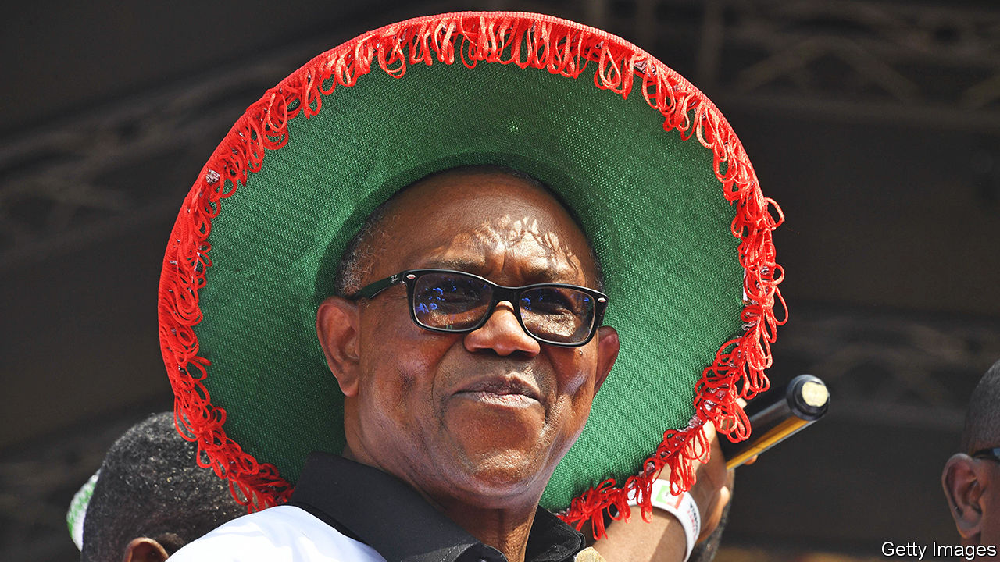

###### A chance for change

# Nigeria desperately needs a new kind of leadership 

##### Peter Obi offers the best hope of it 

 

> Feb 16th 2023 

Nigeria has been cursed with bad rulers. A military regime gave way to democracy in 1999, but since then elections have offered voters an ugly selection of the ancient, the incompetent and, most recently, a former military dictator. Parties have stoked ethnic divisions, intimidated their opponents and bought votes. Many candidates—federal, state and local—seek power to grab a share of the country’s oil wealth. Successive governments have been deeply corrupt. Turnout has steadily fallen. But as Nigerians go to the polls on February 25th, , a third-party presidential candidate, offers a measure of hope. 

Africa’s most populous country is in desperate need of it. The economy, the continent’s biggest, bursts with youthful potential—half the country is 18 years old or younger. A flourishing  would boost the whole of Africa. Instead it is dragging it down. Nigerians are poorer now than they were in 2015, when the outgoing president, Muhammadu Buhari, took over. At least 60m (and rising) survive on less than the equivalent of $2.15 per day. Mr Buhari’s protectionist policies have made things worse.

In addition, the country is beset by violence. Boko Haram and its jihadist offshoots launched more attacks across the north-east last year than ever before. In the north-west criminal gangs murder and kidnap ordinary people, including schoolchildren. Farmers and herders feud over land. Fully 10,000 Nigerians were killed in conflict last year. And a botched banknote reform just before the election has sparked riots, as local banks have run out of cash. The country is catastrophically failing to achieve its potential.

Turning that round starts with a clean ballot. Rigging elections outright is harder these days but the electoral body and police must clamp down more on intimidation and vote-buying. 

Beyond that, much will depend on who wins.  of the ruling All Progressives Congress is an old-school politician who, at 70 years old, is unlikely to shake things up. He shuns scrutiny. His manifesto veers from the fanciful (tackling jihadists by topping up the water in Lake Chad) to the incoherent (claiming to back both import substitution and the African Continental Free Trade Area). In the 1990s the American government froze some of his assets, accusing him of profiting from drug-trafficking. He denies wrongdoing and reached a settlement with the American authorities. 

Atiku Abubakar of the People’s Democratic Party, the main opposition, is no better. An ex-vice-president, he is making a sixth run at the presidency. He has grandiose ideas for industrialisation and 1m new police officers but no plan for how to pay for them. Olusegun Obasanjo, the president he served, accused him of embezzling $145m. In 2010 a report by the United States Senate alleged he was implicated in the transfer of $40m in “suspect funds” to America. He also denies wrongdoing. 

Mr Obi, a sprightly 61-year-old former state governor who is leading in the polls, offers an alternative. Most striking, he has urged people not to vote along ethnic or religious lines but to favour competence. Should they do so, it would mark a radical shift in Nigerian politics. He has also warned his supporters they should expect no money in return for their votes. 

Mr Obi talks of supporting business, freer trade, and getting a grip on Nigeria’s mounting debts. He diagnoses the country’s failings more precisely than his rivals, though he is not much better at explaining how he would fix them. His promises to scrap the staggeringly wasteful petrol subsidy and rationalise the central bank’s many exchange rates are echoed by his opponents.

Mr Obi is not entirely a new broom. He was Mr Abubakar’s vice-presidential running-mate in 2019 before switching parties. He has faced questions over undeclared offshore assets. (He says he earned the money in question before he took office as governor.) Even if he wins, his Labour Party is very unlikely to gain a majority in the national assembly, so governing will be hard.

But he is the only candidate to offer Nigerians much hope of change. In a country that has been badly and repeatedly failed by its leaders, he is easily the best choice. ■

