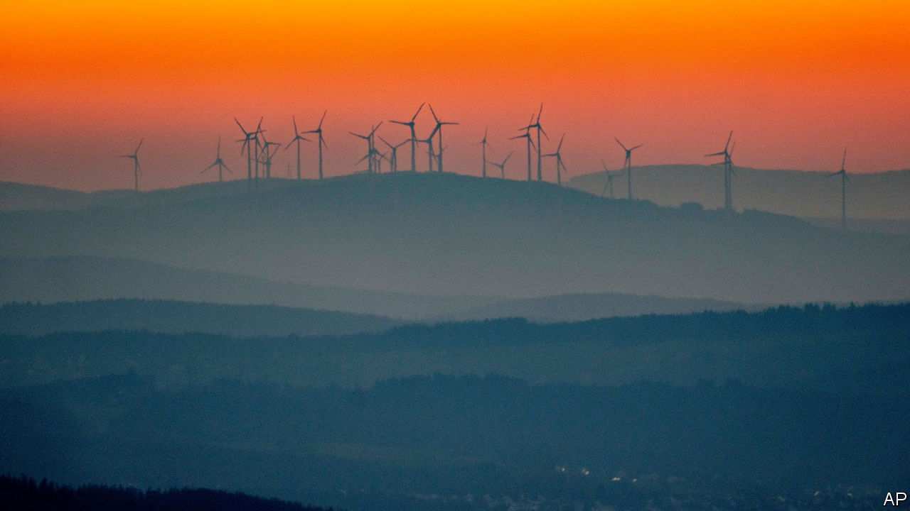
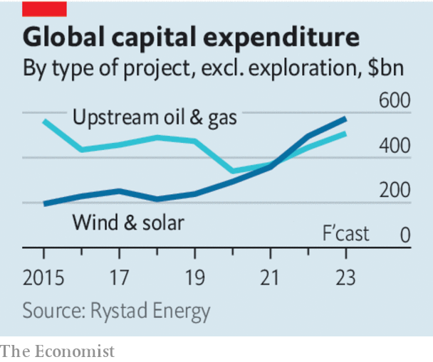

###### Plug and pay

# The world won’t decarbonise fast enough unless renewables make real money 

##### Governments must accept that green power is pricey 

 

> Feb 16th 2023 

Amid the misery of war in Ukraine and the global energy crisis, there is a glimmer of good news. The green transition has speeded up. True, a spike in natural-gas prices fuelled greater demand for coal, the dirtiest of fossil fuels. But it also led consumers to use energy more efficiently. And, more significantly, it spurred investment in renewables around the world. Last year global capital spending on wind and solar assets was greater than investment in new and existing oil and gas wells for the first time. Governments in America and Europe are spending billions on subsidies for clean tech over the next decade; China is offering juicy incentives, too. 

As a happy consequence, the  may have accelerated by five to ten years. Yet the remarkable thing is that the transition could have proceeded at a faster pace still. Even as governments have loosened the purse-strings, they have begun to blunt the incentives to invest. Sharpening them again will be vital, as on today’s trajectory the world is unlikely to reach net zero carbon emissions by 2050, the milestone for limiting temperature  above pre-industrial averages by 2100. 

 


One problem is obtaining permits. Endless delays stop firms that want to invest from breaking ground. This has long been an obstacle to new projects in America and Europe; the worrying thing is that some places are going backwards. Denmark is a star in offshore wind. But on February 6th it stopped processing all applications for such projects, after a dawning realisation that it may be in breach of EU law. The gains from cutting red tape are large. The International Energy Agency, an official forecaster, estimates that renewables generation would rise by an extra 25% by 2027 if bureaucratic and financing barriers were removed. 

The bigger problem is that some renewables providers are now rethinking their investments altogether, because energy projects are becoming less attractive. Price caps and various taxes, together with rising costs, are putting them off. 

Between January 2021 and April 2022 logistical hiccups, post-lockdown rebounds and war-induced disruptions together buoyed the prices of everything from shipping to industrial metals, which in turn raised the prices of solar modules and turbines. Higher interest rates have made money dearer—a headache for builders of green plants, which are much hungrier for capital than their fossil-fuel-fired counterparts. 

Such costs would be manageable if they could be passed on. But governments are increasingly micromanaging power markets to keep prices low, or to raise revenue of their own. The EU has imposed a price cap on renewable generators, and many European countries have implemented a windfall tax on their profits. Around the world, auctions for renewables contracts are being designed to keep electricity cheap—so cheap that generators will struggle to make money. That leads them to sell electricity on the spot market instead, which is riskier and less appealing to investors. Some tenders entice developers to compete over how much they are willing to pay to run projects, a system known as “negative bidding”. This may bloat costs yet more. 

The result has been squeezed profits. The four largest Western turbine-makers are losing money. In January Orsted, the world’s largest offshore-wind developer, took a $365m charge on a big American project; on February 8th the renewables arm of Equinor, Norway’s state-owned energy giant, reported a widening loss for the fourth quarter of 2022—despite an 81% jump in revenue compared with the same period in 2021. That week Duke Energy and Dominion Energy, two American firms, also booked charges of $1.3bn and $1.5bn, respectively, on chunks of their wind and solar portfolios.

This is clogging up project pipelines. From America to Asia, wind developers are trying to revise their bids or renegotiate financing deals, delaying construction. Some are withdrawing from big tenders, decrying projects as “uninvestible”. In America many solar projects are stalled, and in Europe fewer agreements to buy the power they generate are being signed.

Governments are keen to keep power prices low today, but that may be a false economy if it reduces the renewables spending needed for tomorrow. And as more wind and solar capacity is built, developers will probably need to withstand even bigger cost increases: a shortage of copper, say, would push up the prices of cables and wires, and a scarcity of trained workers needed to maintain and operate turbines would boost wages. 

All this means that, if investing is to stay attractive, green power will need to be sold at higher prices than governments would like. If the energy transition is to happen fast, there must not be a race to the bottom. ■


