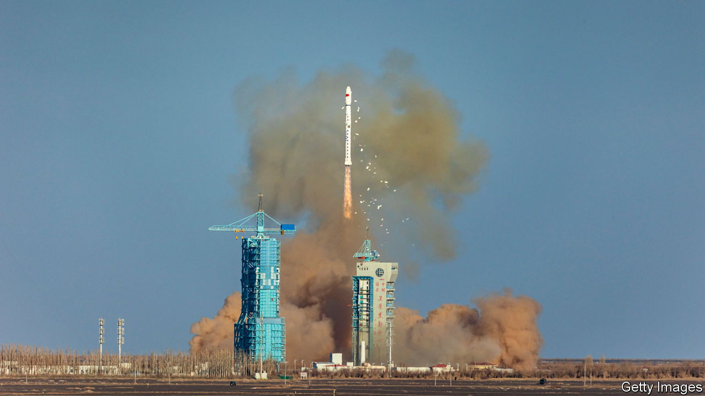
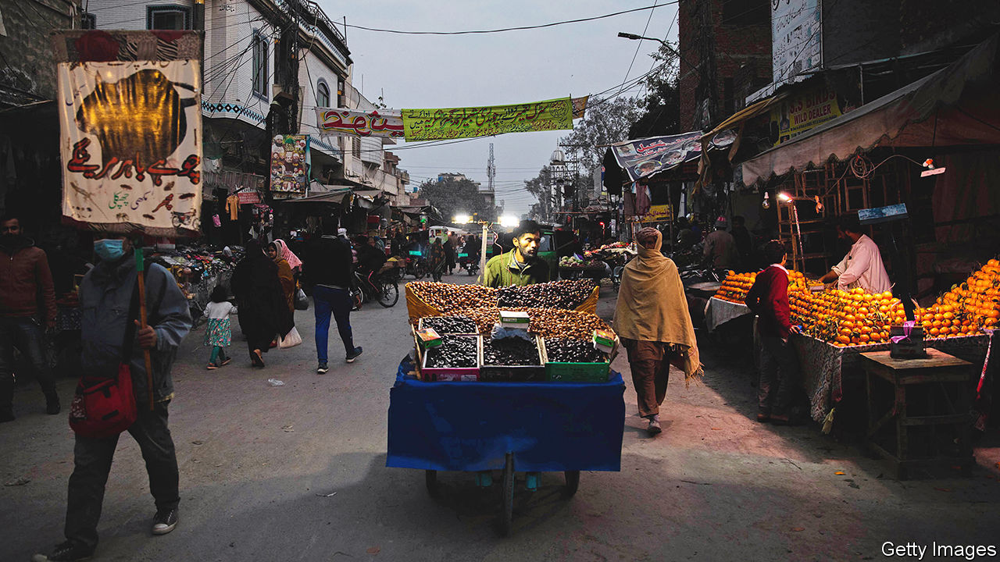
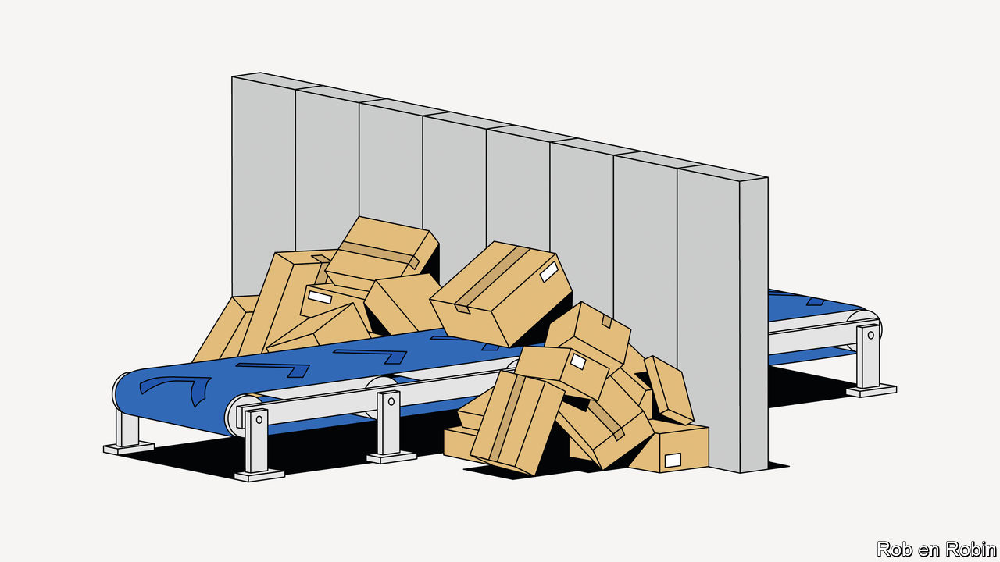

###### On China and space, Turkey, Paul Pennyfeather, Pakistan, The Gambia, banking, old age

# Letters to the editor 

##### A selection of correspondence 

 

> Feb 16th 2023 


Africa’s space race

There are several geopolitical factors to consider in the plan for a Chinese firm to build a spaceport in Djibouti (“”, January 21st). The project risks eroding the international rules-based order in space. Djibouti is not a party to any of the five core international space-law agreements. Chief among them is the Outer Space Treaty, which among other things, establishes that state parties are liable for damage to other state parties. The Convention on International Liability for Damage Caused by Space Objects expounds on this, clarifying that the launching states assume fault-based liability for any damage caused to other state parties’ objects or persons in space. There is no guidance on how to tackle the liability of non-parties, like Djibouti.

Space needs more, not less, trust. Djibouti could, over the five years it will take to build the spaceport, accede to international agreements. Signing the Outer Space Treaty would be a strong first step. However, implementing treaty responsibilities, such as the obligation to continue the supervision of space objects that have been launched from its territory, is an onerous technical challenge. Djibouti has a frighteningly steep hill to climb to rise beyond a spaceport of convenience, but it should act to minimise the consequences to trust and co-operation in space. 

Benjamin Silverstein

Research analyst

Carnegie Space Project

Carnegie Endowment for International Peace

 

 


Free speech in Turkey

Your special report on Turkey () made passing reference to Turkey’s treatment of critical journalists and opponents. Can Dundar, himself previously imprisoned and subjected to an assassination attempt in Turkey and now living in exile in Germany, wrote an article recently in . In it he lists some of those critics who are being subjected to surveillance, persecution and pursuit in at least 31 countries that have provided them with asylum.

There have been physical attacks on individuals in Sweden and Germany, and the publication of home addresses of those who attract Ankara’s disapproval. Foreign governments and Interpol are regularly approached with requests for the extradition of critics of the Ankara government, with such individuals now customarily described as terrorists or supporters or enablers of terrorism. 

This behaviour has become more public through Turkey’s demands for accepting Swedish and Finnish membership of NATO. Such practices are already a threat to Turkish democracy and freedom of expression, with implications for responses within NATO.

Blaine Stothard


I doubt that Turkey is still important to NATO. It certainly used to be. But after the cold war Turkey has become more trouble than its worth for the troubled Atlantic alliance. Afghanistan excepted, Recep Tayyip Erdogan’s Turkey has blunted Western security in the Mediterranean and the Balkans. He is now two-timing with Russia, and his officers at NATO headquarters are regarded as a security liability.

If Mr Erdogan is re-elected as Turkey’s president the tables will have to be turned. A new European Security Council involving all EU members plus Britain, Iceland and Norway should be launched. The engagement of America and Canada will be welcome, but not Turkey. Strategic decisions in the European Security Council will soon supersede the facile “open door” policy of NATO as well as the spurious enlargement policy of the EU.

ANDREW DUFF

Former Vice-Chair of the EU-Turkey Joint Parliamentary Committee


 


The university of life

I disagree that “things only get worse” for Paul Pennyfeather in Evelyn Waugh’s “Decline and Fall” after he is sent down from the fictional Scone College in Oxford (“”, January 28th). Pennyfeather’s adventures in a series of situations teach him far more about life than he would have learned from his schooldays, his university career, or his intended profession as a clergyman. 

He meets and gets an understanding of the “preposterous inhabitants” of the private school where he works for a while as a teacher. He is initiated into sex by a beautiful and wealthy woman. He hears confessions from a series of vivid characters, among them a child abuser, a clergyman who is lacking faith, a criminal impostor, and a successful rags-to-riches politician. He undergoes the experience of prison, where, like anyone who has been through the public-school experience, he feels “comparatively at home”. He will in due course be ordained as a clergyman, but one endowed with a far deeper and richer acquaintance with human nature and life than would have been the case if he had never been debagged by the Bollinger (aka Bullingdon) Club.

Rishi Sunak, as you correctly say, “is surrounded by colleagues whose decisions cause him harm”. The effect on Paul Pennyfeather of the decisions made by others is, ultimately, to do him good.

Simon Jackson


 


Pakistan’s power blackout

It was disingenuous for  to characterise the electricity blackout of January 23rd in Pakistan as “indicative of an economic crisis” (“”, February 11th). There was no correlation between the blackout and the country’s economic situation.

The blackout was a black-swan event triggered by wide voltage fluctuations in the national grid that in turn caused the automatic protective shutdown of power plants. We began to recover electricity supply within 12 hours, and returned the country to blackout-free normality in 36 hours. Pakistan has sufficient stocks of fuel as well as finances to operate its power plants for the foreseeable future.

Khurram Dastgir-Khan

Minister for power in the federal government


 


Helping teachers

Providing a pre-lesson classroom script in poor countries does work (“”, January 28th). In 2019 The Gambia introduced a scripted curriculum for pre-primary teaching as part of a World Bank programme. This provides a framework that makes sure all topics are covered and at the same time gives sufficient space for inspirational teachers to build their skills and careers. The idea of giving more materials to pupils and better lesson plans to teachers resonates with our charity’s experience of assisting community pre-primary schools. Our model is that in return for topping up teacher salaries and providing the infrastructure, materials and teacher training, the schools must adhere to agreed standards. It costs a low £55 ($67) a child.

JOSH DALE-HARRIS

Chairman

Gambia School Support


 


Too much banking regulation

Your briefing on zero-sum economics told the story of deglobalisation (“”, January 14th). An important but overlooked factor in this is the effort by American and European regulators to ring-fence banks geographically, and thereby other forms of finance and trade. That effort has taken two forms: the ring-fencing of capital and liquidity in the wake of Lehman Brothers and the anti-money laundering mandates to “de-risk” clients in developing countries. 

The ring-fencing of capital was needed, but the reforms have been harmful, causing capital to become trapped. The money-laundering mandates take the form of regulators defining industries or regions as “high risk”, which triggers extraordinary compliance costs and threats of ruinous fines and business restrictions. The effects of these regulatory mandates may be larger than any tariff or export or import restriction, but receive far less attention, perhaps because they are less transparent and are more complex.

Greg Baer

President and CEO

Bank Policy Institute

 

Richard Nixon once told Golda Meir that he would trade any three American generals for Moshe Dayan, a famed Israeli commander. “I’ll take General Motors, General Electric and General Dynamics,” the prime minister replied. Meir understood that GM gave America the power to set its own course. Today GM depends on chips from overseas.

Douglas Green


Past it

Patrick Slattery made a good point about Georges Clemenceau being 76 when he became the leader of France (, January 28th). In a recent interview at an anti-government rally Jean-Luc Mélenchon, leader of the far-left La France Insoumise party, declared that it was outrageous to expect people to work until 64, because by the age of 62 “their bodies and nerves are worn out.” Mr Mélenchon is 71.

Anne-Louise Crocker


