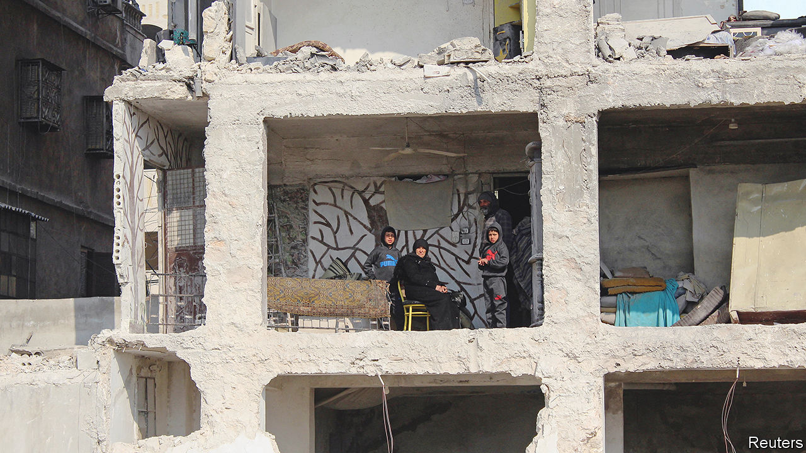

###### Never let a crisis go to waste

# Bashar al-Assad does not want to let a calamity go to waste 

##### The Syrian dictator hopes devastating earthquakes will ease sanctions on his regime 

 

> Feb 16th 2023 

TIMING is everything after a disaster. For aid workers the first 72 hours are crucial, as injury, thirst and the elements conspire to kill survivors. Beyond that mark, their odds of rescue drop sharply. For autocrats hoping a disaster will ease their international isolation, however, the timeline is a bit more forgiving.

The rebel-held enclave in north-west Syria was hit hard by this month’s earthquakes. On February 13th the United Nations said that Bashar al-Assad had agreed to ease the passage of aid into the region. His decision, a full week after the quakes, came too late for those trapped under the rubble for want of fuel and heavy machinery: they were already dead.

Helping them was not really the point. Mr Assad was already emerging from a decade in the diplomatic wilderness, as Arab states came to accept that he would stay in power. Now he sees a chance to woo the West as well—and no doubt hopes a gesture towards the rebel areas will help.

The quakes killed around 6,000 people in Syria, both in the north-west and in regime-held cities like Aleppo and Latakia. That number is sure to rise. The un reckons that as many as 5m Syrians have been left homeless. Helping them will be a monumental task. After a decade of war Syria has been carved into a patchwork of statelets, impoverished and, to varying degrees, cut off from the rest of the world.

The north-west is controlled by Islamist rebels, some of whom belonged to al-Qaeda’s former Syrian affiliate. In Mr Assad’s telling, the area is a hive of terrorists. In truth most of its 4m people are destitute civilians, displaced time and again from other parts of Syria.

The rebel government has been wary about accepting help from regime areas. It also turned back a convoy organised by authorities in north-east Syria, which is controlled by a Kurdish-led administration. After a decade of war, its paranoia is perhaps understandable. The regime has a history of approving aid convoys to besieged areas, only to turn them back at the last minute or rob them. Instead the rebels want help to be sent via Turkey, through which food, medicine and other essentials have flowed for years. 

Mr Assad does not control this stretch of border, but he postures about sovereignty and refuses to consent to the deliveries. Aid thus arrives under a Security Council resolution first passed in 2014. Russia, Mr Assad’s ally on the council, has sought for years to shrink or even stop the shipments.

Since 2020 the un had been limited to using just one border post, called Bab al-Hawa. But the quakes damaged motorways in Turkey that lead to the crossing, just as demand for aid soared. Mr Assad has now agreed it may flow through two additional border posts. 

But the regime’s motives are hardly benevolent. It is struggling to respond to devastation in its own areas, and has tried to blame a convenient scapegoat: the West. “All we want from Europe and the us now is to lift sanctions,” Bouthaina Shaaban, a presidential adviser, said soon after the quakes. “If they lift sanctions, the Syrian expatriates and the Syrian people will be able to take care of their country.”

 In fact, dozens of planes carrying aid have landed at Damascus airport since the earthquake. The donors include close American partners such as Egypt, Jordan and the United Arab Emirates. Sanctions have not prevented them from sending help to regime-held territory.

The sanctions can hold up aid on the margins. Some well-meaning foreigners who tried to organise crowdfunding efforts have found that their campaigns were rejected because sending money to Syria might be a legal risk. To that end, America’s Treasury Department issued a broad waiver on February 9th covering “all transactions related to earthquake relief”. It will remain in place for six months; diplomats expect it will be extended.

Mr Assad hopes to see more of this. Since the quakes he has received calls of support from most Arab leaders. Some Western analysts have raised broader questions about sanctions: even if they do not hamper disaster relief, they do hobble the Syrian state, which has consequences for civilians. The Caesar Act, a package of American sanctions on Syria that became law in 2019, explicitly targets the energy and construction sectors—in a country with widespread blackouts and vast damage to housing and infrastructure.

Those who want to relieve the plight of Syrians face a horrible dilemma. Easing sanctions would not ensure Syrians receive 24-hour electricity and new homes. Keeping them in place, however, all but guarantees they will not. Western governments are loth to channel money to Mr Assad to help him rebuild; they are also anxious to avoid blocking that rebuilding entirely. In working out how to help the people living amid the devastation of Syria while not rehabilitating a blood-soaked regime, there are no easy answers. ■

