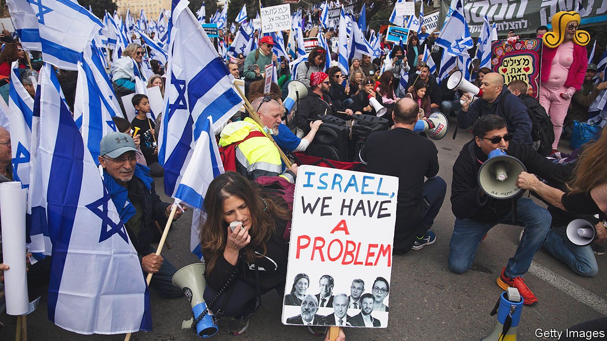

###### The day of judgment

# Proposed legal reforms could be dire for Israel 

##### The debate over them has exposed profound divisions within Israel 

 

> Feb 16th 2023 

“ZION SHALL be redeemed with judgment.” The words of the prophet Isaiah are quoted by Simcha Rothman, chairman of the law committee of the Knesset, Israel’s parliament, at the start of each of its meetings. Mr Rothman is in charge of pushing through a radical overhaul of the country’s judicial system. On February 13th the committee voted in favour of the first tranche of the changes as nearly 100,000 Israelis demonstrated outside the Knesset. 

The leaders of those protests cite the same prophecy. And both sides claim the same goal: saving Israel’s democracy. Since Binyamin Netanyahu’s latest government took power in December 2022, Israel has been engulfed by a toxic row over the powers of the fiercely independent Supreme Court. Supporters of the reforms argue that, after decades of a “judicial dictatorship” that has imposed its own left-wing values, they would restore democracy. Opponents say they threaten Israel’s democratic nature and risk introducing majoritarian rule. But it is increasingly clear that the conflict is about more than the role of the country’s judges. The two sides are fighting over different visions of Israel.

The government is right to point to flaws in the country’s judicial system. The balance of power between the court and parliament is unclear. Israel has no formal constitution. In that vacuum the court has become ever more activist. In the 1990s it deemed a series of “basic laws” passed by the Knesset, which establish rights, to be quasi-constitutional in weight. It has since dismissed various pieces of legislation on the basis of narrow and controversial interpretations of those laws. 

But the government’s agenda goes beyond a redress of power. Under its plans, the Knesset would in nearly all cases be able to override Supreme Court rulings. The court would no longer be able to nullify government decisions on the basis of “reasonableness”. The government could stack the judicial appointments committee with government representatives. 

If they pass, the reforms would remove nearly all checks and balances on the government. Israel not only lacks a constitution, but also an upper house to review legislation. The government of the day controls parliament. Members of Mr Netanyahu’s far-right coalition are already introducing a raft of controversial proposals that include disqualifying “terror-supporting” Israeli Arabs from running in elections and allowing politicians with criminal records to serve as ministers.

Legal experts say the changes could make Israeli leaders and military commanders more vulnerable to charges of war crimes in international courts because it would be harder to argue that they are subject to an independent judiciary at home. The government’s opponents, who include business leaders and former generals and intelligence chiefs, object to both the content and process of the reforms. They are being rushed through in a series of raucous committee meetings, where the objections of the opposition and legal experts have been dismissed. 

“Democratic countries like ours can become dictatorships,” warned Ron Huldai, the mayor of Tel Aviv, Israel’s secular and liberal bastion. “But dictatorships can only return to be democracies through bloodshed.” Such dire predictions are increasingly common. On February 12th Isaac Herzog, Israel’s president, said that the country was “on the brink of constitutional and social collapse”. He called on the politicians to discuss a watered-down version of the plans. The government refuses. Yair Lapid, the leader of the opposition and a former prime minister, is willing to discuss legal reform but insists a presidential committee should come up with a constitutional proposal to put to the Israeli people.

Mr Netanyahu’s personal legal issues make reaching a consensus harder. The prime minister was once a staunch defender of the Supreme Court’s independence but, facing charges for bribery and fraud (which he strenuously denies), he has become a fierce critic. And if the court were to recuse Mr Netanyahu, Israel could face a constitutional crisis. 

Anxiety about the reforms is spreading. Israel’s business community, which has rarely intervened in politics, has criticised the proposals. Workers from the tech sector, which accounts for more than half of Israel’s exports of goods and services, have joined the protests and senior executives have threatened to move their money abroad. “Israel built a prosperous economy in part due to its strong institutions and clear ground-rules,” explains Karnit Flug, a former governor of Israel’s central bank. Making rapid and radical changes would jeopardise that, she argues.

The rancorous debate is forcing Israelis to grapple with the demographic and ideological changes that have brought their country’s most religious and nationalist government to power. It is pitting supporters of the far-right parties most opposed to the Supreme Court, who are much less likely to serve in the army or work in tech companies, against the secular middle class, who have rallied around the court. 

Israel’s internal convulsions might seem less relevant to its relations with the rest of the Middle East, hardly a hotbed of liberalism. But Mr Netanyahu returned to office promising to establish formal relations with Saudi Arabia. His government’s turbulent start may make that harder. 

The kingdom does not much care about the state of Israeli democracy: it is not a democracy either. But the Saudis do care about their own self-interest. Shared hostility towards Iran has brought them closer to Israel over the past decade. For the Saudis to make the relationship official, however, they need something more. America brokered the Abraham accords, which saw four Arab states upgrade their ties with Israel in 2020. It would probably need to fill the same role in a Saudi-Israeli deal. Normalisation is a powerful card in Washington: if the Saudis play it, they will expect a big boost to their diplomatic standing.

Joe Biden has spent most of his presidency feuding with the kingdom. Now his administration is offering rare public rebukes (and much sharper private ones) of Mr Netanyahu’s legal scheme. A president on icy terms with both Israel and Saudi Arabia may be disinclined to offer them incentives to make peace—and if he does not, the Saudis may be in no rush to join the Abraham accords.

Then there are the Palestinians, whom Mr Netanyahu would prefer to forget. King Salman, the nominal Saudi ruler, still feels for their plight, but he has largely delegated power to his son Muhammad, the crown prince. Younger Saudis have less sympathy for the cause. Still, if Israel annexes parts of the occupied West Bank, or takes similarly drastic steps, the Saudis are unlikely to sign a diplomatic agreement.

Israel’s wars with its Arab neighbours have long kept its society united. Since 1967, when it occupied the West Bank and Gaza, the Palestinian issue has been the defining issue of Israeli politics. But as the Arab world has gradually accepted Israel’s presence and hopes of resolving the conflict with the Palestinians have evaporated, the internal divisions over Israel’s identity have sharpened. Mr Netanyahu has long exploited them, but now they are threatening to split Israel irrevocably. Mr Netanyahu wants peace with the Saudis to be his legacy. Instead he is jeopardising his country’s democracy, prosperity and unity. ■

