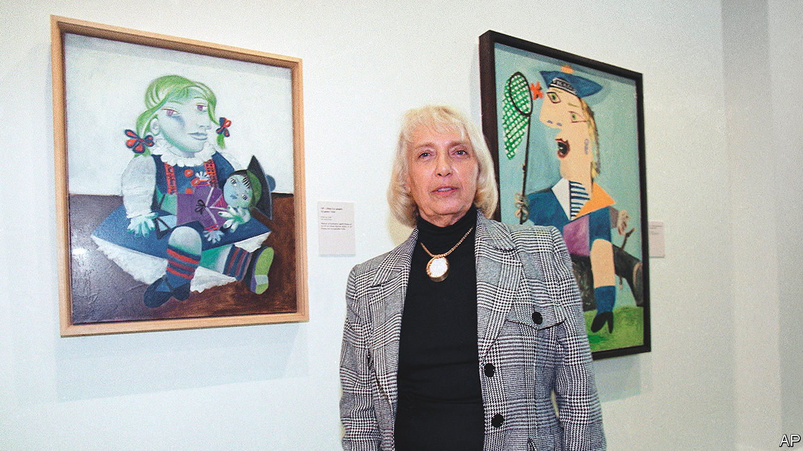

###### Through a child’s eyes

# Maya Widmaier-Picasso helped to revive her father’s creativity 

##### The artist’s elder daughter, muse and expert on his work died on December 20th, aged 87 

 

> Feb 16th 2023 

Two weeks after the liberation of Paris in 1944, Maya Picasso, then nine, made her way to her father’s studio. Such visits were precious, because the family was complicated. Her father did not live with her and her mother, Marie-Thérèse Walter, but was still married to Olga Khokhlova. Maya and Marie-Thérèse were his secret family, though for a while they lived in a flat almost directly opposite his. Her father was also seeing a woman called Dora Maar, whom Maya did not like. She had met Dora only once, in that very studio, standing beside her father’s “Guernica”, with its tangled bodies and that terrified horse’s head, and she had begun to cry. Her father painted the two women fighting over him, black and white doves in a cage. He was happy, even delighted, with the way things were. Maya minded more; but she also knew she was his , his “little anchovy”, the joy of his life. 

In most weeks they saw each other. He would collect her from school and they would walk along the Seine, picking up pebbles that he made into little dolls. (He also made her characters of cloth or paper, with chickpea heads, and origami birds from exhibition invitations.) He took her to cafés to hear jazz bands. The greatest fun, though, was to go to his studio and watch him paint. Almost no one else was allowed to. But there she would sit for hours as he approached the canvas like a dancer, on tiptoe, applied the brush (the inevitable cigarette jammed in his mouth), then danced away again to judge from a distance what he needed to do next. On that first visit after the liberation they sat and painted together, and he hung their pictures up to dry on the studio clothesline: Maya’s, Picasso’s, daughter’s, father’s, as if their value was equal. 

From her father she learned what it meant to live, all the time, with the urge to create. It was sometimes exasperating. At supper he would suddenly tell her not to move or change her expression, and would dash off to find paper, pencil, notebook, anything to catch that pose and look. Those seconds, while he caught them, seemed to last for ever. He drew her once with a napkin round her neck and sent the picture to an exhibition. She blushed to think what people would say. At times she dared not admit her father’s strange occupation, and said he was a housepainter. 

But it was faces that intrigued him. First her mother’s, cool, pale and beautiful, seen one day in 1927 outside a Metro station; then her own chubby baby one. She too was his muse, drawn or painted more than any of his other children and as much as any of his mistresses. On the snowy day when she took her first steps he drew her in tender pastel, and kept the little pink boots she was wearing for the rest of his life. He sketched her in a woolly hat, with a cloth doll in her hair, or sitting moodily at a table. In any of these drawings she could recognise herself. In his paintings, though, her limbs atrophied, or stuck out at odd angles. Her eyes slid down her face, her plaits stiffened and her skin acquired strange colours. She held up a green net, and gaped with all her teeth when a red butterfly flew into it. The name “Picasso” was on her sailor’s hat, as though her father owned her. And in a way he did. Apart from her mother’s blonde hair and blue eyes, she looked extraordinarily like him. Picasso was also painting himself in this small disjointed figure, sitting solemnly with her toys. 

Their relationship, though, was not one-way. Maya’s arrival in 1935 had suddenly revived him, after a lull of years. Her official name, María de la Concepción, was his idea, after a sister who had died when he was 14. She replaced that loss, and when she stopped moving after her birth he splashed water on her, urgently, to shock and baptise her. As she grew, and especially as she began to draw, he watched her keenly, teaching her but also learning how to see with a child’s eyes. He made her colouring books, and filled sketchbooks with his work alongside hers as they sat together in the kitchen, the only warm place in the flat. It had taken him four years, he said, to paint like Raphael; it would take a lifetime to paint like a child. 

She was not only his inspiration but also, increasingly, his guardian spirit. Picasso kept everything he could as a protective cloak around him: every scrap of paper, every object, even the dust that fell on his paintings and on the studio floor. The strongest cloak was her and her mother’s enduring love for him, despite his betrayals. He presented Maya with his nail- and hair-clippings, to prevent them being used as spells against him; he died intestate, being terrified of confronting death and knowing, trusting, that she would sort out everything. 

He believed this despite the fact that, as the years passed, they had drifted apart. He last drew her just before her 18th birthday. Afterwards she went to study in Spain, and worked as an assistant to the singer Josephine Baker; after her marriage in 1960, to a naval captain, she and her father did not speak again. As a way to emerge from the stifling fame of Picasso, she began to emphasise the Ruiz side, his father’s side, of the family, and gave her three children Ruiz-Picasso as a surname. Yet when Picasso died in 1973, leaving both an unallocated fortune and around 45,000 works to be catalogued, authenticated, licensed, prudently donated and defended, she naturally took charge. A seven-year legal battle secured her inheritance, with those of Picasso’s two other illegitimate children. With her half-brother Claude, however, she increasingly clashed over authentication, until in 2012 he set up the Picasso Administration to do the job, and she was moved aside. 

She was appalled when that happened. Although her daughter Diana, an art historian and curator, constantly supported her, to be superseded was painful. Her arguments came from the heart. She was the one who knew instinctively whether or not a work was Picasso’s, not least because she had spent those childhood hours doing art beside him. She was also the only person who truly understood how the sensual curves of his still lifes were those of her mother’s body, and how “Le Rêve”, the painting she loved best, her mother dreaming of Picasso in a red armchair, was a portrait of the love that had created her, who had in turn recreated him. ■

