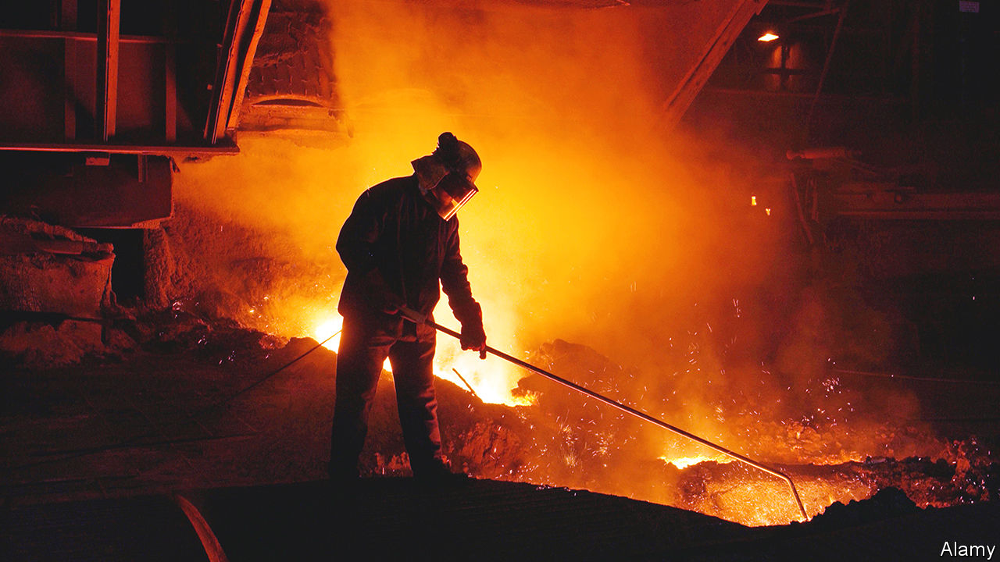
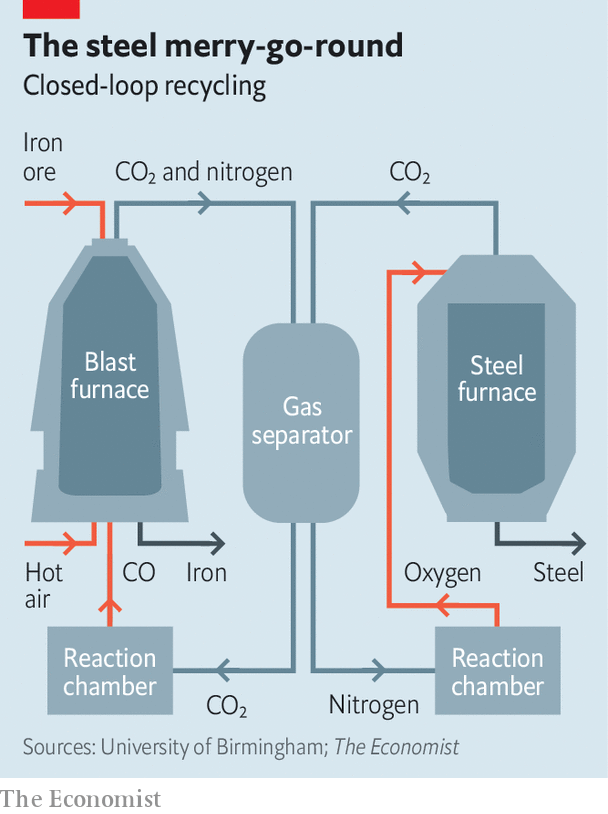

###### Greening steel

# A new way to clean up the steel industry 

##### Carbon dioxide emissions could be cut by more than 90% 

 

> Feb 15th 2023 

Making steel is a dirty business. For every tonne of it some 1.8 tonnes of carbon dioxide (CO) are emitted into the atmosphere. As a result, steelmaking accounts for 7-9% of the world’s anthropogenic greenhouse-gas emissions. 

Cleaner ways of producing steel are being explored. Mostly, these are based on the use of hydrogen instead of coke as the reagent which extracts the oxygen from iron-oxide ore. But much of the pertinent technology is in its infancy. That, together with the cost of converting from old to new equipment, which might run to several billion dollars per plant, means it could take decades for steelmakers to go green. 

Yulong Ding and Harriet Kildahl of the University of Birmingham, in Britain, have, however, come up with something they think might change things. They have developed a process which could be fitted quickly and cheaply to existing plants, and would cut their emissions by around 90%. Steelmakers are talking to them about getting a demonstration version up and running within five years.

Drs Ding and Kildahl propose employing a closed-loop carbon-recycling system to replace most of the coke. At the moment, coke and ore are packed in alternate layers inside a tower-like blast furnace and, as the name implies, blasted with air that has been heated to more than 1,200°C. At this temperature the carbon in the coke reacts with the oxygen in the air to yield carbon monoxide (CO). This gas then goes on to react with the oxygen in the ore, liberating the iron in a process called reduction. Heat from the various reactions involved pushes the furnace’s temperature above iron’s melting point (1,538°C), and the resulting liquid metal flows out of the bottom of the tower. Meanwhile, CO and other gases, including residual nitrogen from the injected air (which starts as 21% oxygen and 78% nitrogen), are vented from the top.

 


The modification Drs Ding and Kildahl propose (see diagram) cuts coke out of the loop by pumping CO directly into the blast furnace. The clever bit is where this gas comes from. It is made by capturing the CO produced in the furnace and recycling it by splitting it into CO and oxygen. The oxygen thus released can then be used in the second part of the steelmaking process, in which that gas is blown through molten iron in a differently designed furnace, to burn off part of the carbon now dissolved in it and arrive at the optimum ratio of iron to carbon to create the type of steel required.

What makes all this possible is an intriguing material called a perovskite. This sits in a reaction chamber at the heart of the recycling system. The original perovskite was a mineral discovered in the Ural mountains, in Russia, in 1839, and named after Count Lev Perovski, a mineralogist from that country. The name has now been generalised to refer to a group of materials which share this mineral’s distinctive crystal structure without necessarily sharing its chemical composition. 

Researchers are finding a variety of roles for perovskites. One type is used to make  more efficient. Another can produce  that are almost unbreakable. Further variants are employed in fuel cells and other clean-energy systems. Drs Ding and Kildahl made their version by grinding up barium carbonate, calcium carbonate, niobium oxide and iron oxide, mixing the resulting powders, and then baking the mixture in an oven. The result is BaCaNbFeO (BCNF1, to its friends). 

When the recycling system pumps the CO through the reaction chamber, the BCNF1 grabs oxygen atoms from the gas and absorbs them into its crystalline structure, leaving behind CO. This cannot go on for ever, though. After about a day, the BCNF1 becomes saturated with oxygen atoms, and so has to be rejuvenated.

That works by taking nitrogen emitted from the blast furnace and pumping it through the reaction chamber. This creates a low-oxygen environment inside the chamber, encouraging the BCNF1 to release its oxygen. When the oxygen is used to make steel, that also emits carbon dioxide. But this, too, can be recycled through the reaction chamber.

Around in circles

The trick to making things efficient is to plumb two reaction chambers into the system. One can then be used to make CO while the other is rejuvenating and producing oxygen. After a day, their roles are reversed, allowing round-the-clock operation. The idea has been tested successfully in a laboratory without any degradation of the BCNF1, says Dr Kildahl. “That part of the system works,” she adds. “It just needs to be scaled.”

For the trial plant to get under way, some hurdles will have to be overcome. One is that besides being a source of CO for the iron-reduction process, the coke also provides a structural support for the ore in a blast furnace, allowing the gas to rise up through it and the molten iron to flow down, so some is still required. One idea the team have is to replicate this support using ceramic materials.

The science thus looks promising. But what about the numbers? To evaluate those, the researchers looked at Britain’s steel industry, which makes some 7.6m tonnes of the stuff a year. Two firms, Tata Steel and British Steel, each turn out 3m tonnes at their plants in Port Talbot and Scunthorpe respectively, using the conventional approach of blast furnace followed by oxygen furnace. This accounts for 94% of the sector’s British emissions. The remainder comes from electric-arc furnaces, which use mainly scrap steel and can be run on renewable electricity. 

The Port Talbot and Scunthorpe plants could be adapted to use BCNF1 at a cost of around £360m ($435m) each, the team calculate in a recent paper in the . Of this, £210m would pay for the 42,500 tonnes of perovskite needed by each plant. That material might have to be replaced every five to ten years. However, the researchers estimate that, besides the green benefits accruing, the initial investment would be repaid in 22 months by the elimination of expensive metallurgical coke from the process, and from selling any oxygen that was surplus to requirements. 

Even allowing for a small increase in electricity consumption, implementing the system on both sites would save about £1.3bn over the course of about five years. There would also, the researchers conclude, be a reduction in carbon-dioxide emissions of 88%, resulting in a countrywide fall in overall emissions of 2.9%

The point of replacing coke with hydrogen would have been to reduce the ore in a way that created water rather than CO, thus eliminating climate-warming emissions. Hydrogen can, moreover, be produced sustainably, using renewable electricity to electrolyse water. But the infrastructure required to make, store and transport green hydrogen does not yet exist. And there are competing demands for the gas, including as a replacement for natural gas as a fuel for boilers, and in the production of green aviation fuel. So Dr Ding’s and Dr Kildahl’s proposal does look like a serious alternative.

Given more work, it might be possible for BCNF1 to replace all of the coke in a blast furnace, cutting emissions down close to zero, reckons Dr Ding. If the talks with steelmakers are successful and a trial plant is built, the next step is to see whether the system proves its worth. If it does, then a curious crystal will start to give green hydrogen a serious run for its money. ■


