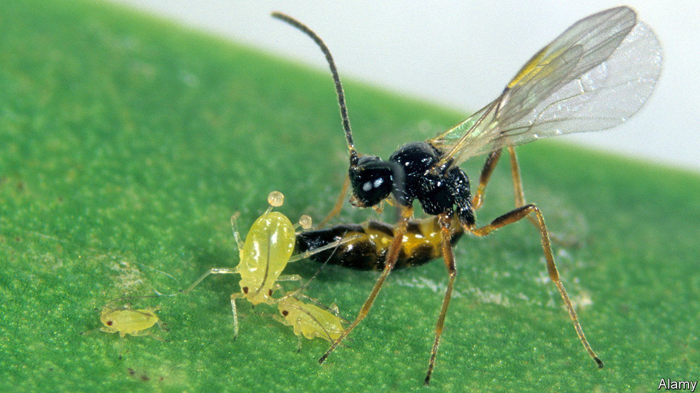

###### Plants, aphids, wasps and L-DOPA

# Plants call for help with a chemical employed by people as a drug 

##### The talk through their roots, asking others to summon wasps, using L-DOPA 

 

> Feb 15th 2023 

Botanists have known for years that some plants send distress calls when under attack from herbivorous insects such as aphids, and that these calls lead neighbours to release volatile chemicals which draw other insects into the area, to attack the attackers. This response brings mutual benefits. It helps the plant already under attack. And it also stops the infestation spreading.

That at least some of these calls for help travel underground is also clear, but the details were murky. Now, a study published in  by Emilio Guerrieri of the Institute for Sustainable Plant Protection, in Turin, has shown that these subterranean cries for help are made using a molecule, L-DOPA, which achieved fame in the 1990s as the star of a film called “Awakenings”.

“Awakenings” is based on cases described in his own, non-fiction, book of that name by Oliver Sacks, a psychiatrist who lived in New York. Sacks used L-DOPA, a precursor of several so-called neurotransmitters, including dopamine and epinephrine, which carry signals between neurons in animals, to treat victims of encephalitis lethargica, a mysterious illness that spread around the world in the second and third decades of the 20th century. Encephalitis lethargica caused catatonia. L-DOPA permitted victims to awaken, though only for a while.

Dr Guerrieri worked with broad-bean plants, pea aphids and wasps called , which lay their eggs in aphids (see picture). Past studies had shown that broad beans can recruit neighbours as allies even when covered with plastic bags—hence the belief that the signals involved were subterranean. But no one knew the chemical doing the recruiting. By growing the beans hydroponically, rather than in soil, he and his colleagues were able to find out.

They raised 80 bean plants, infested 40 of them with aphids two weeks after germination, and then, three days later, tested samples of the hydroponic solution of each using a process called bioassay-guided fractionation. The principal difference they found turned out to be levels of L-DOPA. And when, having discovered that, they raised further batches of beans and fed synthetic L-DOPA to half of each batch, they discovered, first, that those receiving the molecule, but not the others, were indeed attractive to , and, second, that these plants produced more than the others of three particular chemicals which previous work has suggested are the wasp-attracting substances.

That L-DOPA plays a role (albeit a different one) in communication in species as diverse as human beings and bean plants is intriguing. But it is also useful information. What works for broad beans probably works for a range of other crops. And L-DOPA is easy and cheap to manufacture. So it might make sense to add it to irrigation systems, thereby discouraging aphids by recruiting wasps to the cause.■


