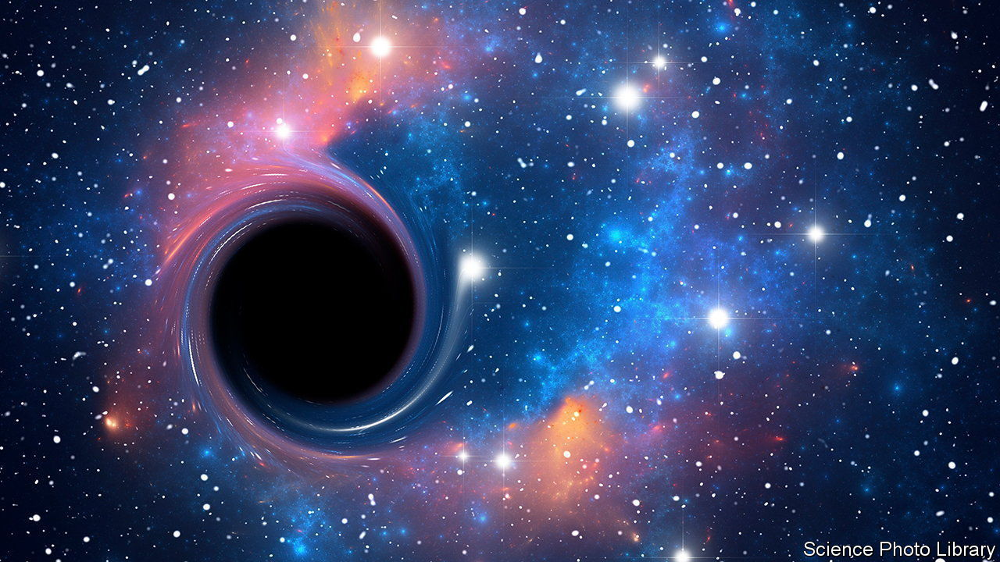

###### Cosmology

# Two of the most enigmatic phenomena in the cosmos may be linked 

##### Black holes could be reserves of the dark energy that pushes the universe apart 

 

> Feb 15th 2023 

Black holes—objects so dense that nothing can escape their pull—are among the most eye-catching predictions of general relativity, a model of gravitational attraction proposed by Albert Einstein over a century ago. They squat invisibly in the middle of galaxies, feasting on stars and interstellar debris.

They are also a clear indicator that general relativity’s days as gravity’s best explanation are numbered. That theory says a black hole’s core is a point of infinite density and pressure called a singularity. This, says Chris Pearson at RAL Space, Britain’s national laboratory for space research, is a mathematical impossibility. 

A host of more palatable alternatives have been proposed, but none has the observational evidence needed to back it up. Two new papers, in the  and , co-written by Dr Pearson, are intended to change that.

The papers’ authors scoured astronomical data for information about black holes at two stages of their lives. The first sort were youngsters at the centres of new galaxies in which stars were forming at a prolific rate. The second were more elderly examples in galaxies where star formation has ceased. According to their assumptions, the second group show what fate has in store for the first. To their surprise, the researchers found that the old black holes had grown ten times faster than cosmological models would predict. But they think they know what might be happening.

Previous work has shown that, in general relativity, the compression of matter past a certain point can lead to the formation of a zone containing vacuum energy, the background energy of empty space. Instead of an infinitely dense singularity, it is therefore possible that black holes contain a well of such energy, the presence of which would account for the observed mass discrepancy. “This”, says Dr Pearson, “is the first time there’s been observational evidence that links these theories to the real world.”

More radical implications follow. One of the universe’s most mysterious features is that the expansion which began with the Big Bang is accelerating. The driving force is labelled “dark energy”, but no one knows what it actually is. In a daring theoretical leap, Dr Pearson and his colleagues suggest that the pockets of vacuum energy present in black holes could be responsible.

What would make this possible is that the properties of vacuum energy are dependent on the size of the universe as a whole. An expanding universe, say theorists, would contain vacuum energy at ever greater densities. This not only means that black holes would gain mass in hitherto unexplained ways, but that their growth would fill the universe with vast reservoirs of energy. They could, in other words, be sources of dark energy.

The team’s calculations show that the size and number of black holes in the universe would be enough to account for all the measured influence of dark energy. The neatness of this explanation is remarkable, but elegance is no proof of truth. Much more work is needed to discount other, albeit less spectacular, possibilities. ■


