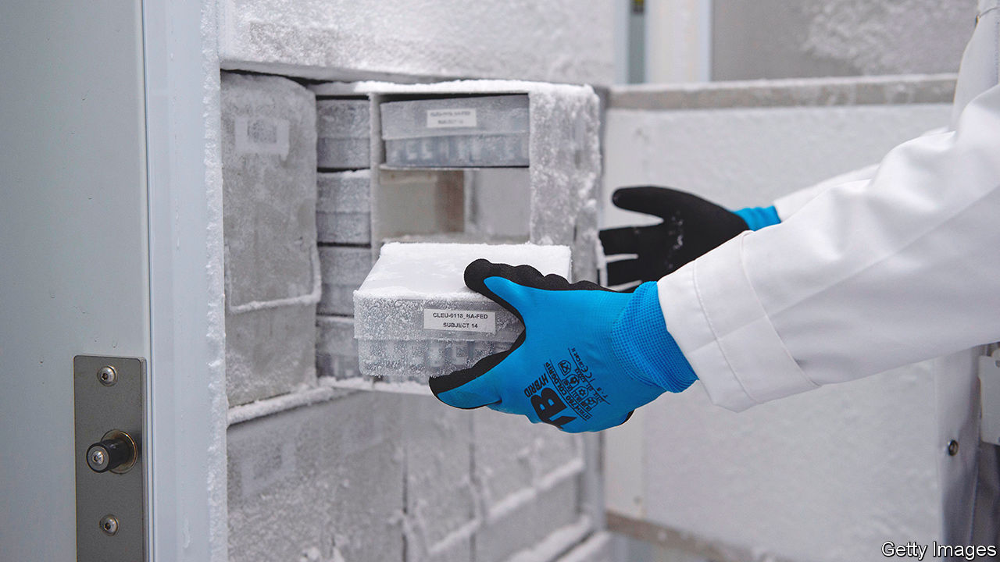

###### Stabilising mRNA vaccines

# Vaccines based on mRNA need to get out of the freezer 

##### Two new ideas might make that happen 

 

> Feb 16th 2023 

The first successful attempt to transport vaccines over long distances was crude, but ingenious. In 1803, seven years after Edward Jenner’s demonstration that inoculations of the lymph from cowpox pustules could protect against smallpox, a group of 22 orphan boys embarked in La Coruña on a ship bound for Spain’s American colonies. Two had been deliberately infected with cowpox. When they developed pustules Francisco Xavier de Balmis y Berenguer, the doctor who had organised the expedition, used the lymph therein to inoculate two more. And so on, until the ship arrived a little over two months later and inoculations could be given to locals. 

It was a splendid success. Thousands of people across the empire, as far north as Mexico, as far south as Peru and (after a further expedition crossed the Pacific) as far west as the Philippines, were vaccinated. Even today, though using orphans for them is now discouraged, the concept of vaccine-preservation chains lives on, with “cold chains” of refrigerators or freezers being employed routinely to preserve heat-sensitive material that is being moved from place to place.

But cold chains are not ideal, especially in countries with dodgy electricity supplies and a lack of technicians to keep them in tip-top condition. Ways of heat-stabilising vaccines are therefore constantly being sought. And two may soon become available for some of the most heat-sensitive of the lot, the mRNA vaccines recently developed against SARS-CoV-2, the agent of covid-19. 

The Pfizer version of this vaccine is particularly fussy. It must be stored at around -70°C. But even Moderna’s offering requires around -20°C. And the problem will soon increase, for the mRNA approach to vaccine-making is being extended to other diseases, including cancers as well as infections. In January 2022 a transnational group called the Coalition for Epidemic Preparedness Innovations (CEPI) therefore put out a call for novel ways to preserve and deliver mRNA vaccines. To date, it has received more than 70 proposals, of which two in particular, from firms called 20Med and Vaxxas, look promising.

Messenger RNA vaccines, to give their full name, have a pair of components, both of which are heat-sensitive. The first, the mRNA itself, is a form of genetic material that encodes a piece of viral protein. When churned out by sub-cellular factories called ribosomes, which translate the RNA’s message, this protein fragment trains the immune system to recognise and combat the virus. The other component is an oily layer of lipid nanoparticles (LNPs) into which the RNA is packaged for protection until it arrives at its target, but which still permits it to be exposed to the cells in a way that allows it to provoke an immune response. 

The approach developed by 20Med improves the protective shield, without compromising the contents’ ability to provoke immunity, by replacing the LNPs with proprietary polymers of as-yet-undisclosed composition. These preserve the RNA from degradation until it arrives at its target. This version will still require cooling, but not below freezing point. Somewhere between 2°C and 8°C is fine, so all you need is a standard refrigerator.

Vaxxas’s approach is more radical. Its researchers are developing a dry vaccine delivered by skin patches armed with thousands of tiny needles. When a patch is applied, the needles penetrate the surface and deliver the vaccine to the immune-cell-rich layers below. 

A patch of good luck

The point of doing this is that removing the water from a vaccine stabilises it. The main factor driving mRNA degradation in storage is hydrolysis—the breaking by water of the chemical bonds that hold a molecule together. Even one change in a strand of mRNA can stop it from working properly. Less water means less hydrolysis, and that means less damage. 

The stability of the resulting product means patches could be distributed by post, instead of using a special courier or delivery company. They could also be stockpiled for use in future outbreaks. And there is one further benefit. Using patches in this way removes the need to train people to administer doses by injection, for applying a patch is easy. 

Both new approaches are still in the early stages of development. But Richard Hatchett, CEPI’s boss, reckons mRNA-based vaccines will be “an important part of our armamentarium to prepare for future emerging diseases”. The ability to develop, manufacture and then deliver effective vaccines will be vital. Xavier de Balmis would have been proud. ■


