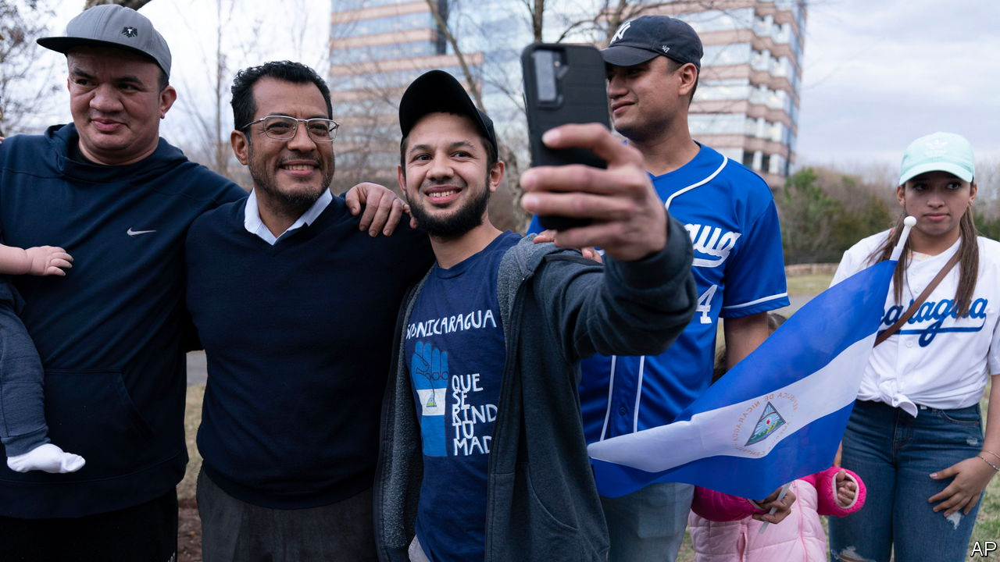

###### A dictator’s purge

# Daniel Ortega expels 222 political prisoners from Nicaragua 

##### Increasingly the country looks like Cuba 

 

> Feb 16th 2023 

Nicaragua’s authoritarian regime has long jailed and mistreated its opponents. So it appeared to be a cause for celebration when, on February 9th, 222 political prisoners were taken from cells across the country and put on a flight to the United States. “We are going to be able to walk freely without fear that they [the regime] are following us, persecuting us, or will kill us,” says Ezequiel González, a 23-year-old student who was among them.

The range of people on the aeroplane, from students to politicians, shows just how sweeping the  has become. President Daniel Ortega, a former Sandinista guerrilla, and Rosario Murillo, his wife and vice-president, will do anything to stay in power. In 2018 they set thugs on protesters, killing at least 350. In 2021 they locked up all seven main opposition candidates before an election. Last year the repression extended to the Roman Catholic church. Priests who spoke out against the regime were put behind bars.

However, the release of the prisoners is unlikely to signal a change of tack by the regime, says María Lilly Delgado, a Nicaraguan journalist in exile in Miami. Soon after the plane had taken off Nicaragua’s Congress stripped the 222 former prisoners of their nationality. Later that day Mr Ortega described them as “mercenaries” acting for the United States. On February 10th a court sentenced Bishop Rolando Álvarez, who had refused to get on the plane, to 26 years in jail.

Mr Ortega may hope the purge will silence those within his regime who are growing uneasy about the level of repression in the country. But it is unlikely to lessen international pressure. The United States has recently imposed sanctions on a broader range of Nicaraguans. It has also excluded Nicaragua from a friendly duty regime on exports of sugar to the United States, and made it illegal for Americans to work with Nicaragua’s gold industry.

The ruling couple may have rid the country of any political opposition. But the released prisoners will organise abroad, once they have recovered from their ordeal, which included starvation. Félix Maradiaga (pictured), a former presidential hopeful who was among those deported, says his time behind bars made him acutely aware of the regime’s cruelty. Few will forget that. As Mr González puts it: “In one way or another this struggle has to continue.” ■

