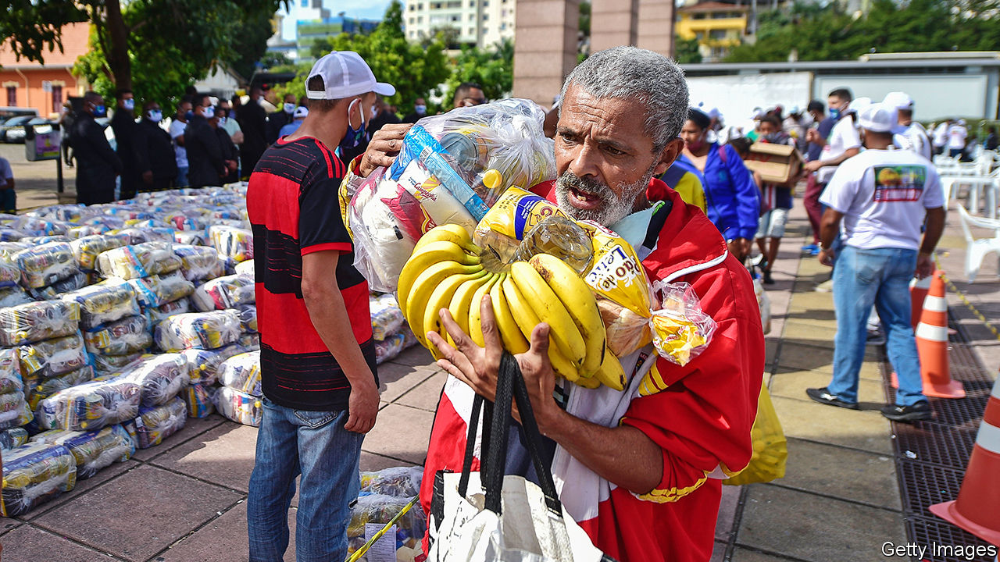
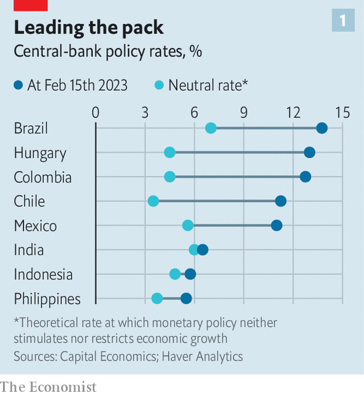

###### Rate rage

# Latin America’s left-wing presidents risk stoking inflation 

##### Brazil’s Luiz Inácio Lula da Silva is the latest to query central-bank independence 

 

> Feb 15th 2023 

After just seven weeks in office, Luiz Inácio Lula da Silva, Brazil’s , has picked a fight with the central bank. , as he is known, has called the bank’s interest rate of 13.75%, a six-year high, “shameful”. He has also called the independence of the central bank “nonsense”, and suggested that the Senate “keep an eye” on its governor, Roberto Campos Neto, whose term ends in 2024. The president may even go further and press for the inflation target—currently 3.25% this year, and 3% for the next two years—to be raised. On February 16th, after  went to press, the National Monetary Council, which sets the target, was due to meet. Lula’s administration will also soon have the opportunity to replace two central bank governors on the monetary-policy committee, which sets the bank’s interest rate.

Lula is not the only Latin American leader to put pressure on the central bank. In October last year Gustavo Petro, the newly elected leftist president of Colombia, tweeted: “Is it useful to raise the interest rate to contain inflation? No.” On February 10th Jonathan Heath, a deputy governor of the Banco de México, Mexico’s central bank, pushed back on Twitter against claims by Andrés Manuel López Obrador, the country’s populist president, that the bank should be boosting economic growth, not just controlling inflation. 

Optimists think this is just politicians, worried about the effect of high rates on their popularity, letting off steam. Pessimists worry that these actions could undermine Latin America’s big economic achievement of the past few decades. 

 


At first glance most Latin American central banks have been exemplars at combating inflation. Interest rates rose fast and high as inflation rose. Brazil moved early and aggressively, raising rates fully a year before the . It increased rates from 2% in March 2021 to 13.75% today. That is one of the tightest policy stances anywhere in the world (see chart 1 ). This helped bring down inflation from over 12% to 5.8%, the largest drop among emerging markets. 

Similarly  higher than markets expected for 11 consecutive months, to 11.25%. On February 9th the Banco de México unexpectedly raised rates to 11% and signalled that another increase may come in March. In Colombia the interest rate is 12.75%, up from 1.75% in 2021. Peru, where anti-government protests have taken place since December, is the exception. On February 9th, after 18 back-to-back rises, its central bank stopped increasing the interest rate, now at 7.75%. In the United States “we had this debate about how transitory inflation would be,” says William Maloney of the World Bank. “The Latin American central banks said: we can’t take a chance on this not being transitory.”

 


But look closer and the signs of strain are there, with two underlying causes. One is that inflation is sticky and requires sustained high rates to control. Though headline inflation is receding in most countries, core inflation, which excludes volatile components like fuel and food, remains uncomfortably high (see chart 2). Wages are rising faster than productivity, which may put further pressure on prices. In Mexico pay rises agreed upon in January averaged 11% in nominal terms, the highest in 22 years and a sharp increase in real terms. This all means it is likely that there is more pain to come.

The other problem is that some leaders appear to think that central-bank independence is now a problem. They fear that high rates dampen growth and hurt borrowers. Central-bank independence also makes it harder for these politicians to stimulate the economy, because the banks counteract fiscal expansion. 

Independent central banks were once seen as one of Latin America’s big achievements. In the 1970s and 1980s inflation in the region went berserk after years of government profligacy. It hit 2,500% in Brazil, more than 7,500% in Peru and over 20,000% in Bolivia. But in 2015-19 it averaged 4% across the region. Today, excluding Venezuela and Argentina, which continue to be outliers, the region’s average inflation is below that of the OECD, a club of mostly rich countries. 

Central-bank independence was key to defeating hyperinflation. It became a consensus among the left and the right, even if Latin America’s central banks became independent later than most. For example, although governments in Brazil had allowed the central bank to operate fairly autonomously since the country’s return to democracy in 1985, the bank was not formally granted independent status until 2021 under Lula’s predecessor, Jair Bolsonaro. According to the IMF, today the region’s banks hit their inflation targets more often than their counterparts in other emerging markets.

Independence can be compromised in several ways. First, politicians can throw their weight around. The de facto autonomy of Brazil’s central bank suffered during the administration of Dilma Rousseff, a Lula protégée who was president from 2011 until her impeachment in 2016. Her government pressed the bank to loosen monetary policy. Inflation soared to 10.7% and private-sector debt piled up, contributing to a disastrous recession. 

Personnel changes can also make central banks more doveish. In a recent note Goldman Sachs, a bank, expressed concern that the changes to the monetary-policy committee in Brazil, because of term limits, could undermine central-bank independence if the two new directors are brought in for political reasons. By contrast Mr Petro tried to reassure investors in December by nominating Olga Lucía Acosta, a former adviser to the UN, to Colombia’s central-bank board. 

A third way independence can be eroded is through constitutional changes. Gabriel Boric, the 37-year-old leftist president of Chile, has respected the independence of the central bank. But a constitutional convention he backed tried to expand the central bank’s remit, and potentially weaken its autonomy. (Voters overwhelmingly rejected a final draft of this new constitution in a referendum last year.) 

So far the damage remains limited. Bond yields have risen, but do not suggest that investors are panicking quite yet. Chile’s central bank remains hawkish, as does Mexico’s. Earlier this month Leonardo Villar, governor of Colombia’s central bank, told Bloomberg that the region’s monetary policies would probably remain “restrictive” for a while yet. In one survey Brazilians were less likely than most to think inflation would rise, and more likely to think their standard of living would improve. Nonetheless, “we have to be patient until we put the genie back in the bottle,” says Alberto Ramos at Goldman Sachs. “And it’s not going to be in 2023.” ■

