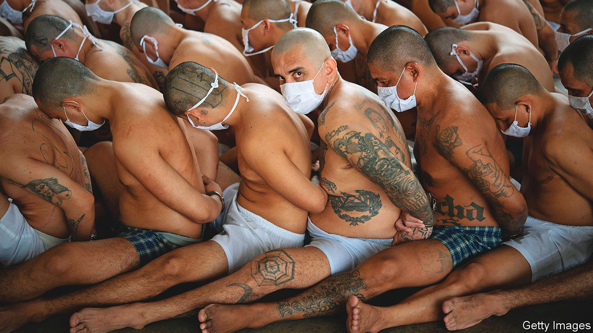

###### In bad nick

# Latin America’s prisons are overcrowded and violent 

##### And since the pandemic they have only got worse 

 

> Feb 16th 2023 

Berta García looks, in her fleece, like a hiker passing through Latacunga, an Andean town 90km (55 miles) south of Quito, the capital of Ecuador. But Ms García is not here for the country’s spectacular volcanoes. Latacunga is also home to a prison where 27 inmates died in riots in 2021. It was here, in a jail run by drug gangs, that her 74-year-old husband was sent after being convicted in absentia of embezzlement. He has cancer, but had to sleep on the floor in an overcrowded cell. He was beaten up. After three months Ms García got him transferred to a lower-security prison. But by then incarceration had already taken its toll. “He’s very skinny, he’s aged a lot,” she says, as she visits the jail to pick up his medical files. 

In the Americas 376 of every 100,000 inhabitants are behind bars, more than twice as many as in any other region. Historically, that rate has been pushed up by the United States, which has one of the highest incarceration rates in the world: 629 people per 100,000. Other countries are now starting to catch up. In the two decades since 2000 the prison population in Central and South America has surged by 77% and 200%, according to the World Prison Brief, a database maintained by Birbeck, University of London.

Latin America’s prisons have little funding. In 2021 the average spent on an inmate in a state prison in Brazil, which has the third-largest prison population in the world, was $4,000 a year. That is about a tenth of the average spent in the United States. And the pandemic has worsened matters, increasing overcrowding and violence. Since December 2020, over 400 Ecuadorians have been killed because of gang warfare in prisons. In June last year 53 prisoners were killed in a riot in Colombia. 

In a region with , citizens have long favoured their leaders treating suspected criminals with , or an iron fist. The most extreme example of this is in El Salvador. In March 2022 a state of emergency was declared by President Nayib Bukele, after a spike of gang-related killings. Some 100,000 people, or 2% of Salvadorean adults, are now . The country’s homicide rate has halved. Mr Bukele’s approval rating is a whopping 90%, the highest in the region. 

But the problem is that Latin American prisons offer little rehabilitation. Fewer than half of prisoners have access to work or education, and programmes that exist tend to be infrequent and short-term. As prison populations started to soar in the 1990s, reformist types who envisioned prisons as places for state-sponsored re-education were disappointed, says Giane Silvestre of the University of São Paulo. Instead it seemed that “prisons are just a place to put undesirables.” 

Few countries keep records on recidivism and different ways of measuring reoffending make them tricky to compare. But the data that exist are discouraging. In Brazil, according to a 14-year study published last year of more than 900,000 former prisoners convicted of , violent crimes and theft, one in five ended up back in prison within a year and nearly 40% within five years. In the United States 45% of former inmates return to prison within five years, either on a new conviction or for violating the terms of their parole.

Overcrowding means that many prisons are simply cages. The World Prison Brief estimates that Brazilian and Bolivian prisons are operating at 147% and 264% of capacity, respectively. Inmates report not receiving medical care. According to the World Health Organisation, a Salvadorean in prison is 99 times more likely than the national average to have tuberculosis. Often another consequence of overcrowding is violence. 

In some prisons, the authorities work in tandem with inmates. Others are run entirely by prisoners, with staff guarding only the perimeter. At the extreme end are the Venezuelan , or kingpins. They control 46% of the prison population, while state authorities govern 11% (the rest is under mixed control), according to the Venezuelan Prison Observatory, an NGO. This is the consequence of a policy from the 2010s when Iris Varela, the prisons minister, realised that the state alone could not control prison violence. She abdicated responsibility to the , who built , swimming pools and zoos.

In Ecuador, where the government says that over a third of inmates belong to a criminal organisation, there is one prison guard for every 62 inmates (in the United States, that ratio ranges from 1:4 to 1:14). Outnumbered and underpaid, they sometimes join the gangs they are supposed to control. In recent years Ecuador has been hit by a wave of murders orchestrated by gang bosses behind bars. In the first eight months of 2022, the number of homicides doubled compared with the same period the previous year. The gangs that hang bodies off bridges were “born in the prisons”, says Renato Riveira, a researcher. 

The Mexicanisation of a region

Some countries are trying to change. Of 25 Latin American countries, six have reduced their prison populations since 2018, according to the World Prison Brief. In Ecuador last year Guillermo Lasso, the president, announced plans to free 5,000 prisoners and hire more guards. 

Some prisoners were displeased with these plans. In November, in an apparent response to the transfer of gang bosses to higher-security prisons, gangsters in Guayaquil, Ecuador’s second-largest city, threw explosives at petrol stations, police stations and a hospital, killing five police officers and a civilian. Such violence may make it hard to persuade society of the value of freeing less dangerous prisoners. ■

