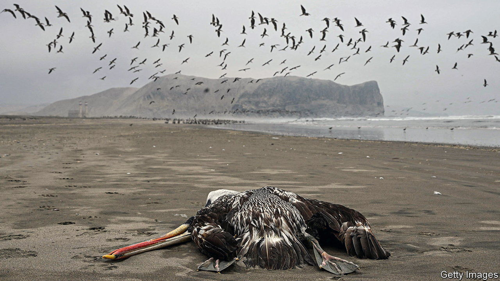

###### The Economist explains

# Will avian flu be the next human pandemic? 

##### The virus has spread from birds to mammals, heightening the risk 

 

> Feb 14th 2023 

THE LARGEST-EVER recorded outbreak of avian influenza is tearing through populations of poultry and wild birds across the world. There are growing fears that it might pose a risk to humans, too. On February 8th Tedros Adhanom Ghebreyesus, the head of the World Health Organisation, warned that the world had to prepare for a possible . How worried should humankind be?

Dr Tedros’s warning was prompted by the recent spread of H5N1, a subtype of the influenza virus, from birds to mammals. In recent weeks Peru has reported the deaths of 585 sea lions from H5N1. In October an outbreak was discovered on a mink farm in Spain. In Britain the virus has been found in foxes and otters. 

These cases, however, do not provide evidence that the virus is about to spill over into humans. H5N1 is not well adapted to infect the upper respiratory tract of mammals; people tend to contract it only after handling birds. Still, the widening range of species carrying the disease suggests that the threat is increasing. Dr Tedros said that the risk to humans is low, but added that it may not stay that way. 

Before covid-19, it was widely believed that the next human pandemic would be caused by an influenza virus. The 1918 influenza pandemic, which is now known to have had genes of avian origin, killed about 50m people. Flu pandemics also occurred in 1957-58, 1968 and 2009. Though avian-flu cases in humans are rare, they can have devastating mortality rates. In 1997, following an outbreak in poultry in Asia, avian flu killed half of the 860 people it infected. 

H5N1 has not been shown to spread directly between humans.  But because the virus is constantly changing, its ability to jump from birds to humans has been evolving since the outbreak in 1997. The extent of its current spread, particularly in the Americas, is worrying. As the virus encounters new bird and animal populations, unexpected new variants could emerge.

A particular worry would be mammal-to-mammal spread. Experts have not yet confirmed that the sea lions passed the virus between each other, rather than catch it from dead, infected seabirds. Mink-to-mink infections appear to have occurred at the Spanish fur farm, but the animals were culled and mammal-to-mammal transmission seems to be extremely rare.

Such bird-flu vaccines that exist do not inspire a strong immune response. Most are produced using an old method that involves incubating the vaccines in chicken eggs. This takes time. Dr Tedros’s warning should stimulate interest in modernising the manufacture of flu vaccines, as well as in stockpiling antiviral drugs. It may also prompt greater monitoring of the current outbreak to provide early warning of any fresh sign of the ability of H5N1 to spread between mammals. Or that it might be developing the ability to infect humans. 

Culling infected animals, and even vaccinating some domestic bird flocks, could tamp down the outbreak. The evolution of viruses, whether influenza or covid, is hard to predict. But with bird flu the signs are worrying enough to warrant planning for the worst, even if the risks seem low. ■

