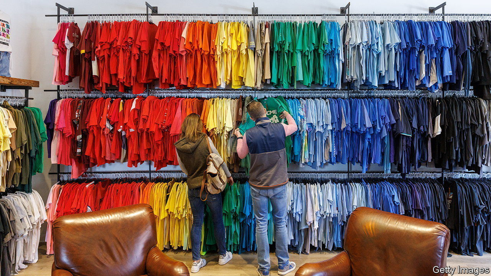
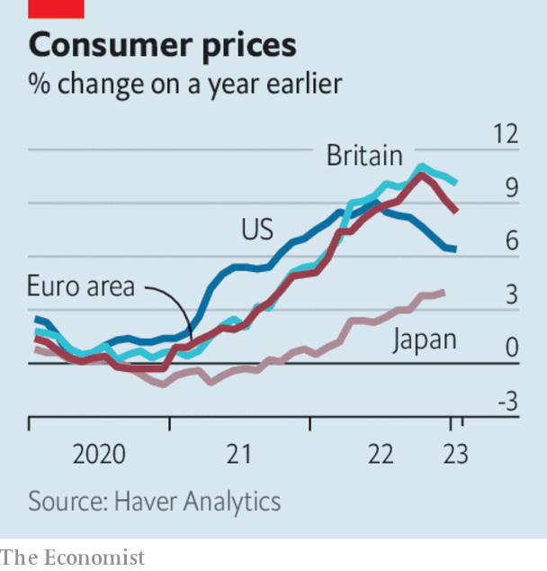

###### The world this week

# Business 

#####  

 

> Feb 16th 2023 

 


America’s annual  rate dipped to 6.4% in January, from 6.5% in December. Markets had expected a sharper fall. Food prices were up by 10.1% year on year, and energy prices by 8.7%, which all point to further interest-rate rises from the Federal Reserve. In Britain inflation stood at 10.1% in January, down from 10.5% but still stubbornly high. Inflation has not been falling as fast there as in America and the EU, though the Bank of England thinks this will change when lower wholesale energy prices start feeding through to consumers. 

The Japanese government nominated Ueda Kazuo to be the next governor of the . Speculation had swirled for months about who would replace Kuroda Haruhiko, who steps down in April, but Mr Ueda was a surprise choice. He is a respected academic economist; his appointment breaks the tradition of selecting someone from within the central bank or finance ministry. Markets will be watching closely for any sign that Mr Ueda intends to adjust the BoJ’s ultra-loose policy. 

The delicate balancing act facing Mr Ueda was highlighted by the latest . The economy grew by 0.6% at an annualised rate in the final quarter of 2022, avoiding recession but a slower rate than had been expected after the easing of covid-19 restrictions. GDP expanded by 1.1% for the whole year. 

 said it would buy 470 planes from Airbus and Boeing to revamp its fleet, the biggest-ever order from a single airline. The carrier was privatised by the government after 70 years of state ownership, returning to the Tata Group, whose founder started the airline in 1932. The order includes wide-bodied, long-distance jets, which will enable Air India to compete with Gulf airlines for Indian long-haul passengers and fly directly to America and Europe. 

A happy ending?

Nelson Peltz ended his brief campaign to secure a seat on  board and force it to change. The activist investor terminated his proxy battle after the company announced a restructuring of its business, which includes placing Disney+, its main streaming channel, in a new entertainment division overseeing all content decisions. Mr Peltz’s firm said the new strategy was “a win” for shareholders. 

After months of rumours,  confirmed that it is cutting its workforce in Europe. The carmaker said that 3,800 jobs would go, accounting for 11% of its staff in the region. Most of the cuts will be in Germany and Britain, as Ford prepares to ramp up production of electric vehicles, which need fewer workers to make than petrol-powered cars.

In its latest forecast the International Energy Agency said that the share of  in the world’s power generation will rise from 29% to 35% in 2025. This means that, although the demand for electricity is expected to keep growing, and 70% of that increase will come from China, India and South-East Asia, emissions from the power sector will “plateau”. 

That transition to renewable energy is still a work in progress.  reported a record annual profit of $34bn, more than half of which came from coal production. The mining and commodities-trading company benefited from soaring coal prices amid Russia’s war in Ukraine. 

 announced his resignation as head of the , a year before his term expires. Mr Malpass, who was nominated for the job by Donald Trump, has been under fire for dodging questions about climate change.

 recorded net income of $1.9bn for last year, its first annual profit. The property-rentals company has seen a surge in bookings from international tourists (during the pandemic people faced restrictions limiting their travel). Rental prices are still significantly higher than before the outbreak of covid, however, raising the issue of affordability. Airbnb is tackling this by increasing the supply of available rooms. 

The post-pandemic company has seen a rise in TWATs, people who work in the office on Tuesday, Wednesday and Thursday. Data from WFH Research show that the new normal for working patterns is costing $12.4bn a year in lost income, as the average worker spends $4,661 less on meals, shopping and entertainment near the office. Sales growth in Manhattan now lags behind other parts of New York City. 

The Nobody Inn

In Britain office workers now have fewer pubs in which to drown their sorrows. Research by UHY Hacker Young, a professional-services firm, found an 83% rise in  filing for insolvency last year. Customers are tightening their belts and costs are rising for pub owners. If that wasn’t enough to send you crying into your beer, rail strikes are deterring people from travelling into town for a night out. 

