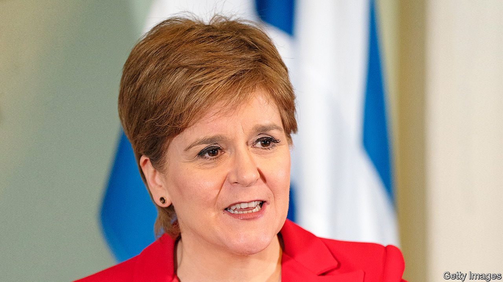

###### The world this week

# Politics 

#####  

 

> Feb 16th 2023 

’s first minister, , unexpectedly announced she would resign, after more than eight years in office. Ms Sturgeon has campaigned tirelessly for Scottish independence, a cause that Scots rejected in a referendum in 2014. Her efforts to ask voters the same question again, hoping for a different answer, have been rebuffed by the courts. She had been pilloried over the state of Scotland’s public services, and rowed with some of her own party over transgender issues. She will stay in office until a successor is found. 

The death toll from the  that hit southern Turkey and northern Syria passed 42,000. Survivors were still being pulled from the wreckage, a week after the tremors, but hope is dim for those still trapped. Critics lambasted Recep Tayyip Erdogan, Turkey’s president, for policies that allowed construction firms to avoid safety measures that would have made more buildings earthquake-proof. He faces re-election this year. 

America temporarily eased sanctions on  to allow earthquake aid into the country. New border crossings were opened to expedite the transfer of supplies. Egypt, Jordan and the United Arab Emirates have been leading the relief effort. 

The president of , Maia Sandu, said that Russia was trying to overthrow her pro-EU government by infiltrating the country and stirring up protests. Ukraine’s president, Volodymyr Zelensky, says that Ukraine has uncovered a Russian plot to destabilise Moldova. The embattled Moldovan prime minister stepped down and was replaced by Dorin Recean, who was the president’s security adviser and is also pro-Western. Moldova applied to join the EU last year. 

Another journalist in  was sentenced to prison under “fake news” laws for reporting on Russia’s bombing of Mariupol in Ukraine last March. Maria Ponomarenko was sent to a penal colony for six years for social-media posts describing an air strike on a theatre full of children.

The  the senior party in the Italian governing coalition, handily won regional elections in Lazio and Lombardy, strengthening the hand of the prime minister, Giorgia Meloni. The right-wing coalition’s victory in Lazio, around Rome, turfed out the centre-left, which had held power there for a decade. 

Up, up and away

A week after shooting down a Chinese spy balloon, America downed several  flying over North America. It did not specify what the objects were.  accused America of having flown balloons into its airspace more than ten times during the past year.

The hunger crisis in  has worsened, according to the South Korean government. Even the army’s food rations have been cut, for the first time in two decades. North Korea, a communist dictatorship, has long mismanaged its food supply. In the 1990s a famine killed at least 200,000 and perhaps as many as 3m people.

Tax officials in raided the BBC’s offices in Delhi and Mumbai, weeks after the broadcaster released a documentary blaming Narendra Modi, the prime minister, for failing to prevent massacres of Muslims while he was in charge of the state of Gujarat. The documentary was banned in India. Critics of the ruling Hindu nationalist party have often run into trouble with the tax man. 

 declared a state of emergency as Cyclone Gabrielle battered the country’s north, causing widespread flooding and landslides. It was also hit by an earthquake of magnitude 6.1. 

 


Huge protests continued in  against proposed reforms put forward by Binyamin Netanyahu, the prime minister, that would curtail the power of the Supreme Court to overturn laws passed by the Knesset. Isaac Herzog, Israel’s president, said many people see the reform as a “threat to Israeli democracy” and warned of a “societal and constitutional collapse”. Meanwhile the government passed a law to strip Israeli Arabs convicted of terrorism of their citizenship. 

Police in  arrested more prominent critics of the president, Kais Saied, including a senior official in the main opposition party, Ennahda, which styles itself “Muslim democratic”. Police have also arrested a former finance minister, judges and a diplomat in the crackdown. 

A Russian frigate, the , docked in Cape Town ahead of joint military drills with  and China. The ship, displaying the Z insignia of Russian troops in Ukraine, carries a Zircon hypersonic missile that Russia intends to test in the exercise. The mayor of Cape Town, who comes from the opposition Democratic Alliance, said the vessel was not welcome. Last month Russia’s foreign minister, Sergei Lavrov, visited South Africa. The government says it is neutral between Ukraine and Russia. 

Jair Bolsonaro, the former president of , said he would return to the country in March to lead a “right-wing movement”. Mr Bolsonaro, who has been living in Florida since December, has not yet conceded defeat after Luiz Inácio Lula da Silva, a leftist, beat him in an election in October. Mr Bolsonaro reiterated baseless insinuations that the election was “biased” against him.

 announced that she would run to be the Republican candidate for the American presidency in 2024. The former governor of South Carolina is the first person to challenge Donald Trump, who has said he will run again. Ron DeSantis, the Republican Mr Trump fears most, has yet to throw his hat into the ring. 

Joe Biden appointed  to head his National Economic Council, which co-ordinates economic policy. Ms Brainard is currently vice-chairwoman of the Federal Reserve. She once argued that the central bank should expand its remit to encompass climate change. Renewable energy is central to the huge infrastructure plans announced by Mr Biden. 

An institution

 decided not to seek another term in the United States Senate. The 89-year-old was first elected to her California seat in 1992 and is the longest-serving female senator ever. She became mayor of San Francisco in 1978, after the assassination of her predecessor, George Moscone. She has pressed for strict gun controls, helping to pass an assault-weapons ban in 1994. Adam Schiff and Katie Porter are among the Democratic bigwigs vying to replace her. 

