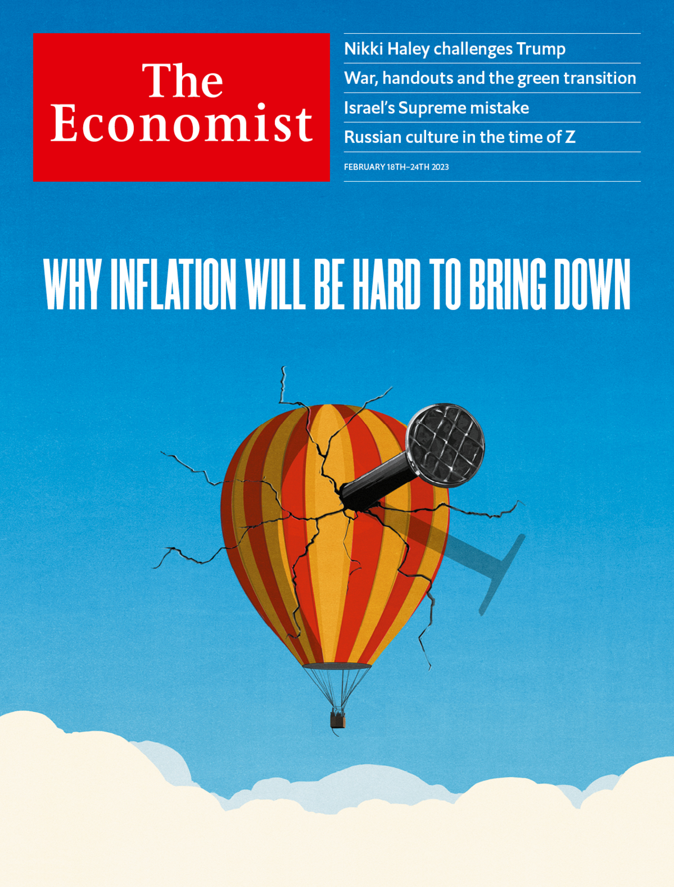

###### The Economist

# This week’s cover 

##### How we saw the world 

> Feb 16th 2023 

Our global cover looks at why the world’s battle with inflation is far from over. Today’s investors are betting that inflation, the world economy’s biggest problem, can be brought down without much fuss. But there may be turbulence ahead. 

 


