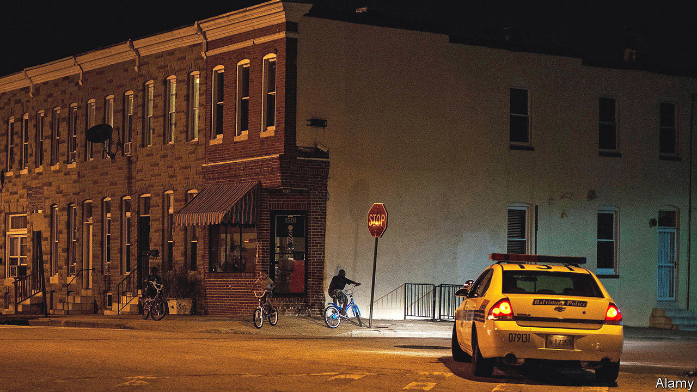

###### Homeward bound

# In the wake of violence American cities resort to youth curfews 

##### But just because they are popular does not mean they work 

 

> Feb 16th 2023 

“There is nothing open after 11pm except for 7-Elevens and trouble,” Rashawn Ray, a sociologist, recalls his grandmother warning him. That sentiment helps explain why more than 400 American towns keep youth-curfew laws on the books. Most forbid teenagers from being in public from midnight to dawn, with exceptions for work, school or emergencies. Some are stricter. In the French Quarter of New Orleans 16-year-olds can be taken into police custody if they are caught on the streets after 8pm. Curfew laws have long gone unenforced. But many cities are tightening their grip. 

After a 12- and a 15-year-old were killed in a  in November, an Atlanta city councillor proposed shifting the 11pm curfew to 7pm. Birmingham, Chicago and New Orleans have started enforcing old curfews; Philadelphia, new ones. 

Fear of untamed teenagers made curfews popular. In November 1995 a criminologist, John DiIulio, warned the public of “superpredators”: “hardened, remorseless juveniles” who would “kill or maim on impulse”. Youth crime had risen as overall crime fell, Mr DiIulio wrote, and “wolf packs” of boys were to blame. Just five months later Bill Clinton’s Department of Justice released a report urging towns to keep teenagers indoors after dark. By 2009, 84% of cities with more than 180,000 residents had enacted youth-curfew laws. 

There is little evidence that curfews curtail crime. They may even spur more of it. In 2015 economists found that stricter curfews in Washington, DC, led to more gunshots fired during curfews. With fewer people on the streets, crime flourished. A meta-analysis in 2016 by the Campbell Collaboration, a research network, found that curfews do not reduce juvenile victimisation. And shutting teenagers in could pose dangers: rates of child abuse probably rose during covid-19 lockdowns, when families were confined to small spaces. 

Declaring curfews makes politicians look tough on crime. But implementing them is hard. Enforcement could distract police from more , while also giving them a reason to arrest any youngster they choose, says Doug Shipman, president of Atlanta’s city council. Crime data from Austin, Philadelphia and New Orleans show that black teenagers were picked up for curfew violations far more than their white peers. In June the police chief of Canton, Ohio, announced that the city’s new curfew was not intended to reduce violence, but to identify parents who failed to supervise their children properly. Yet that could unduly penalise parents who need to work night shifts. 

In Birmingham, a majority-black city, parents whose children violate the curfew must appear before a judge, who sets the family up with services. Recreation centres try to tempt gun-toting children away from hot-headed disputes. The city does not lock parents up, but will fine them if their kids are not compliant. “Policing is no substitute for good parenting,” says the mayor, Randall Woodfin. “We’ve got to wrap our arms around our children and make sure we know where they are.”

Atlanta’s city council is reviewing whether it is constitutional to keep children in after 8pm. The National Youth Rights Association, an advocacy group, thinks it is not. “Today we would never consider curfews for women or ethnic groups,” says Neil Bhateja, a board member. The fact that teenagers’ brains are not yet fully developed, he argues, is no reason to strip them of their right to walk to the grocery store after dinner. Despite clear cognitive declines in elderly people, lawmakers do not restrict their movement.

The legal waters are murky, however. Some courts have protected curfews, arguing that the government has a “narrowly tailored” and “compelling” interest to shut teenagers in during crime spikes. Others have struck them down by emphasising a child’s right to privacy or parents’ right to bring up their children as they see fit. The new proposal in Atlanta is unlikely to pass, but the city’s 11pm curfew will probably remain in place. ■


