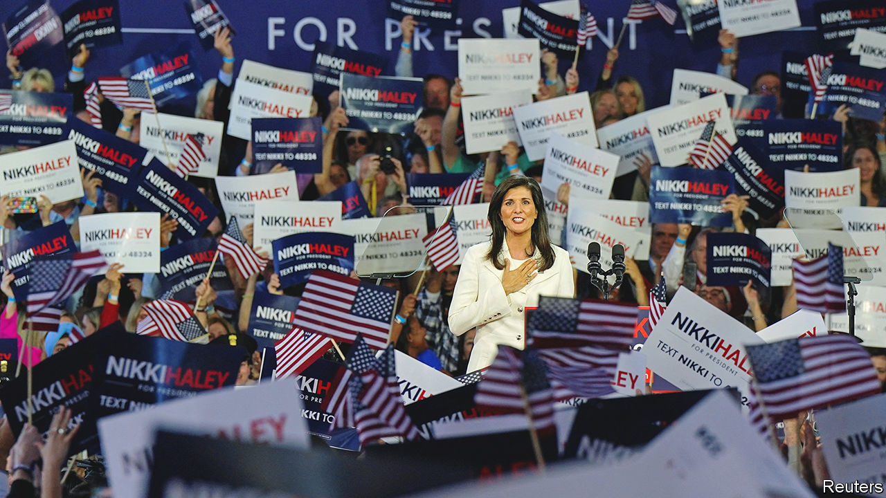

###### Taking on Trump

# Nikki Haley’s bid illustrates the problems of the Republican Party 

##### Her long-shot candidacy for 2024 complicates its chances of finding a new leader 

 

> Feb 14th 2023 

When a new fighter enters the arena to go up against a legend, the crowd braces for a good show. But if the matchup is too lopsided the brawl is no fun. That was the sense when Nikki Haley, a former governor of South Carolina and Donald Trump’s first UN ambassador, announced her presidential run on Twitter on February 14th, becoming the first Republican formally to challenge her former boss. At a launch event in an open-air shed in Charleston the next day, the crowd roared when she suggested mandatory mental-competency tests for politicians over 75. Ms Haley climbs into the ring as a lightweight. But her candidacy helps illustrate the problems of the Republican Party and the nature of the . 

For one thing, it shows that Mr Trump will face competition. Other, weightier contenders have been limbering up, including by writing books in readiness for the fight. Mike Pence, the former vice-president, and Mike Pompeo, CIA director and then secretary of state under Mr Trump, have produced memoirs. And the man shaping up as the most formidable challenger, , Florida’s governor, is due to publish his “blueprint for America’s revival” on February 28th. A crowded field suits Mr Trump (it helped him secure his party’s nomination in 2016). He has said that Ms Haley “should definitely run”. 

Like many other potential candidates—and the party as a whole, which tied itself to a person rather than to ideas—Ms Haley has been bruised by association with Mr Trump. As governor she demonstrated a less angry brand of Republicanism. After a white supremacist killed nine black churchgoers in Charleston in 2015 she campaigned to remove the confederate flag from the statehouse. The daughter of Indian immigrants, she took issue with Mr Trump’s distaste for foreigners and disrespect for women. Even after he easily won her home state’s presidential primary in 2016, she reviled his cosiness with a former grand wizard of the Ku Klux Klan, condemned his plan to build a border wall and chided his character. She backed Marco Rubio, a senator from Florida, and later Ted Cruz of Texas, for president instead.

But in 2016, when Mr Trump asked her to be the country’s ambassador to the UN, she made a Faustian bargain: the foreign-policy post would pad her résumé even if it meant aligning herself with Trumpism. At the UN she did not share her boss’s fondness for authoritarianism. She called herself “a bull in a china shop”; she announced sanctions on Russia, only for the administration to say she had spoken out of turn. Yet her criticism of Mr Trump subsided. Her resignation, after two years, was marked by accolades from the president. She was the rare official to cross him and leave the administration nicknameless. 

In her own book, published in October, Ms Haley likens herself to Margaret Thatcher, Britain’s cold-war prime minister. Both women were not afraid to make enemies to get ahead. But whereas the Iron Lady refused to make U-turns, Ms Haley too often swivels. When Mr Trump claimed Joe Biden stole the 2020 election, she was silent. It was not until a pro-Trump mob stormed the Capitol on January 6th 2021 that she decried his denialism. By October she was backing him again: “I don’t want us to go back to the days before Trump,” she told the 

Such spinelessness makes her an unappealing choice both to the MAGA base and to more traditional conservatives. The latest YouGov/Yahoo poll shows that just 5% of Republican-leaning voters would back her for the party’s nomination. Mr Trump and Mr DeSantis are far ahead of the pack, with 37% and 35% of the vote respectively. 

Mr DeSantis at least benefits from having his own success story to tell. Florida is booming. His anti-woke message has broad appeal among Republicans (and beyond). And he is a proven vote-winner, having stormed to re-election as governor last November with a 19-point margin. 

Other contenders have to work harder to detach themselves from their old boss. Once Mr Trump’s steadfast sidekick, Mr Pence refused to overturn the 2020 election, and now works criticism of the ex-president’s anti-democratic moves into campaign-like speeches in early-voting states. Mr Pompeo remained obsequious while in the administration (“He’s like a heat-seeking missile for Trump’s arse,” a former ambassador said of him), but has since sought to create some distance from that uncomfortable closeness. He has also lost an impressive amount of weight—seen by some as a sign of serious intent.

Almost a year before the Iowa caucuses, it is clear that Mr Trump will not get the effortless nomination he may have hoped for. The poor showing of Trump-endorsed candidates in the midterm elections suggests that voters are no longer in thrall to him. Early strength in the polls for Mr DeSantis, who shares many of the former president’s ideas without posing such a threat to democracy, points to Mr Trump’s vulnerability—which may tempt many more hopefuls to join the fray. 

Yet the more crowded the contest becomes, the harder it will be for any single rival to stand up to Mr Trump. Many party bigwigs are therefore keen to see the fight narrowed down as quickly as possible. If Mr Trump wins the nomination, they fear, Mr Biden could crush him in a rematch. 

The party’s wealthiest donors seem more willing to cast Mr Trump aside than his political rivals are. The Koch network is not planning to support him. Blackstone’s CEO, Steve Schwarzman, and the founder of Interactive Brokers, Thomas Peterffy, who together are worth almost $60bn, are also tired of him. Ken Griffin, Citadel’s boss, who gave over $100m to midterm candidates, has endorsed Mr DeSantis. 

Such funders know that by helping Ms Haley, and diluting the opposition to Mr Trump, they could put the party at risk. That may make her candidacy short-lived. Even in South Carolina she could face stiff competition from Tim Scott, the country’s only black Republican senator. She could perhaps piggyback her way to the White House as vice-president on someone else’s ticket (though rivals for that slot could include Kari Lake, Arizona’s firebrand, and Kristi Noem, South Dakota’s governor). In 2017 Ms Haley said that she wears heels not for fashion, but so that if she sees something wrong she can “kick ’em every single time”. Much has since been wrong in the Republican Party. The trouble is that Ms Haley, and too many of her colleagues, seem to have given up on kicking. ■


