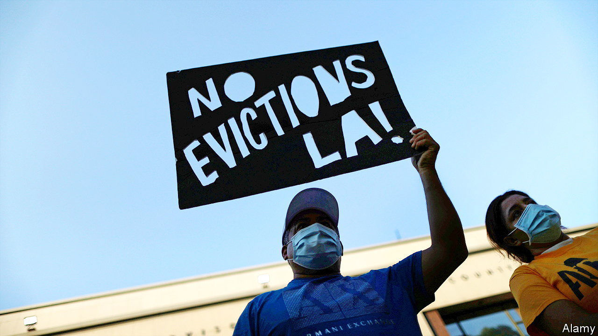
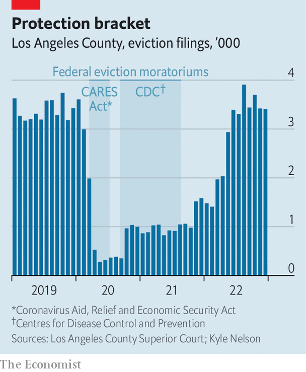

###### The rent is too damn high

# Pandemic eviction bans have spawned a renters’-rights movement 

##### The housing crunch has Democrats pushing for more tenant protections 

 

> Feb 16th 2023 

A BAN ON evictions sounds simple. In practice, it was anything but. As covid-19 spread across America in early 2020, the federal government, 43 states and countless municipalities issued some kind of eviction moratorium. The result was a patchwork of policies to help renters stay in their homes. Some places prevented landlords from filing petitions to evict. Elsewhere, courts stopped processing evictions, or officials avoided locking people out of their homes. Several governments offered grace periods for late rent.

The reason for this flurry of tenant protections was fear of contagion. As lockdowns hobbled the economy and millions of Americans lost their jobs, officials worried that evictions would force families and friends to move in together, spreading the virus. It is tricky to measure the success of eviction moratoriums alone, says Peter Hepburn, a researcher at Princeton University’s Eviction Lab. Officials were also doling out unemployment insurance and rent relief. But a paper published in 2022 in , which Mr Hepburn helped write, suggests that when a moratorium was in place eviction filings were nearly 50% below their historical average. 

 


By 2023 most eviction moratoriums had expired. But not in Los Angeles. Kyle Nelson, a researcher at the University of California, Los Angeles, has been tracking eviction filings in Los Angeles County. The number of evictions sought by landlords in 2020 and 2021 was about a third of those filed in 2019 (see chart). Officials fear that allowing a wave of them now will worsen the city’s. Weekly census data suggest that in January 450,000 renters in the LA area were behind on their rent, and 92,000 were worried about being evicted in the next two months.

The city finally let its eviction moratorium expire at the end of January. But the effect will be muted, for two reasons. First, the surrounding county decided at the last minute to extend its ban on evictions until the end of March. Second, Los Angeles passed a slew of new policies to protect renters. Landlords will be able to evict tenants only for unpaid rent or lease violations. The new rules also establish timelines to pay rent owed during the pandemic, and a minimum amount that tenants need to owe before they can be kicked out. “We’re not going back to a status quo that had been very hard on renters in Los Angeles,” says Nithya Raman, the chair of the city council’s housing committee. 

Worries about housing insecurity are not confined to pricey Southern California. A new report from Moody’s Analytics, a research firm, suggests that for the first time in at least 20 years Americans, on average, are “rent-burdened”, meaning they put at least 30% of their income towards rent. The adoption of pandemic anti-eviction measures and rising rents have spurred national interest in tenant protections. According to the National Low Income Housing Coalition, 32 states and 73 municipalities have passed new tenant protections since January 2021. Democrats in Oregon’s state legislature and Denver’s crowded mayoral race are advocating rent control. In January, the Biden administration released its plan for a renters’ bill of rights.

Landlords and developers are not happy that tenant protections are in fashion. Two surveys of landlords, from Harvard University and the University of California, Berkeley, suggest that financial hardship during the pandemic has led landlords to consider leaving the rental market altogether, potentially limiting the supply of units and pushing up rents further.

Many anti-eviction activists  and developers as ruthless capitalists. But Los Angeles needs them onside if it wants to tackle its housing shortage. Tenant protections alone can’t keep people housed, says Tim Thomas, of UC-Berkeley’s Urban Displacement Project. Cities need to preserve existing affordable housing and produce new units, he argues. In LA, where single-family homes sit on plots big enough for apartment buildings, there is growing agreement that the city needs a building boom. “Supply is part of the response to our housing crisis, our homelessness crisis, our gentrification and displacement crisis,” says Ms Raman. “It has to be the city’s priority.”■


