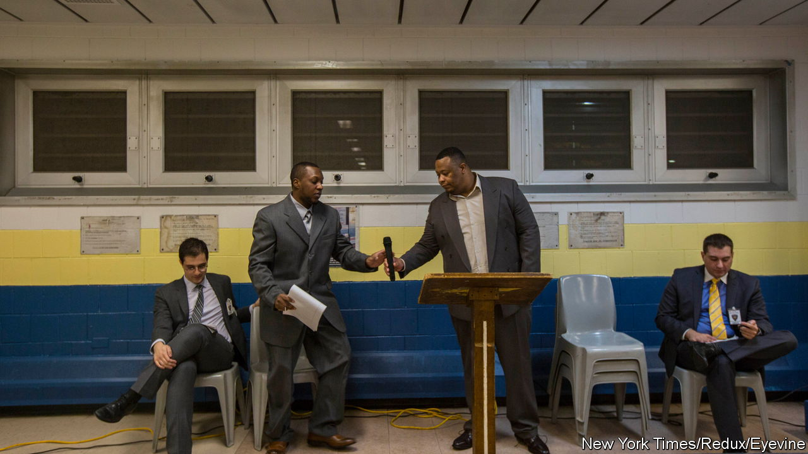

###### Arguing behind bars

# Volunteers teach debating skills to America’s incarcerated 

##### It helps prepare them for life after jail 

 

> Feb 16th 2023 

“ANYONE who’s ever been in a courtroom accused of something knows that the presumption of innocence is an assumption of guilt. That’s the actual way it is,” said Domenick Crispino, bluff and jovial as he spoke from behind a lectern. He knows whereof he speaks. After the word “something” he smiled sheepishly and raised his hand: Mr Crispino, a former lawyer, spent six years behind bars.

Mr Crispino was arguing to retain , which he said helps deter crime and provides an essential incentive to get people to return to court. Whether he actually believed this is beside the point: he was involved in a debating contest on the topic of cash bail, along with another ex-inmate, against two Columbia University students, and a coin-toss determined the position he took.

Mr Crispino works with the Rikers Debate Project (RDP), a group of volunteers who have taught around 1,000 prisoners debating skills over the past seven years. The RPD arranges debates between inmates and former inmates who have taken their classes, and students; it pays ex-inmates $250 per debate. RDP began at Rikers Island, New York City’s biggest jail, but has expanded to other facilities in New York and beyond. At its pre-pandemic peak the project was teaching 12 classes in six states, including Louisiana and Texas. 

The scheme’s goal is to develop prisoners’ critical-thinking and public-speaking skills, which will help them professionally after their release. Hashani Forrester, Mr Crispino’s partner at a debate held on February 13th at Columbia University, praised the programme for giving him “confidence” and enabling him to network.

Mr Forrester, a 41-year-old combat veteran, owns a property business with his siblings and is studying for a bachelor’s degree at New York University. Camilla Broderick, who spent eight months in Rikers and is now studying at Columbia for a master’s in social work, says the “logical arguments and framing devices” she learned have helped her in her studies. And the weekly debating classes seemed more attractive than the alternatives on offer (courses on religion and food safety).

In the end, Messrs Crispino and Forrester narrowly lost their debate to their undergraduate opponents. Six of the 11 judges felt that the students did better in covering the “flow” (a debating term for the array of arguments offered, each of which must be answered in turn). But, says Mr Crispino, a little wistfully, “it was kind of a throwback to those skills I learned years ago, which I haven’t used in a long time.”■


