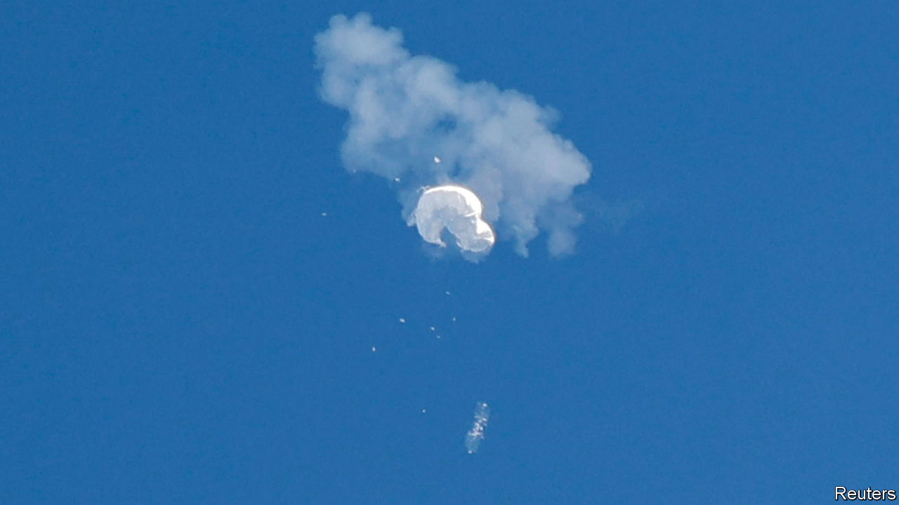

###### Shoot first, ask questions later

# What America has been shooting down in the sky 

##### After much excitement, there is still only one balloon that was up to no good 

 

> Feb 15th 2023 

It turns out that the three unknown objects shot out of the skies by American jets in successive days, after the earlier taking down of a Chinese spy balloon, were neither sent from Beijing nor from another galaxy (as some had suggested). They were probably “benign” and employed for commercial or research purposes.

They came to light after the radars America uses to detect incoming missiles were recalibrated to pick up slower-moving objects at different altitudes. The National Security Council’s spokesman, John Kirby, justified the action by saying that their altitude, lower than the Chinese airship (a more accurate term than balloon), posed a “very real” threat to civilian aircraft. The Federal Aviation Administration, which has responsibility for aircraft safety, may have something to say about that.

The unidentified vehicles shot down came in various shapes and sizes. The one flying over Alaska on February 10th resembled a “small car”; the second, above northern Canada, was a “small metallic balloon with a tethered payload below it”; the last, which came to grief at the hands of an F-16 jet over Lake Huron on February 12th, had an “octagonal structure” with strings. Whether more will be destroyed is unclear. But given that the combined cost of the two AIM-9x Sidewinder missiles fired on Sunday was about $900,000, it could become a rather expensive exercise in futility. 

None of this is to downplay the seriousness of the accusations the Biden administration has levelled against a People’s Liberation Army espionage programme which has targeted security facilities in many countries, notably China’s Indo-Pacific neighbours. On February 14th the Japanese defence ministry said that three flying objects spotted in Japan’s airspace since 2019 were now believed to be . America claims these have flown over 40 countries and five continents. 

Nor is it to take lightly the diplomatic ramifications. China is still sticking to its story that the vehicle, even though its 30-foot payload was crammed with sensors and antennae, was nothing more than an unmanned weather airship that was accidentally blown off course. But as more becomes apparent about its capabilities and purpose from the examination of the wreckage now under way by counter-intelligence officers, the defensive tone has given way to  with hints that an American surveillance satellite might be destroyed in retaliation. On February 15th Wang Wenbin, a foreign-ministry spokesman, said China would “take countermeasures in accordance with the law against the relevant US entities that undermine China’s sovereignty and security”. 

However, it is China that would be in breach of international law as it applies to airspace were it to attack an American satellite orbiting above the so-called Kármán Line, 100km (328,000 feet) above the Earth. Less clear is whether sovereignty applies at all altitudes below the Kármán Line, as there is no generally accepted definition. But even if there is a grey area in higher airspace (probably best defined as what you can get away with without being shot down), 60,000 feet, where China’s balloon was lurking, is not remotely close to it. 

The nascent attempts by both China and America to take a little of the heat out of an increasingly antagonistic relationship now look like being stillborn. The anti-China momentum in Congress has been given a further shove. The House Financial Services Committee, under Republican leadership, has prepared a 17-bill barrage aimed at isolating China’s economic and financial system. Despite Joe Biden’s recently expressed hope that his country and China might still find important areas in which they could collaborate, such as climate change, the hardening mood will make it difficult. There will be more weapons on the way to Taiwan and more high-level visits. The tech freeze will intensify. 

The deepest mystery, since China clearly wanted at least a pause in hostilities, is why it allowed the balloon incident to happen. “The most worrying thing is what this tells us about the Chinese system’s ability to think through and co-ordinate,” says Nigel Inkster, a former senior British intelligence officer who is now a China specialist at the International Institute for Strategic Studies. “Most intelligence services would have worked out that this was not a great time to do something like this. Did no one ask whether this was a good idea?” ■


