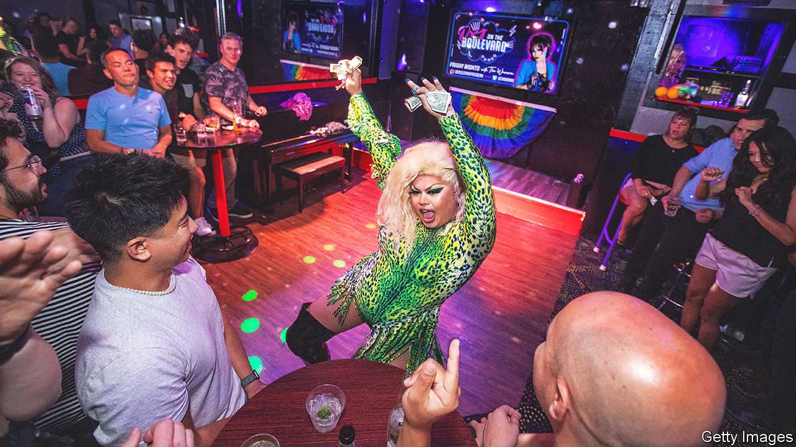

###### Politics in drag

# Why proposed laws targeting drag shows are proliferating in America 

##### A new front has opened up in the country’s culture wars 

 

> Feb 12th 2023 

Last month “”, a reality show, began its 15th season on television. In it, contestants compete in costume to become the next “drag superstar” and win $200,000. Meanwhile, lawmakers across the country are engaged in a different sort of race: to restrict drag performances in the name of protecting children. At least 36 bills in 15 states are proposing rules that would make it harder for people to perform in drag (see map).

 


The drag drama may sound like a sideshow. But it offers a glimpse into lawmakers’ political thinking, the next phase of the culture wars and the way the media (including social media) fuel outrage.

Drag is a form of entertainment in which people dress up in clothes stereotypically associated with the other sex. Long familiar at gay bars, drag has pushed more into the mainstream, in part thanks to the attention spurred by “RuPaul’s Drag Race”. “Drag-queen story hours”, launched in San Francisco in 2015, now take place in libraries across the country. Parents take children to hear books with titles like “Be Who You Are”, read aloud by people in drag. Supporters say the readings promote self-acceptance, diversity and tolerance.

In a recent cameo on “RuPaul’s Drag Race”, Ariana Grande, a popular singer, described drag as “the most infectious and joyous art form that there is”. Conservative politicians disagree, instead finding joy in railing against it. They say drag is inherently sexual and inappropriate for minors. Critics also use drag as a sloppy shorthand for transgender people (whose gender identity does not conform with their biological sex), even though many drag queens are gay men who dress in drag to entertain, and are not trans. 

Some states, including Texas, are seeking to classify any venue hosting a drag show as a “sexually oriented business”, which brings restrictions on where it can be. The goal is to reduce the number of places willing to host drag shows, says Mark Jones, a political scientist at Rice University in Houston. Arkansas is among states trying to prevent public funds from going to drag shows, in response to news that some cities have used taxpayer money to sponsor drag-queen story hours. New York City reportedly spent around $200,000 on them from 2018 to 2022.

The most extreme proposals would stop public drag shows and make it a crime for a minor to see one. In Missouri, North Dakota and Tennessee, exposing a minor to a performance would become a felony, which carries jail time. “I believe that the LGBTQ community and drag queens have the right to assembly, to organise, but they do not have the right to organise with a prurient interest in front of children,” says Brandon Prichard, a legislator in North Dakota who co-sponsored the drag bill. 

Protecting children is a theme of many of the proposals. “We’re seeing a lot of what’s old is new again in this era,” says Logan Casey of the Movement Advancement Project (MAP), a think-tank that supports LGBTQ rights. “Save Our Children” was the name of a political coalition formed in the 1970s by Anita Bryant, a singer and former beauty queen, to fight incipient laws that made it illegal to discriminate against gay people. The drag proposals are also reminiscent of cross-dressing bans that flourished across America from the mid-1800s. Both share a concern not “with clothing per se, but with the power of clothing to signal gender and sexual identities…that challenge conservative religious ideologies”, says Clare Sears, a sociologist at San Francisco State University who has written a history of cross-dressing bans.

The proposals have many flaws—not least vagueness. The way some bills are written, a performance by the pop star Harry Styles, a gender-fluid dresser, would become illegal, as would any historically accurate performance of Shakespeare featuring male actors dressing as women, points out Joshua Matz, a lawyer. West Virginia defines drag and performances in such a way that it would become a crime for a trans person to give a speech or sing at a wedding if even one minor was present, says Mr Casey of MAP. 

“I don’t think any first-class lawyer who specialises in free speech would say that these are constitutional,” says Geoffrey Stone, a First Amendment expert at the University of Chicago, who thinks that “prohibiting these shows cannot be justified on any ground other than people not liking the expression they are communicating.” The First Amendment protects free speech, but has narrow carve-outs for protecting people from obscenity. The test for obscenity includes whether the average person would think it appeals to “a prurient interest”. Some of the proposed laws define drag as appealing to a “prurient interest” for this reason. “It’s like by saying it’s so, they think they can make it so,” says Roberta Kaplan, a civil-rights lawyer. 

The fuss over drag reflects three broader trends. One is that LGBTQ issues have become a prominent battle within the culture wars. As many as 311 anti-LGBTQ bills are pending in statehouses across the country, according to the ACLU, an advocacy group. Public approval for gay rights is at an all-time high, but the backlash is also strong. In its official materials, the Texas Republican Party now calls homosexuality “an abnormal lifestyle choice” and opposes “validating” transgender identities. 

One of the biggest frustrations some conservatives have with Donald Trump is that he “didn’t stand up for traditional marriage” and accepted gay marriage as a “lost” issue which the Republican Party should move on from, says Mr Prichard of North Dakota. The drag bills are a “natural and continuing outgrowth of a desire to suppress and stigmatise LGBT people and the existence of nonconformity”, says Joshua Block, a lawyer at the ACLU. 

Child’s play

The drag bills also point to brinkmanship in Republican states. The party is looking for new culture-war issues beyond abortion. In primaries Republican politicians can speak against LGBTQ people, especially transgender ones, but voters often object to the government pushing into people’s personal lives. Republicans are on safer ground, and more in line with public opinion, if they focus on children rather than LGBTQ adults, says Mr Jones of Rice. A bill to ban children from drag shows is harder for Democrats to attack than one banning such shows entirely. If Republicans can paint Democrats as the party of drag queens, obsessed with peddling gender fluidity, it is a win for them. 

Lastly, the kerfuffle over drag illustrates how the attention economy operates in America. “This is just showing up at the legislatures but has already been in practice going on in conservative media for some time now,” says Mr Block of the ACLU. Fox News has turned drag shows into a prime-time subject. Its most popular host, Tucker Carlson, often gives a platform to guests who rail against “sexualising” children by exposing them to drag. From June 2022 until February 2023, Fox News spent about a quarter as much time covering drag, drag queens and transgender people as it devoted to Ukraine.

On social media, meanwhile, Libs of TikTok, a Twitter account with 1.9m followers, posts mockery about drag queens and trans people. Last June, men believed to be associated with the far-right Proud Boys showed up at a drag-queen story hour in San Lorenzo, California, after Libs of TikTok tweeted about it. One man wore a shirt with an image of an AK-47 and the slogan, “Kill your local pedophile”. 

In November the Department of Homeland Security warned of the “persistent and lethal” threat of domestic attacks, including on gays. That was soon after a man in Colorado Springs shot up a gay bar, where a drag show was wrapping up, killing five people. According to Maxi Glamour, a drag queen who lives in Missouri and recently testified against the state’s proposed bill on drag, “I’m now asked if I have security at my events, because queer people are afraid to leave their homes.” ■


