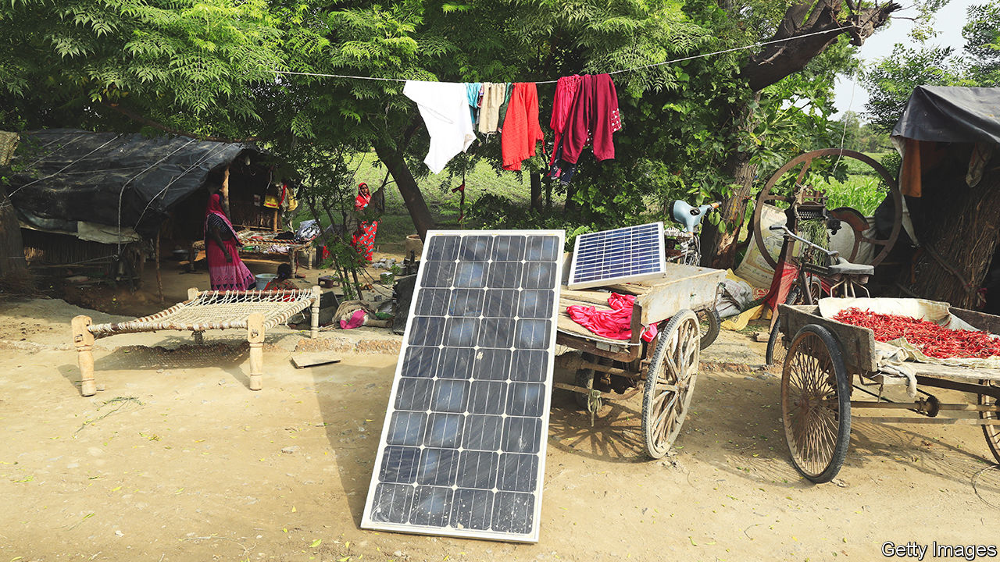

###### Renewable energy

# India’s solar power rollout is flagging 

##### Protectionism is choking the supply of solar panels 

 

> Feb 23rd 2023 

WHEN OLAF SCHOLZ meets Narendra Modi in Delhi this weekend,  will be at the top of the agenda. In Berlin last May the German chancellor committed €10bn to help India meet its ambitious goal of generating 500GW of power from non-fossil-fuel sources by 2030. India’s prime minister will have some impressive progress to regale Mr Scholz with. Renewable sources now make up 121GW of India’s 411GW of power-generation capacity, up from 113GW when the two men met in Berlin. 

Yet there is a significant blot on this progress. By the end of 2022, India had installed a total 63GW of solar-power capacity. That represented a 14GW increase over the year, but was far short of the government’s 100GW target. Given , this was ominous. Of India’s 500GW goal for 2030, 280GW is expected to come from solar.

Most of the shortfall is in panels mounted on rooftops, which the government envisages will account for 40% of total solar generating capacity. Even as the growth of overall capacity has accelerated, rooftop installation has slowed. Just 8GW of India’s solar-power generation is small-scale, and most of it is atop offices and factories, which pay higher rates for grid electricity, as opposed to residences.

Three factors discourage Indians from topping their homes with sun-soaking panels. The first is that most Indian cities, whose residents are likeliest to have the requisite cash and technological know-how, already have reliable grid power and many demands on rooftop space. Urban rooftops tend to be crowded with satellite dishes, water-tanks and other paraphernalia, or used as social spaces. Or landlords may build extra rooms on them. 

A bigger obstacle is a shortage of suitable financing for small-scale renewable-energy installations. A 5kW solar unit, sufficient to power most homes, costs at least 250,000 rupees, or about $3,000. And yet the average monthly household electricity bill in Mumbai, an expensive city, rarely exceeds 5,000 rupees. Without attractive financing, Indian households have insufficient incentive to go green. And energy companies also have too little incentive to promote rooftop solar. It works on the basis of “net metering”, whereby the value of the electricity a rooftop unit supplies to the grid is deducted from the household bill. And since the households likeliest to install panels are those paying the highest bills, utilities tend to consider this arrangement a net loss. 

Central and state governments are experimenting with ways to realign the incentives behind rooftop solar. Haryana, a small state next to Delhi, requires new buildings to get a portion of their electricity from it. In Jharkhand, a poor eastern state, the government is considering topping up the central government’s subsidies for rooftop solar to make it free for low-income households. India is developing a bouquet of such policies, says Ashwini Swain of the Centre for Policy Research, a think-tank in Delhi. “If all materialise, we will probably overshoot the target.” 

If that proves optimistic, it will probably be because of another bottleneck: protectionism. To boost domestic manufacturing, the government slapped a 40% import tariff on Chinese panels and decreed that panels used in most solar projects be sourced from an “approved list” of Indian panels and panel-makers. Reducing India’s reliance on China in this area seems prudent. And having robust domestic production, says Nandita Sahgal of ThomasLloyd, an investment company with 434MW of solar fields in India, might make it easier “to have the capacity of installation that India is projecting”. Yet, for now, domestic output is not keeping pace with demand.

To supply solar projects that have been approved with domestic panels would take seven years, the minister of power, R.K. Singh, said earlier this month. “But we can’t wait seven years.” The government therefore relaxed its procurement rules for two years. That will allow imports of panels from South-East Asian countries with which India has a free-trade agreement. But the tariff on Chinese panels remains. ■


