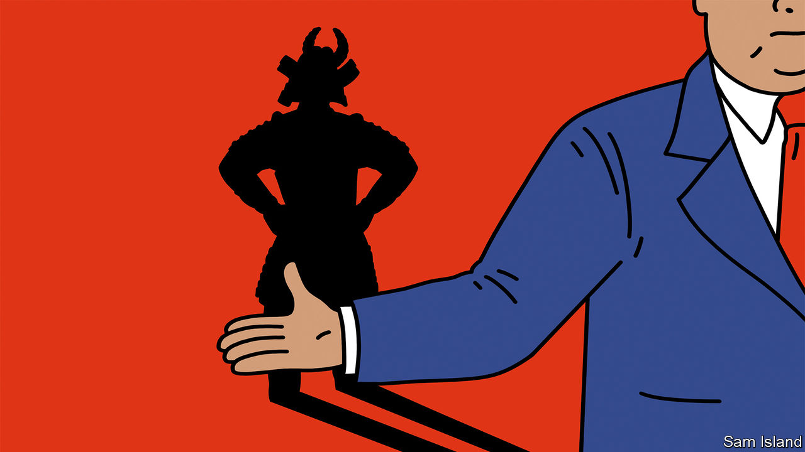

###### Banyan

# Keeping up with the Tokugawas 

##### The new shogun reflects on family history and Japan’s looming social change 

 

> Feb 23rd 2023 

If not for , Tokugawa Iehiro might be running Japan. Instead, the new head of one of Japan’s most eminent dynasties, which ruled from 1603 to 1863, spends his days overseeing its relics at a spacious stone compound down a side-street in  Yoyogi-Uehara neighbourhood. The shogun greets Banyan in fluent English, with no ceremony and a warm smile.

Mr Tokugawa, who took over from his father last month in the dynasty’s first succession for over half a century, cuts an incongruous figure at the head of a family perhaps best known for barring its subjects from travelling abroad. He is a consummate internationalist, who grew up partly in New York and completed master’s degrees at the University of Michigan and Columbia University. He is a prolific translator of books, from tomes on China to polemics by George Soros. Mr Tokugawa worked for years at the United Nations, including in Rome and Hanoi, where he met the Vietnamese woman who became his wife. 

The Tokugawas wield no formal political power now. (Mr Tokugawa ran for a Diet seat with a liberal opposition party in 2019, but lost.) The 19th shogun’s main role is to shepherd the family legacy. Artefacts need cataloguing and preserving. But his most important task is shaping the public’s understanding of Tokugawa history. “The image of the Tokugawa is malleable and changing over time,” says Isoda Michifumi, a historian. That image continues to influence how Japanese see themselves—and how the world sees Japan. 

The first Tokugawa shogun, Ieyasu, came to power amid civil wars. He and his successors introduced a strict class structure and a complex system of internal control that sidelined the emperor and kept the peace between Japan’s many , or local lords. But by the time Matthew Perry sailed America’s black ships into Japanese ports in 1853, lower-ranking samurai and commoners were bristling at their lack of opportunity. Fearful also of ending up under the thumb of technologically superior Westerners, they banded together and “restored” the emperor to bring an end to Tokugawa rule. 

Several narratives of the Tokugawa period have since emerged. One defines the period in terms of its purported backwardness—Japan as  or closed country, cut off from the world. Another sees the era as a dark age of oppressive “feudal” rule under the samurai sword. For some of the ultra-nationalists who led Japan to disaster in the second world war, the shogunate represented an unspoilt state, a manifestation of the Oriental spirit before the arrival of Western modernity. 

To Mr Tokugawa, many of these ideas reek of myth. Contemporary historians challenge the notion that the Tokugawa period was entirely closed (even the term was a translation of a German observer’s description in the early 19th century). A brisk trade continued with Chinese and Koreans and also Dutch merchants stationed in Nagasaki. “Japan was controlling traffic,” Mr Tokugawa says, “but we didn’t cover our eyes, or our ears, like the monkeys of Nikko,” referring to a famous carving at the temple where Ieyasu is entombed. 

Yet perhaps the most misleading myth has to do with change. When contemporary observers invoke the old trope of Japan as unchanging and stuck, it is often images of Tokugawa traditionalism or isolationism they draw upon. That misses the dynamism within the superficially static Tokugawa era. It was in fact a time of remarkable social change, when great cities grew and mass culture flourished thanks to a vibrant merchant class. Even Tokugawa ideas, the political philosopher Murayama Masao once wrote, “could be seen as developing unceasingly toward modernity”. 

Today, too, change in Japan is of the Tokugawa rather than the Meiji sort, bubbling away under the surface. It is often obscured by the grey-haired men in leadership positions, thanks to Japan’s stubborn seniority system. “Change happens in due course, with the changing of the guard,” says Mr Tokugawa, who is a relative youngster at 58 years old. 

Such a shift may be coming soon. Shibusawa Ken, a descendant of a great Meiji-era reformer and an adviser to the government, speaks of a “clay layer” of older managers and leaders who came of age during the post-war period, and whose passing will reveal a different Japan beneath. Mr Tokugawa illustrates it. “He is a person with a new Japanese mindset, but from an old family,” Mr Isoda says. “He’s not the Japan of the past, he’s the Japan of the future.”■


