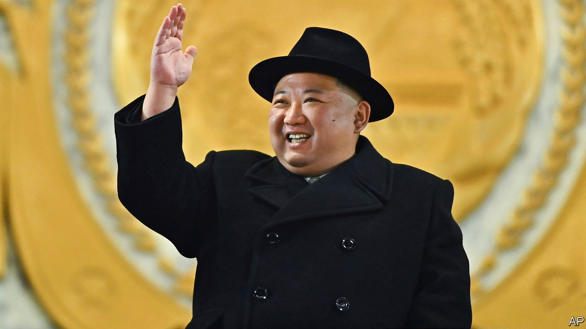

###### Crypto-heist

# North Korean hackers stole a record $1.7bn of crypto last year 

##### Investigators are getting better at cracking the hackers 

 

> Feb 22nd 2023 

Few forms of celebration are as close to literally burning money as fireworks and missile tests. And for North Korea, a great fan of both, the more it burns the better. It launched more than 95  in 2022, a new record. And it loves above all to splurge on the biggest, showiest rockets, like the intercontinental ballistic missile it fired eastwards into the sea on February 18th.

Despite being unable to feed its people, North Korea has found innovative ways to fund its missiles programme, including by forging foreign currency, committing insurance fraud and making and selling arms and narcotics. A more novel revenue stream is stolen cryptocurrency. Last year its hackers pinched a record $1.7bn of the stuff, according to a report published this month by Chainalysis, a data firm based in New York.

Some of North Korea’s hacking thefts were eye-wateringly big. Last March it ripped off a cross-chain bridge, a method for moving cryptocurrency from one coin’s blockchain to another, associated with the game Axie Infinity. At the time it was discovered, the stolen currency was worth more than $600m, making it the second-biggest crypto-theft ever. 

But as with all heists, the robbery is just the first step. To launder their loot North Korean hackers employ all sorts of tricks, including splitting up the money, moving it between different crypto-wallets, converting it into different coins and putting it through mixers—large digital pools where crypto owners can deposit funds to obscure their origins.

Some of the stolen crypto was put to direct use. In 2022 two South Koreans, including an army captain, were arrested on suspicion of selling secrets to the North in return for bitcoin. But North Korean hackers mostly try to turn the loot into hard cash, either through a broker or more commonly through a centralised exchange. The fiat currency obtained is then used to purchase items through established procurement channels, run through front companies and North Korea’s embassies abroad.

Most of the hacking-and-laundering operation is visible to expert eyes, however. “This isn’t happening in some shadowy corner of the world,” says David Carlisle of Elliptic, another blockchain-analysis company. “It’s happening in public on the blockchain.” This helps investigators trace funds and understand hacking methods—and they are getting better at doing both.

America has blacklisted crypto-wallets associated with North Korean hackers. In May it targeted Blender.io, a mixer used in the Axie Infinity hack. In September American investigators recovered $30m of cryptocurrency stolen in that hack. Given a  of cryptocurrency after the heist, that represented about 10% of the total. On February 16th Norwegian authorities seized another $5.8m.

But countries should adopt more stringent measures, argues Allison Owen of the Royal United Services Institute, a London-based think-tank. “Most hacks begin with relatively unsophisticated phishing attacks. Better regulation of the industry and cyber-hygiene could help prevent them.”

The crypto industry is meanwhile getting better at policing itself. On February 14th two centralised exchanges, Binance and Huobi, froze $1.4m of cryptocurrency associated with a North Korean hack.

The hackers are also adapting and improving. “It is a bit of a game of whack-a-mole,” says Mr Carlisle. Even if North Korea’s hackers could actually lay their hands on only a fraction of the $1.7bn they stole, it would all be worthwhile, notes Dennis Desmond, a former American intelligence officer who now teaches at the University of the Sunshine Coast in Australia. “It’s all free cheese,” he says.

Mr Desmond foresees a continuing “arms race” in theft and counter-theft capability between the hackers and crypto-crimefighters. If the crimefighters could only get the upper hand, it might help to slow the actual arms race, illuminated by a blaze of ballistic missiles, taking place on the Korean peninsula. ■

