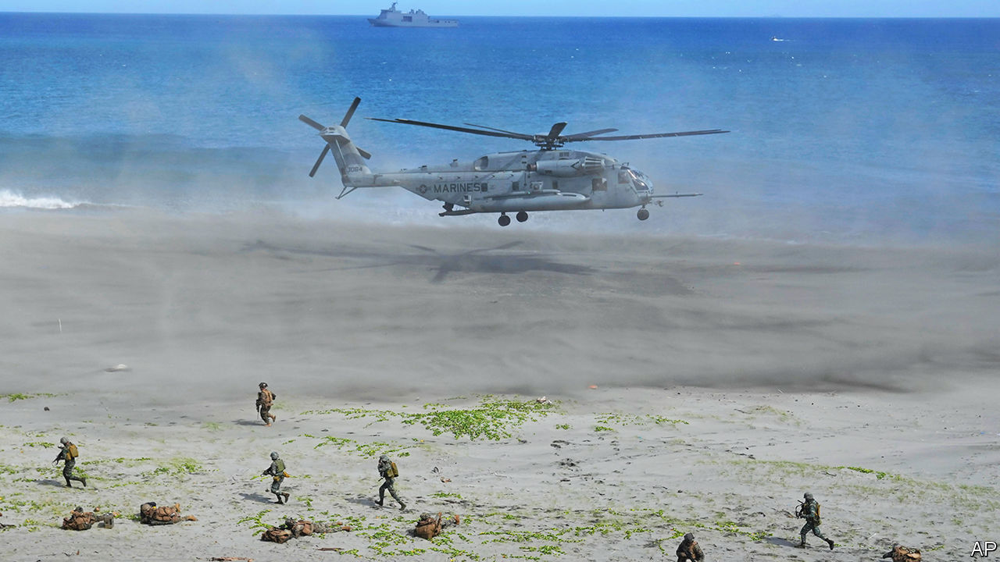
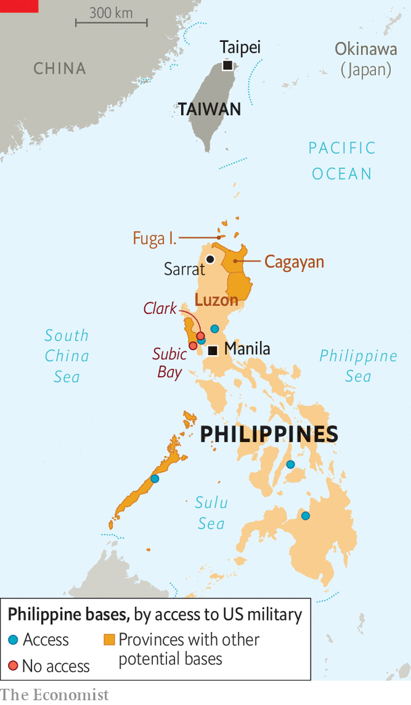

###### The indispensable archipelago

# The Philippines’ proximity to Taiwan makes it central to Western strategy 

##### America has secured access to nine military bases in its former Asian colony 

 

> Feb 21st 2023 

AmONG the ways in which great-power competition is reordering , a new Western focus on the Philippines stands out. The archipelago country of 115m people is not rich, spends little on defence and was until last year led by an anti-American populist. Yet Rodrigo Duterte’s successor, , has returned the Philippines to its usual pro-Western posture. And with Taiwan on its doorstep, its location and long-standing ties to America have made the country central to Western strategy. As sparring between China and America grows nastier, officials in Washington say the Philippines has become as prominent in their security debates as any Asian country save China itself. 

In February, during a second visit to Manila by America’s secretary of defence, Lloyd Austin, the Philippines announced a deal to allow American forces use of four, currently unspecified, military bases. Building on a previous agreement, the Enhanced Defence Co-operation Agreement (edca) of 2014, this gives America access to nine Philippine bases in all. The country’s two biggest bases, Clark and Subic Bay, are not expected to be among them. Yet, significantly, the new pact will probably include two coastal bases in the northern province of Cagayan, less than 400km (250 miles) from the coast of Taiwan.

 


That makes them the closest possible launch-pad to the disputed island for American and allied forces, apart from one or two far-flung Japanese island bases, which would be harder to defend and supply. “New EDCA locations will allow our forces to respond rapidly to shared challenges in the Philippines as well as across the Indo-Pacific region,” says a Pentagon official. Other American allies are also investing in their relations with the country, including especially Japan, which sent two fighter jets to it for joint exercises late last year. It was the first time Japanese military planes had landed in the Philippines since the second world war.

America has dense ties with its former colony, underpinned by its large Filipino diaspora and elements of common culture. Filipinos are solidly pro-American. Even under Donald Trump, whom they strongly disliked, around 80% had a positive view of the superpower. America’s promise of protection, under the terms of a mutual-defence treaty the two countries signed in 1951, is also popular. In 2019 America ended decades of strategic ambiguity by confirming it would come to the Philippines’ aid if its vessels were attacked. On the day the enlarged basing deal was announced, America said it would restart joint patrols with its ally in the South China Sea. 

The two countries have co-operated on security sporadically. The Philippines acted as an American logistical rearbase during the war in Vietnam and hosted American troops during the cold war. Subic Bay was at one time the biggest American military base outside America. In the early 1990s, a surge in Philippine nationalist sentiment led to America’s forces being banished from it and Clark base (named after an early American aviator, Harold M. Clark). Yet, a decade later, the 9/11 terrorist attacks ushered in a fresh burst of co-operation. Up to 1,300 American troops joined the fight against Islamist separatists in the southern Philippines. By reinvigorating military ties between the two countries, Operation Enduring Freedom - Philippines, as the effort was called, was one of the more useful bits of the war on terror.

Mr Trump and Mr Duterte, who viewed China as a more reliable and lucrative partner, jeopardised that progress. In 2020 Mr Duterte threatened to end the two countries’ Visiting Forces Agreement, which permits American troops in the Philippines. Mr Trump welcomed this as an opportunity to “save a lot of money”. Yet Mr Duterte’s threat, later abandoned, proved to be a “crystallising moment” for the defence and foreign-policy establishments in Washington and Manila, says Gregory Poling of the Centre for Strategic and International Studies, a think-tank in Washington. They considered the relationship to be both important and undervalued. Mr Marcos, the son and namesake of a former dictator and American proxy (who fled to Hawaii after he was ousted in 1986), has turned out to be unexpectedly supportive of that view. 

Despite sharing Mr Duterte’s desire for closer economic relations with China, he has proved a far more willing American security partner. Expanded Chinese drills around Taiwan last year, which brushed against Philippine territory, have encouraged him. “It’s very hard to imagine a scenario” where the Philippines could stay out of a war over Taiwan, he recently said. The Biden administration has pushed to seize the opportunity this represents. Last year it helped negotiate the sale of a bankrupt shipyard at Subic Bay—which two Chinese companies had expressed interest in buying—to an American private-equity firm, Cerberus Capital Management. The administration has also so far agreed to pay $82m to upgrade the infrastructure at five Philippine bases.

In October it provided Mr Marcos’s government with $100m in military funding, in part to help “offset” losses from an agreed 12bn-peso ($227m) purchase of Russian helicopters that it cancelled after Vladimir Putin invaded Ukraine. Under threat of Western sanctions, it had little alternative. Yet when compared with Mr Duterte’s former efforts to cosy up to Mr Putin, whom he once described as “my favourite hero”, the cancellation looked like further evidence of a pro-Western tilt.

The West has broadly welcomed it. Security co-operation between Japan and the Philippines has reached “a turning-point”, says Kiba Saya of Kobe City University of Foreign Studies. Beyond last year’s exercises, Japan has supplied a dozen patrol vessels to the Filipino coastguard. During a visit this month to Tokyo by Mr Marcos, the two countries signed a deal making it easier for Japanese forces to deploy to the Philippines on humanitarian missions. Mr Marcos said a trilateral security pact, also including America, was under discussion.

Poland in the Pacific

Australia, the only other country to have a Visiting Forces Agreement with the Philippines, has stepped up security co-operation. On February 22nd the two countries’ defence ministers met in Manila to discuss conducting joint patrols in the South China Sea. Earlier this month Britain and the Philippines held talks in Manila on maritime law enforcement. Last month France and Germany said they were willing to conduct trilateral maritime patrols with the Philippines. Canada has offered it investment and aid and hopes to sign a first defence framework with it by June.

If America and China came to blows, little would be expected of the Philippines’ 140,000-strong armed forces. They are not equipped to first-world standards and largely focused on counter-insurgency operations. Yet playing the logistical-support role Western strategists envisage would still carry great risks for the Philippines, notes a retired Filipino general. The threat of war with NATO has made Poland’s eastern border an uncrossable line for Russia, even as Poland performs a similar role for Ukraine. By contrast, if China were already engaged in a war with America, there would be no fear of it provoking one by attacking the Philippines.

The country’s constitution forbids foreign troops from being permanently stationed on its territory. America’s will therefore be rotated through the bases available to them. Mr Marcos’s government may also be wary of taking Filipinos’ pro-Americanism for granted; foreign troops are often unpopular. Sensitive to such concerns, Pentagon officials stress the multifaceted nature of America’s commitment—they are as keen to talk up typhoon response as Taiwan. Ahead of the two countries’ annual “Balikatan” (“shoulder-to-shoulder” in Tagalog) military exercises in April, America will build a clinic in the northern town of Sarrat.

Yet such baubles are nothing to the economic contribution of China, the Philippines’ biggest trade partner. And Mr Marcos hopes to retain it. The president visited Beijing in January and was rewarded with $23bn in investment promises, including in sectors such as energy, on which the Philippines until recently placed foreign-ownership restrictions.

During last year’s Balikatan exercises, American troops staged an amphibious landing in Cagayan province. Chinese firms have proposed an array of projects along the surrounding coastline, including a “smart city” costing $2bn on nearby Fuga island. Filipino security experts protest when provincial governors wave through such projects. Cagayan’s governor, Manuel Mamba, meanwhile opposes the joint military exercises on the basis that they might scare away Chinese investment.

It is a reasonable concern. Chinese and Japanese investment has played a big part in raising the Philippines’ growth rate—to 7.6% last year. Yet Mr Marcos is in a bind. China’s near-constant bullying in the South China Sea “pushes us into a situation where we have a deeper military alliance with the US”, says Jose Manuel Romualdez, the Philippines’ ambassador to America. That, in turn, has made the country’s economic reliance on China less straightforwardly positive. Chinese firms own 40% of the Philippines’ electrical grid and much of its telecoms infrastructure. Equipment provided by Huawei, a Chinese telecoms giant, is allegedly being used in some of the military bases to which America has been granted access.

Maintaining the Philippines’ growth spurt will require more than such investment: it requires peace. And peace in the South China Sea, as Mr Marcos seems to have concluded, will depend on America and its allies maintaining an effective deterrence against Chinese aggression. ■

