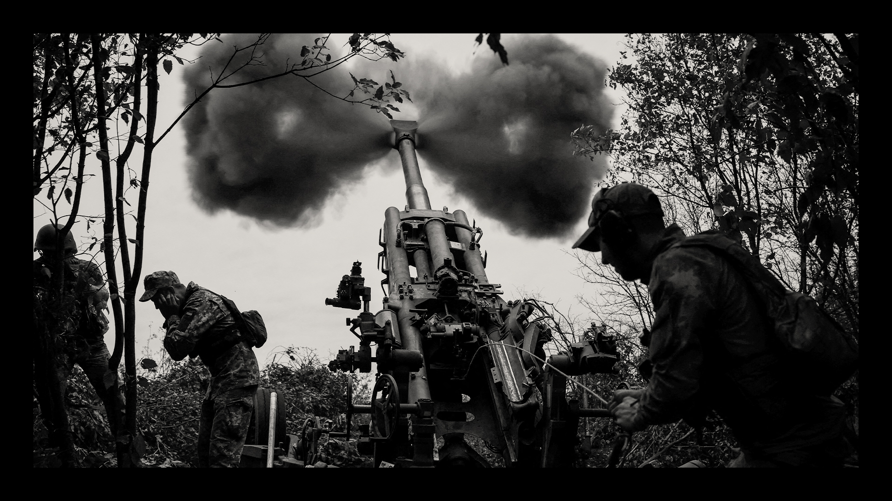
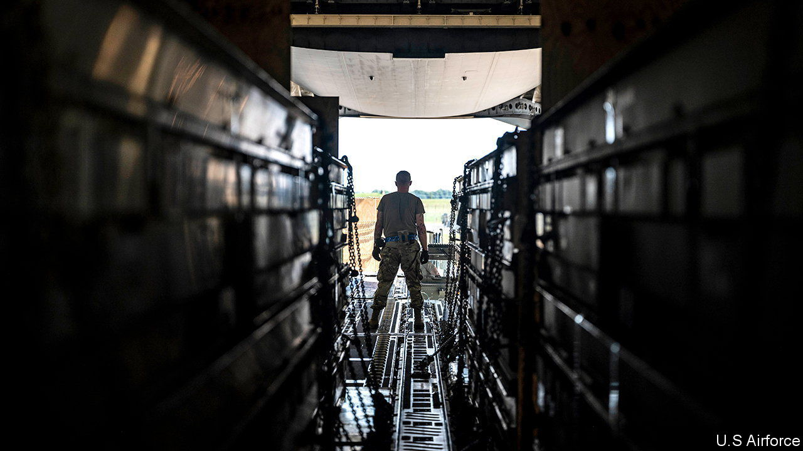

###### A year of war: Keeping the guns blazing

# The West is struggling to forge a new arsenal of democracy 

##### Production of weapons is set to increase, but it may be too slow for future conflicts as well as for Ukraine 

 

> Feb 19th 2023 


“IAM A bomb technician,” reads the t-shirt draped over a chair at Scranton Army Ammunition Plant in Pennsylvania. “If you see me running try to keep up.” In fact, it is the bomb technicians who are scrambling to keep up, as America transfers huge quantities of munitions to , for use in the . The factory in Scranton makes the steel casing of M795 155mm howitzer shells, of which America has given Ukraine more than 1m over the past year. But even such prodigious quantities of ammunition are not enough: Ukraine is firing roughly as many shells in a month as America can produce in a year.

The process of making shells is quite involved. Thick, 20-foot long solid steel cylinders are first cut into stubby billets. They are then heated in a furnace to 2,000°F (more than 1,000°C), extruded into longer cylinders, cooled and hollowed out. One end is “nosed” into a precise cone shape—a process that Rich Hansen, who supervises the plant for the army, likens to cutting the top off a Coke can and squeezing the remaining part into a narrow point without leaving a single crease. Any imperfections, he notes, would cause the projectile to veer off target. 


Once painted, the finished shells are loaded onto lorries and trains, and taken to another army facility in Iowa, where they are filled with explosive. All told around a dozen components from roughly as many places go into a finished, ready-to-fire howitzer round. Galvanising this supply chain to produce much bigger quantities of shells is proving surprisingly difficult.

Like generals, military planners always fight the last war. The last wars the West fought were against Iraq, the Afghan Taliban and Islamic State. The first was against a middling military power that was utterly outmatched in terms of technology and tactics. The others (including the aftermath of the second war in Iraq) were counter-insurgencies. They were not wars between countries with remotely comparable military capacities, much less big defence industries.

For at least the past five years, military planners have paid lip-service to the growing possibility of such a conflict in the future, with a revanchist Russia in Europe or in the Pacific with a China attempting to invade Taiwan. But it has not been reflected in either the stockpiling of essential munitions or the investment in the industrial capacity required to produce them at the rate that any war lasting more than a few weeks would demand. 

The fighting in Ukraine has come as an unpleasant reminder that high-intensity warfare, which the West has not really experienced since 1945,  at an extraordinary rate. A similar lesson had to be learned in the first world war, when the French faced shortages of shells after only six weeks and the British and Germans soon after. This munitions crisis led to the fall of the British government in 1915. As Hew Strachan, a historian, has observed, what started as a military problem quickly became an industrial and then a political one. 

With both Russian and Ukrainian forces dug in, the war over the winter has settled into an artillery duel. The Ukrainians reckon that they are on the receiving end of about 20,000 shells and rockets a day. They have managed to maintain a barrage of about 5,000-6,000 most days—similar to the annual procurement of a smaller NATO member before the war—although the blitz may be diminishing as both sides seek to conserve ammunition.

Ukraine, having probably burned through most of the 152mm and 122mm shells used by their Soviet-era artillery, is now relying increasingly on nato countries for both 155mm shells and the guns to fire them. But the stocks held by its Western allies from which it has been supplied up until now are rapidly becoming depleted. America has started sending shorter-range 105mm howitzers and shells to make up for the shortfall in larger calibre rounds.

Ukraine will soon be dependent on what the American and European arms industries can manufacture (plus a few shells scrounged by America from allies in Asia, such as South Korea, which has a sizeable arms industry but strict export rules). Currently, America can make about 180,000 155mm shells a year, while Europe, according to Bastian Giegerich of the International Institute for Strategic Studies, a think-tank, produced about 300,000 last year. All told, that amounts to barely three months’ consumption for Ukraine. 

Shell signal

The warning signs have been flashing for years. In 2011, during a bombing campaign against Libya, European countries ran out of precision bombs within weeks and had to be resupplied by America. During the campaign to push Islamic State out of Iraq and Syria, America ran worryingly low on smart bombs.

Francis Tusa, the editor of , a newsletter, thinks NATO’s European members probably have only 10% of what would be needed for even the early stages of a war in Europe. He estimates the cost of building up Germany’s stockpiles to cover 30 days of high-intensity warfare would be €20bn ($21bn). Olaf Scholz, Germany’s chancellor, has pledged to spend  on defence in the coming years, but none of it has been earmarked for munitions. 

Part of the problem is a tendency, among both politicians and soldiers, to prioritise purchases of “platforms”, eg, ships and planes, over the munitions that they fire. “You can’t buy nine-tenths of a ship,” says Eric Fanning, a former Pentagon official now at the Aerospace Industries Association, a lobby group, “But you can buy nine-tenths of the number of missiles you need.” Munitions thus become the “bill-payer” of weapons procurement, explains Stacie Pettyjohn of CNAS, a think-tank. 

Big American and European defence contractors tend to sell to just one buyer: their home governments. “When I walk into a hardware store I am always going to be able to buy a hammer because there are lots of customers for it. But in the defence industry, when the government stops buying something, it disappears,” says Mr Fanning. 

Even for weapons still in production, arms manufacturers gear their capacity to what they expect to be asked to make. “The US defence industrial base is scoped for maximum efficiency at peacetime production,” says Jim Taiclet, the boss of Lockheed Martin, America’s biggest defence conglomerate. That means, in effect, that contractors usually have the capacity to make munitions only at the pace needed to replace those expended in training.

Western governments and defence contractors are now scrambling to increase their output. The rush has echoes of the early days of covid-19 when countries found they had hardly any reserve stocks of protective clothing or ventilators. Unfortunately, it takes a bit longer to set up production lines and supply chains for weapons than it does for rubber gloves and face masks. Doug Bush, the US army’s acquisition chief, says the Pentagon has learnt from the experience of the pandemic to issue contracts with unprecedented speed and give industry a clear “demand signal”. Congress, meanwhile, has authorised greater use of multi-year contracting to give firms more certainty about that demand. However, until now, such contracts have been used mainly for expensive planes, ships or tanks, not the munitions they fire. Money is also being spent on clearing production bottlenecks.

Explosive growth

As a result of such efforts, says Mr Bush, production of Stinger shoulder-fired surface-to-air missiles will increase six-fold (from very low levels); that of  (anti-tank weapons that helped to halt the Russians’ initial offensive) will double; ditto for , which have also proved their effectiveness in Ukraine, destroying arms dumps, command posts and barracks far behind the front lines.

Output of 155mm shells will triple and possibly increase six-fold, to over 1m a year, as the Pentagon sets up another production line in Texas and issues contracts to a firm in Canada. But much of the extra capacity will not be available until 2024 or even 2028. “I think the American economy is capable, and knows how to do this,” declares Mr Bush. “It’s simply a matter of time. It’s not a new thing. Industrial mobilisation in world war two and the Korean war also took time.”

A similar process is under way in Europe. Armin Papperger, boss of Germany’s Rheinmetall, says his firm can quickly lift production from 70,000 to 450,000 shells a year or more, having recently agreed to buy Expal Systems, a Spanish ammunition producer. Rheinmetall is also setting up a new munitions plant in Hungary. CSG, a Czech arms manufacturer that produced 100,000 shells last year, is hoping to boost its output to 150,000 this year. A Norwegian firm, Nammo, could also increase production. Former Warsaw Pact countries are even toying with reopening factories to make 152mm munitions, so Ukraine can keep using its Soviet artillery. 

But for all the talk of urgency, European governments have not been signing many procurement contracts. Mr Papperger has said he is prepared to “pre-finance” some of the investment required to accelerate production of shells and missiles, but there are limits to what private companies will do without firm orders. 

Ukraine, meanwhile, needs weapons now, both to fend off a Russian offensive and to launch one of its own. Shells are the most pressing requirement, but the rapid depletion of guided munitions, particularly Javelins and Stingers, may cause even greater problems in future. Even at newly accelerated rates of production, according to Mark Cancian of the Centre for Strategic and International Studies (CSIS), an American think-tank, replacing the 8,500 Javelins that Ukraine has received will take nearly seven years. As for Stingers, Ukraine has already received as many (1,600) as all buyers bar America over the past 20 years. The Pentagon will probably order more advanced alternatives instead of Stingers for itself, but to replace those used in Ukraine would take more than six years.

 


The root of the problem is the fragility of the defence industry. Both in America and in Europe, the state of the supply chain can be surprisingly opaque, even to prime contractors making the weapons and government departments ordering them. The difficulties often lurk in the second and third layer of suppliers. They are often highly specialised but small enterprises. The barriers to entry for new firms are high because of the exacting certification required to provide equipment to the armed forces and other peculiarities of doing business with defence ministries. This means that particular widgets in weapons are often made by only one firm, raising the risk of a breakdown. Bottlenecks include shortages of labour, semiconductors, tools, sub-components and more. 

For old technology, such as 155mm shells, the main obstacle to increasing production is brute industrial capacity—notably the machinery required to forge and machine shell casings. There is also a need to boost the supply of explosives: IMX-101, which is made at only one factory in America, and TNT, which is imported.

For guided munitions, meanwhile, the multitude of components makes for many potential constraints. A shortage of just one or two parts can hold up production of an entire type of weapon. If the maker of a simple bracket goes out of business, a new supplier must be certified and its product tested for compatibility. Chips for weapons—often requiring the ability to withstand extremes of heat, humidity and vibration—are a perpetual headache. The problem is not usually the most advanced semiconductors, but older chips that may have gone out of production. “There is no drop-in replacement,” notes a Pentagon official. Increasing production of the Stingers, for instance, required a redesign of parts of the missile so that it could use newer chips.

Of particular concern among missile-makers is the shortage of rocket motors. Only two firms in America make engines for small missiles. One is a subsidiary of Northrop Grumman. The other is Aerojet Rocketdyne, which has been the object of several takeover bids and which Greg Hayes, boss of Raytheon, a big arms manufacturer, describes as a “weak link” in the supply chain. Establishing an alternative supplier could take years, however. Rocket propellant is yet another worry.

Bill LaPlante, the Pentagon’s under-secretary for acquisition, says America will increasingly have to think of including surge capacity when it buys weapons. “We have to be comfortable with the fact that what we may be building may not be used.” Industry executives note that, with foresight, it is cheaper to store tools than to build them anew. In the end, though, the capacity to surge will come at a cost; maintaining the ability to build weapons quickly tomorrow means having more expensive ones today.

Mr LaPlante also wants the industry to adopt more standardised, modular designs to allow a plug-and-play capability akin to consumer electronics. Most precision weapons, he notes, have three main elements: a sensor to detect the target; a command-and-control system, be it an algorithm or a “man in the loop”; and an “effector”, ie, a warhead or other device to destroy the target. If the interfaces between these can be standardised, the components can be swapped easily as weapons are improved or new ones developed.

A third way to enhance greater resilience is for America to work more closely with allies, Mr LaPlante says. They could co-operate in setting common standards, produce weapons in more than one country and develop new ones jointly. Australia, for instance, will work with America and Britain to develop hypersonic missiles, and is thinking about making munitions for the HIMARS launchers it is buying. Industry insiders say Norway’s Nammo could become a third source of rocket motors for America.

But standardisation and joint procurement are hard, all the more so when they are attempted across national borders. NATO has been banging the drum for it for as long as anyone can remember. The European Defence Agency was set up in 2004 to boost collaboration among European Union members. But it has no authority, and must rely on persuasion. Only about 18% of EU defence procurement is collaborative. 

Defence firms competing for business want to preserve their distinctive technologies; countries, in turn, want to protect what they see as national champions. Although grateful for weapons wherever they come from, Ukraine is having to cope with a mix-and-match arsenal in which every incompatibility adds to logistical complexity. “We are exporting our fragmentation to Ukraine,” notes a European defence minister. 

If state-on-state wars were simply a contest between the industrial capacity of the antagonists, the economic might of Europe and America should be adequate to cope with foes such as Russia or, should it come to that, China. Russia’s economy is smaller than Germany’s even after adjusting for the cost of living. The EU and America together easily outstrip China. But liberal democracies take more time to put their economies on a war footing than authoritarian regimes and are much more reluctant to do so.

Russia’s armament factories are not waiting to negotiate contracts with the Kremlin; they are already working round the clock. Sanctions may be impeding them from buying the microprocessors needed for precision munitions (hence reports that allies of Russia, such as Kazakhstan, have been taking huge orders for Western domestic appliances to strip them of their chips and pass them on to Russian arms firms), but few would bet against Russia scraping together enough shells for the next offensive and the one after that. Mr Putin no doubt subscribes to Stalin’s dictum “quantity has a quality all its own”. 

As for China, over the past 20 years it has been building up the world’s largest stockpile of precision-guided land-based missiles. It wants to prevent American sea and air forces, particularly carrier groups, from coming to Taiwan’s rescue during a Chinese blockade or invasion. To counterbalance the Chinese arsenal, America would need large stocks of long-range precision missiles of its own, to threaten Chinese naval forces from beyond the range of China’s formidable air defences. 

These are not the sort of weapons being sent to Ukraine, so the effort to help one American ally is not jeopardising the security of another. But America still does not have nearly enough of them. CSIS has modelled a conflict with China over Taiwan in which America exhausts its inventory of long-range anti-ship missiles in less than a week. This year the Pentagon is planning to buy just 88 such missiles. It currently takes two years to produce most of the relevant munitions, Seth Jones of csis notes—and that lead time is for the delivery of the first missiles, not the last ones.

Would China, too, have trouble staying in the fight? It has a vast manufacturing capacity and little compunction about bossing private firms about, let alone state-owned enterprises. It also has the advantage of deciding when an invasion would occur. 

Wars are won or lost for all sorts of reasons. Leadership, tactics, morale, logistics and technology all play their part. But running out of ammunition before the other side is never a winning strategy. ■

Photo: Reuters


