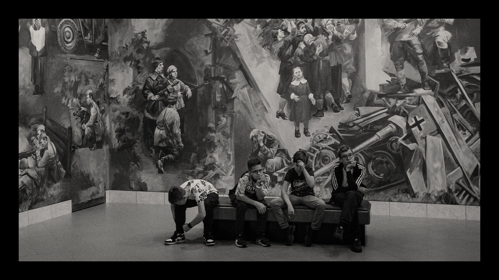
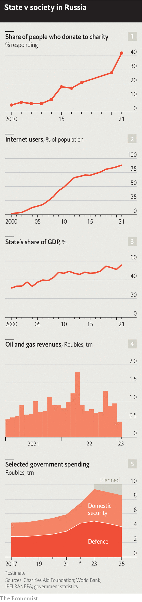

###### A year of war: Militarising Russia

# The invasion has stalled, but Putin’s war on dissent marches on 

##### Russian society is almost as closed and repressive as it was in Soviet times 

 

> Feb 20th 2023 


TANKS DID put a stop to Grigory Sverdlin’s career in the end—but not in the way he expected. In 2017 Mr Sverdlin, who until recently ran one of  largest and oldest charities, the Shelter, was talking to a local official in St Petersburg about homelessness in the city. It was clear that the activism of groups like his, and civil society more generally,  the authorities. “If you don’t keep quiet, we will run you over with a tank,” the bureaucrat warned him. 

Yet Mr Sverdlin was allowed to continue his work as long as he was not too vocal about the failings of  government. “We tried to warm the cold air outside our comfortable flats. We tried to create a country where people are independent of the state.” He felt his efforts were working: “Russian [civil] society was growing fast. People started to think not just about themselves, but about their neighbours and what is going on in their streets.” Donations to charities were rising fast (see chart 1).

“Then this bastard started this war and the temperature dropped 300 degrees and maybe lower than ever—at least in the last 70 years.” After several days of protesting on Nevsky Prospekt, St Petersburg’s grandest boulevard, Mr Sverdlin was warned that he was about to be arrested and so fled the country. “For years I have been talking about what it is like to be homeless, and suddenly, overnight, I lost my home,” he says.

Mr Sverdlin is one of the hundreds of thousands of Russians who have  since the war began. Their exodus, and the ruinous effect it is likely to have on Russia’s future, is the subject of a new podcast, “Next Year in Moscow”. We spoke to dozens of exiles in Britain, Georgia, Turkey and elsewhere—and many people who stayed in Russia. Their stories help explain why Mr Putin started this devastating war and how it will change their country.


Exiles like Mr Sverdlin are not the only Russians to have lost their place in society. Some 20,000 have been arrested since the start of the war for protesting against it. The police have even detained people laying flowers by statues of historic figures of  origin, since they see the gesture (rightly) as an implicit rebuke. Alexei Navalny, a jailed opposition leader,  to solitary confinement. Prosecutors are preparing a new political show trial for him. 

 


What is more, the few remaining institutions that criticise the government or advocate a more liberal society have disappeared. The legal restrictions Mr Putin’s regime has imposed on discussing the war—or even calling it that—have forced the closure of all independent media outlets, including Echo of Moscow, a radio station, and TV Rain, a television channel (both now broadcast from outside Russia). The Moscow Helsinki Group, which campaigns for human rights, has been shut down. Another such outfit, the Andrei Sakharov Centre, is being evicted from its premises. 

Daniel Treisman of the University of California argues that these people and institutions are not accidental victims of the war, but one of its main targets. Ukraine, after all, posed no military threat to Russia. And a vast and sparsely populated country, spanning 11 time zones, could scarcely be said to need more territory. Rather, it was the gradual emergence in Ukraine of a vigorous civil society that successfully demanded reform of the state, and the inklings of a similar process in Russia, that Mr Putin found threatening. 

Before the tanks rolled into Ukraine, Mr Treisman notes, liberal values were spreading fast in Russia. The share of people who told pollsters that freedom of speech was important to them rose from 34% in 2017 to 61% in 2021. Use of the internet was rising rapidly (see chart 2); record numbers were watching Mr Navalny’s YouTube channel. Meanwhile, television viewing, the government’s main tool for shaping Russians’ outlook, was in sharp decline. 

The shift is largely generational. People born during Russia’s liberalisation in the 1990s tend to be more enterprising than their elders, less prone to rely on the state and more liberal on matters such as gay rights. In 2017 some 70% of older Russians told the Levada Centre, a polling group, that they could not survive without the government’s help, whereas only 27% of people under 35 felt the same. And in 2020, despite the Kremlin’s propaganda, some 60% of young Russians told Levada that they had a positive view of America. 

“Putin and his crew understood that time was working against them, because the young generation is not interested in their tv propaganda and does not believe that Russia is a besieged fortress encircled by enemies, or that the United States wants to conquer us,” says Mr Sverdlin. This week Mr Navalny echoed that sentiment in a statement conveyed from his prison cell by his lawyers. Alexander Gabuev, who worked for a think-tank in Moscow forced to close last year, laments, “This is a war against Russia’s future…And Russia’s future will now be very different, regardless of the outcome of the war, from the one it might have been had February 24th not happened.” 

For one thing, the 500,000 people who have fled are among Russia’s best educated and most dynamic. They may not have had any say in politics even before the war, but their voices were nonetheless audible. No longer. Political debate, to the extent there is any in Russia now, occurs not between those who oppose the war and those who support it, but between “patriots” and “turbo-patriots”, who criticise Russian commanders for not being brutal and aggressive enough. 

By amplifying pro-war voices and silencing common sense, Mr Putin has achieved an illusion of total support for the war. People are wary of expressing criticism of it in any form but, even so, some 20% of Russians tell pollsters they are against it. It is safe to assume that disquiet is far more widespread than that. “Putin has managed to persuade the minority that it represents a majority, and the majority that it is a minority,” says Leonid Volkov, Mr Navalny’s chief of staff.

Polling conducted by Mr Navalny’s team, which operates from outside Russia, suggests that even among supporters of the war confidence in Mr Putin’s wisdom is fast evaporating. Since the summer, the share of people who think that the “special military operation” is going as planned has declined from 40% to about 15%. This is hardly surprising, given the rising death toll. In October 6% of Russians said they knew someone who had been killed in the war; by January that figure had doubled. Two-thirds of Russians know someone who has been mobilised or is fighting in the war. 

In a recent interview Oscar Kuchera, an actor and television host, neatly captured the inchoate views about Ukraine that are typical of many Russians. He simultaneously displayed confusion about the purpose of the war, misgivings about its progress, and ardent support for Mr Putin and “our boys” on the front line. The idea of annexing Ukrainian territory is especially puzzling to him: “Don’t we have enough problems of our own without having to feed someone else?” he asked. But he insisted that Mr Putin must have good reasons for his land grab, even if a simple man like himself could not fully understand them. 

Pocketbook patriots

The idea that things are under control is bolstered by the stability of the economy. On the surface, Moscow looks much as it did before the war. Some popular Western brands—McDonald’s, IKEA—have disappeared and some martial symbols have materialised. The economy contracted by a little over 2% last year, with the harm inflicted by sanctions largely offset by the benefit of massive export earnings thanks to high prices for oil and gas (see chart 4). Those were equivalent to about $230bn (10% of GDP), according to Re: Russia, a research network, almost compensating for the $275bn of capital that fled the country. The bonanza has allowed the government to boost its spending by a quarter, injecting an extra 5.5trn roubles ($74bn) into the economy. That will only reinforce the state’s growing hold over the economy (see chart 3).

Monthly output in some import-dependent and consumer-facing industries, such as cars and pharmaceuticals, was 50% lower by the end of 2022 than at the beginning. But arms manufacturing, naturally, has boomed. Tatarstan has seen a joint venture to make Ford cars shut down, but expects a factory to make military drones in collaboration with Iran to open soon.


A lower oil price and sharply reduced sales of gas are likely to lead to a budget crunch this year. In the long run, the exodus of skilled workers will harm the economy. Since the start of the war Russia is estimated to have lost at least 100,000 it specialists. But the bureaucracy has done a good job of adapting to the new circumstances, blunting the immediate impact of the brain-drain and sanctions. “They see this as a quest,” says Mikhail Komin, a political scientist who had surveyed middle-level technocrats. “They feel as much in demand as the military themselves”. 

In fact, the war has raised the status of technocrats, and of the army and security services even more so. The government wants to expand the army from its current 1m soldiers to 1.5m. That is 4% of the male, working-age population, a higher share than in any other country bar North Korea. A third of the national budget goes to men in uniform. Spending on the armed forces this year has been revised up by 40% compared with pre-war plans. Spending on domestic security—the machinery of repression—is up by over 50% (see chart 5). Meanwhile, spending on health care has fallen by 9%. To further exalt men in uniform, the government plans to reserve seats in the Duma, Russia’s docile parliament, for “military patriots”. 

Culture and education have also been “mobilised”. Actors and artists who have decried the war have been expelled from state-funded theatres. The latest victim is Liya Akhedzhakova, a famous actress who has been pushed out of the Sovremennik Theatre after 45 years. Zelfira Tregulova, the director of the Tretyakov Gallery, which houses the country’s biggest collection of Russian art, was dismissed for deviating from the Kremlin’s “spiritual and moral values”. Her replacement is the daughter of a senior officer in the security services.

In short, even though the material impact of the war is scant in much of Russia, the conflict is inescapable. “Putin’s purpose in this war is to achieve a radical break from the West and thus maintain control over Russian society by moving it into a state of permanent struggle and mobilisation,” says Kirill Rogov, the founder of Re: Russia. Any lack of progress on the battlefield is likely to be compensated for by ever-growing repression and purges, particularly as success becomes more elusive and casualties mount. 

Russians who used to look to Europe for modernisation have been cut off from it, rather as when Stalin tightened his grip in the 1920s. Some have turned instead to China. Many opponents of Mr Putin and his war see a Ukrainian victory as the best hope for Russia. Mr Sverdlin, who ran the homeless charity in St Petersburg, is now trying to resist Mr Putin from outside the country. His new volunteer group helps Russian soldiers desert and escape, often crossing Russia’s borders illegally. Since the autumn, his organisation has helped 4,000 soldiers flee. “For me, and for many volunteers, it is not charity, it is our way of striking back.” Few people have as much interest in a Ukrainian victory as Russians who want their country to be peaceful, independent and prosperous. But for Ukraine to feel secure, Russia would need to change radically. Just as the war started in Russia, it can only end there, too. ■

Photo: ©Nanna Heitmann/Magnum


