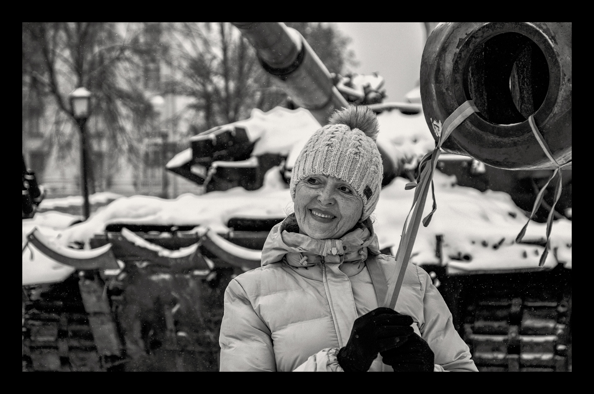

###### A year of war: Ukraine’s self-belief

# The war is making Ukraine a Western country 

##### But the cost is appalling 

 

> Feb 21st 2023 


Ukraine’s armed forces had prepared for the  that began at 4:30am on February 24th, but many ordinary  had not. Svitlana Povalyaeva, a writer, had to be woken by her 24-year-old son, Roman Ratushny, at about 5am. She wanted to go back to sleep; he insisted that she take the news seriously. “They’re bombing Boryspil airport with fucking ballistic missiles,” he railed.

Prepared or not, people like Mr Ratushny jumped into action. Later that day he returned to see his mother, in military fatigues, with a gun. She screamed at him hysterically, desperate to stop him going off to war and getting himself killed. But she also knew that he was a determined sort, who had faced down death-threats while campaigning to stop a wood in Kyiv being bulldozed by developers. As she feared, her protests were in vain.

Mr Ratushny was not the only one doing the unexpected that day. When Andrii, a fighter pilot, finally took a break after almost 19 hours of sorties, too exhausted to fly any more, his commanding officer spooned stew into his mouth to revive him. Vitaly Shabunin ignored warnings that his name was on a list of people whom Russian soldiers had been instructed to kill, and set about turning his anti-corruption organisation into a network to support the armed forces. Famously, Volodymyr Zelensky, the president, declined to flee the onslaught. Instead, the next day, he posted a video of himself in the centre of Kyiv to reassure Ukrainians that the state was still functioning. “We’re all here,” he declared. “The military is here. Citizens and society are here. We’re defending our independence, our country.”

With Mr Zelensky setting the bar for courage, the Ukrainian state proved much less flimsy than the Russians—and many Westerners—had expected. What is more, many ordinary Ukrainians were eager to come to its defence. During the course of the war, the state and civic pride have become stronger still. “We had belief in the resilience of our institutions, but it was only after 24th February that we became sure,” says Denys Shmyhal, the prime minister. “We paid bills, collected taxes, supported business, provided services and restructured the economy. Our Western partners tell us they are amazed at how strong we’ve been.”

The Russians, says Mykhailo Podolyak, an adviser to the president, “don’t get what Ukraine is about”. They disliked that it was becoming a more functional democracy and, by fits and starts, drawing closer to Europe. But they did not understand how far that process had advanced. On the face of things, after all, the country was still riven by political divisions, addled by corruption and dominated by powerful oligarchs. Twice in a decade, in 2004 and 2014, protesters had toppled unpopular governments. The previous president, Petro Poroshenko, a media and chocolate magnate, had been voted out in part because of a litany of corruption scandals. Russian-speakers in the south and east of the country seemed alienated, often voting differently from the rest of the country. And in 2014 Ukraine had not been able to stop Russia seizing Crimea and fomenting rebellion in the Donbas region. 

But all the upheaval, while revealing discontent and division, also showed that civil society was becoming more vigorous and politics more responsive to it. People like Mr Shabunin and Mr Ratushny, who both participated in the Maidan protests in 2013-14, kept up their activism after the crowds had dispersed, the first as an anti-corruption campaigner, the second as an environmentalist. Despite the domination of the media by oligarchs, a free press had also sprung up, abetted by the internet. Large-scale migration for work to European countries, and a liberal regime for tourism, had helped develop an affinity for Europe. Meanwhile, efforts to curb corruption had begun to undermine Russia’s chief means of exerting influence. 

The war has accelerated all these trends. Almost overnight Ukraine’s geographical divisions, which had anyway diminished since 2014, disappeared. Russian-speakers bore the brunt of the invasion, since they are concentrated close to the Russian border. The indiscriminate, vicious offensive disabused them of any illusions they might have had about Russia’s brotherly benevolence. According to Volodymyr Paniotto, a pollster, most of the 9m or so Russian-speakers in Ukraine now regard it as their homeland. Many of them are learning Ukrainian and immersing themselves in Ukrainian culture, which they might previously have seen as quaint or parochial.

The political rift about whether Ukraine’s future lies more with Russia or the West has also been decisively resolved. Ukraine has officially become a candidate for eu membership, a step that was seen as a decade away before the invasion. A full 86% of Ukrainians want their country to join Nato, up from barely half before the war.

Fewer Ukrainians describe themselves as cynical than a year ago; three and a half times as many (68%) express optimism for the future. Trust in government and institutions has increased. Mr Zelensky’s approval rating shot up after the invasion, from barely 30% to over 90%. Mykola Davydiuk, a political analyst, likens the surprisingly concerted response to the invasion to the behaviour of bees: “In normal times, bees buzz around and make honey. But when a bear tries to steal it, they swarm, and sting him.” 

Ukrainians’ willingness to swarm, in turn, reflects genuine improvements in its institutions, and above all in the armed forces. When Russia invaded Crimea in 2014, Viktor Muzhenko, Ukraine’s top general at the time, said his army was “literally in ruins” and suffering from “total demoralisation”. Much of the navy defected to Russia rather than fight. Mr Poroshenko initiated sweeping military reforms. America, Britain and Canada sent aid and advisers. Five battalions a year received training from America at a military base in western Ukraine. America first gave Ukraine Javelin anti-tank missiles—used to great effect to repel the Russian advance on Kyiv—in 2017. Perhaps most importantly, Ukraine’s military culture was transformed. By the time Russia invaded again last year, says Liam Collins, a former US Army officer involved in those efforts, “Ukraine had built a well-led, professional force with a culture that encouraged junior leader initiative on the battlefield.” 

Hard wiring

Other parts of the government, too, have shown remarkable adaptiveness. Ukrzaliznytsya, the state railway company, runs trains through war zones, evacuating citizens and ferrying troops, supplies, and diplomats in the opposite direction. Government cyber-security agencies draw on the best IT specialists in the country to provide a robust defence against some of the world’s most sophisticated hackers. Engineers in the power industry work around the clock, sometimes in body armour, to somehow bandage together infrastructure as fast as Russia bombs it.

The Ukrainian state still has many weaknesses. Corruption continues to plague it. A recent scandal involving overpriced contracts for military rations shows that plenty of venal officials remain, even in the Ministry of Defence. Nor has petty politics disappeared: the president’s office is paranoid about the stratospheric popularity of Valery Zaluzhny, the head of the armed forces, and appears to be circumscribing his role. “Ukraine faces its biggest danger when politicians start interfering and telling soldiers what to do,” warns Mr Shabunin.

And whatever strides Ukraine has made, they must be weighed against the catastrophic consequences of the war. Hundreds of thousands have died. . Ms Povalyaeva, the mother of Mr Ratushny, who headed to the front so eagerly on the first day of the war, says she sensed that her son would die many months before he eventually did, on a reconnaissance mission in June. She could see the desperation on his face. “The pain is unbearable,” she says, reflecting on her son’s squandered potential. “We are losing our best people. The very people we need if we are to build the modern, just society we all now demand.” ■

Photograph: ron haviv/vii


