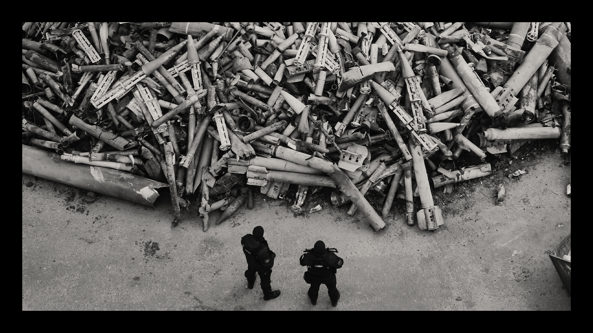

###### A year of war: Geopolitics in flux

# Ukraine’s fate will determine the West’s authority in the world 

##### A revanchist invasion has become an ideological battle 

 

> Feb 18th 2023 


THE OFFICES of Supreme Headquarters Allied Powers Europe (SHAPE), NATO’s command centre near Mons in Belgium, are the opposite of imposing. Instead of granite and marble, the low-ceilinged corridors are decked out with plasterboard and tiled carpeting. Four-star generals sit on the higher floors—but SHAPE only has three storeys. The building, erected in the late 1960s, was supposed to be temporary. 

Never before has the flimsiness of SHAPE so belied NATO’s monumental sense of mission. Vladimir Putin’s , on February 24th 2022, has revitalised the alliance. It is armed with its first new set of goals since 1967, the year shape’s offices opened. Whereas the old NATO was reactive, it is now being rebuilt to deter  in peacetime and to respond in force as soon as it threatens to encroach on its members’ territory. “We are rapidly enhancing the readiness of our forces,” says General Sir Tim Radford, SHAPE’s second-in-command, “and our overall military responsiveness is increasing exponentially.”

The war has changed Ukraine even more. Mr Putin planned a lightning strike to topple the government, the culmination of a campaign of aggression and destabilisation that began in Crimea and the Donbas region in 2014. Instead, in the pulverised ruins of Donbas and in bomb shelters across the country, it has forged itself anew, into a more unified, more Westward-leaning, more resilient democracy (see later article). Russia, meanwhile, has been reorganised around the war and Mr Putin’s broader hostility towards NATO, even as  and an exodus of its  have sapped its long-term economic prospects. Its descent into despotic , coupled with Nato’s invigoration and Ukraine’s transformation, have turned the war into a trial of rival ideological systems.

Ukraine’s future still hangs in the balance—and is likely to remain uncertain for years to come. Mr Putin may accept a ceasefire at some point out of expedience, but his overhaul of Russian society is geared entirely towards aggression abroad and repression at home (see later article). Any conceivable end to the shooting will therefore require strong Western security guarantees and large and lasting transfers of arms and financial aid—almost as if a second, much bigger Israel had appeared on Europe’s eastern borders. Some European leaders argue that requires full NATO membership. If reconstruction of Ukraine were to fail, and its economy to falter, then Ukrainian democracy would start to fail, too. NATO’s generals reckon that Russia could rebuild its land forces in three-to-five years. Ultimately, the conditions would be ripe for Mr Putin or his successor to have another go.

Hence, in both war and peace, Ukraine will put to the test the West’s resolve, its unity, even its industrial capacity. The conflict raises three fundamental questions of geopolitics, in particular: what role the United States will play in European security, whether NATO’s European members can credibly take responsibility for more of the region’s defence and what the allegiances of the rest of the world will be amid the biggest war in Europe since 1945. The answers are not just crucial to Ukraine’s fate—they are a measure of the West’s self-belief and stature. 

Much of the world has concluded that the power of the United States and its allies is ebbing, because of their failure to prevail in Afghanistan and Iraq, their part in the global financial crisis and a succession of governments plagued by strife and populism. If Ukraine succumbs to Russian chaos, the perception of Western decline will deepen. But if Ukraine thrives, the lesson will reverberate around the world. That includes the Pacific, where the struggle between dictatorial Russia and Western-backed Ukraine should be seen as a prologue to the century-defining contest between China and the United States.

The Atlantic shrinks

Of the three geopolitical questions, the most pressing is America’s role in Europe. “European security hasn’t just shifted a bit, it’s fundamentally changed,” says Michael Clarke, the former head of the Royal United Services Institute (RUSI), a think-tank. In 2019 France’s president, Emmanuel Macron, said that NATO was suffering “”, because under Donald Trump and Barack Obama America had seemed uninterested in Europe. Ukraine has proved that judgment wrong. 

“The war brought back the US as a prime European power,” says Fabrice Pothier, a former policy planner for NATO and director of Rasmussen Global, a consultancy. Under President Joe Biden, the United States has sent Ukraine weapons and aid worth $48bn. Kori Schake, a former official now at the American Enterprise Institute, a think-tank, says it is clear that, without the United States, Europe would not have come together to provide Ukraine the support it needed. 

The aid is not just an indication of America’s generosity, but also of its strength. At a cost of roughly 5% of America’s annual budget for defence, Ukrainian forces have punctured the myth of Russia’s military prowess, destroying more than 1,000 Russian tanks in less than a year. “We used to think Russia was the second-best military in the world,” says Ms Schake. “And now it’s not even the best military in the former Soviet Union.” 

The question is what America chooses when the hot war is over and Ukraine needs rebuilding during a heavily armed peace. Ms Schake expects American officials to argue that, as they have provided most of the assistance during the fighting, Europeans should pay for the reconstruction and rearming of Ukraine. At the same time, she says, the Pentagon may conclude that the diminished state of Russia’s land forces means that America no longer needs a large standing army on European soil.

Looming behind this calculation is the need for America to focus on China. A dramatic withdrawal would not be in its interests: if America’s security guarantees are not thought reliable in Europe, they will not be thought reliable in Asia. “Xi Jinping is watching us closely,” said Senator Roger Wicker, the most senior Republican member of the Armed Services Committee, last month. “He wants to see if we will stick by our commitment as he weighs his opportunities of invading his own neighbour and our friend, Taiwan. Our Indo-Pacific allies are also watching closely—and even helping in Ukraine.”

For that reason, says Andrew Michta of the George C. Marshall European Centre for Security Studies in Germany, the United States is likely to insist that “burden-sharing” becomes “burden-shifting”. By that he means that America still helps defend Europe through its nuclear deterrent and other high-tech capabilities, but leaves European armies to provide most of the conventional forces. This elevates the age-old demand that NATO’s European members take more responsibility for defending their own continent, which both Mr Obama and Mr Trump urged in different ways.

Before the war, America saw burden-sharing mainly as a way to cut costs. Today, says Fiona Hill, a Russia expert who served on the National Security Council, it also has a broader strategic logic: “What Russia was saying is, OK, the United States is still an occupying force in Europe; Europe has no security; we want to be the dominant force just like Germany in World War One or World War Two.” Ms Hill foresees serious thinking about how to “retrofit” European security around Ukraine without having the United States dominate everything, because enhanced European responsibility counters the Russian perspective that NATO is just an American tool. 

That raises the second question: can Europe rise to the challenge? The war has forced it to think more strategically, Mr Pothier believes. In just a year some of the constraints that had diminished its room for diplomatic manoeuvre, such as German dependence on Russian gas, have largely been dismantled. Three days into the war the chancellor, Olaf Scholz, declared a turning point in Germany’s global outlook, pledging to spend €100bn ($107bn) to prepare the  to be —though it has yet to be seen how effective that spending will be.

The impact of  joining NATO would be more immediate and probably even bigger. If Turkey agrees to their membership—and it should—they will bring lots of new personnel, equipment and fighting expertise. Finland, for example, can muster 280,000 troops within weeks, more than twice the size of Britain’s standing army and reserves.

Geographically, Finland and Sweden would also help secure the Baltic states, which are hard to resupply through the narrow stretch of Polish territory that sits between Belarus and the Russian enclave of Kaliningrad. Although they greatly extend NATO’s frontier with Russia, “Nordic and Scandinavian military can pool resources,” says Ms Hill, “becoming a quite formidable line of defence.” In addition, were Mr Putin or his successor to attack a member of the alliance, he would have to worry about defending a longer frontier. 

Continental European members of NATO have also shown a new seriousness about applying sanctions, says Tom Keatinge of RUSI. In the past, their sanctions were often symbolic. Although Western leaders were being bombastic when they pretended that sanctions would rapidly bring Russia to its knees, EU states have taken them seriously enough to update their legislation repeatedly in order to implement them. That matters because sanctions are a slog. “They are a plague of henpecking that you hope eventually will kill the target,” Mr Keatinge says. “The target shape shifts and you therefore need to maintain your aim.”

Considering where Europe was before the Russian invasion, all this marks progress. A view is emerging that NATO’s centre of gravity is shifting from France and Germany towards the east and north. European defence is increasingly being redefined in Poland and the Nordic countries, as well as in Ukraine. Post-Brexit Britain has also shown that in defence and security it can still be in the European vanguard. Owing to this new vigour, Mr Pothier says, Europe, always an economic giant, is turning from a political dwarf into a more imposing presence in world affairs.

Despite that progress, however, NATO’s European members are still unable to take up America’s mantle. “Whatever Europe does, it does in a piecemeal way,” says Sir Lawrence Freedman, professor of war studies at King’s College London. “Grand visions for new European security just don’t cut it. Because there are too many disparate views.” Not only is power shifting eastward, but Mr Macron’s dream of “European strategic autonomy” from America looks as distant as ever. 

Cash and caring 

One worry is that Europe will not cohere sufficiently to bring about Ukraine’s reconstruction. The bill will run into the hundreds of billions of dollars at a time when government budgets are being squeezed. Money is not the only factor. The EU also has a role in fostering a Western institutional culture in Ukraine, including a decent regulatory environment and a brake on corruption. The prospect of Ukrainian accession to the EU could be a powerful spur to reform, but only if membership seems genuinely attainable, not, as so often with other countries, a receding dream. 

Another worry is that Western arms-makers do not have the capacity to equip Ukraine for victory, let alone build up its arsenal during the peace and replenish NATO’s own stocks. Ukraine is firing 5,000-6,000 shells a day, roughly the annual procurement of a small NATO country before Russia invaded. The West’s defence industries have withered since the collapse of the Soviet Union (see next article).

If Europe falls short in these ways—and, just now, that seems depressingly possible—Ukraine is likely to pay the price. The job of filling the gaps and of corralling and cajoling Europe would, once again, fall to America, possibly led by a different president. “As things stand, we’ve got a single point of failure in this very impressive Western alliance,” says Mr Clarke. “And the single point of failure is America’s willingness to keep on.” 

 


The final big geopolitical question posed by the war is whether the West can win the battle of international opinion. Only a third of the world’s population lives in countries that have condemned the invasion and also imposed sanctions on Russia, according to the Economist Intelligence Unit, our sister organisation. Most of them are close allies of America. The rest tend to see the war as a contest between autocrats and hypocrites. 

Shivshankar Menon, formerly India’s top diplomat, speaks for many. He acknowledges that the war has imposed global economic costs, and made it harder for the international system to deal with problems such as development and climate change. But he rejects the idea that the global south should side with Ukraine out of principle.

“It’s not some geopolitical turning point for the rest of the world,” says Mr Menon. “Where we are, the primary geopolitical fault line is still between China and the US and this is not going to change it.” He sees the war as a struggle over European security. Whoever wins, or if neither side wins, Europe is going to be unsettled and preoccupied. Mr Menon sees Europe remaining a force in the global economy, but not becoming one in geopolitics. 

And yet, in at least three ways, the war has already perturbed the international order. The first is in Africa, the Caucasus and Central Asia, where Russia’s diplomats are in overdrive in an attempt to shore up its influence. Although Russia is holding its own in Africa, it is losing ground elsewhere.

When Azerbaijan, backed by Turkey, launched a  against Armenia in September, Russia was unable to prevent its ally’s defeat. Kazakhstan’s president, Kassym-Jomart Tokayev, owes his job to Russian paratroopers who helped suppress an insurrection shortly before the war in Ukraine. Yet Mr Tokayev has felt no compunction about being courted by Mr Xi, who visited him just before a regional summit where Mr Putin was chided by both China and India.

The second upset to global politics is Mr Putin’s threat to use a nuclear bomb. Although he has failed to deter the West from supplying Ukraine with advanced weapons, he has slowed their arrival. Mr Putin was half-successful, says Mr Pothier. “He did, indeed, inject fear in our population and even in our leaders.” 

Even a limited erosion of the taboo against using nuclear weapons presents a problem for all countries. If Mr Putin is seen to have gained an advantage from his threats, it will be an incentive to other aggressors to acquire the bomb and to threaten its use. Given that Russia and America are struggling to agree on arms control, the risk of proliferation is growing. Nuclear blackmail is a particular worry for India. It enjoys superiority in conventional arms over its rival, Pakistan, which has invested a lot in short-range nuclear weapons to compensate. 

Lastly, the war is driving Russia into the . In the Soviet era, China saw Russia as a threat. Now that the vast northern border is at peace, Mr Xi can shift military resources elsewhere. China also benefits from a like-minded ally at the UN, where it can take a back seat while Russia acts as a bully. And finally, notes Alexander Gabuev of the Carnegie Endowment for International Peace, a think-tank, Russia is a valuable source of commodities that are increasingly being supplied on Chinese terms. 

“I would probably throw modern Russian weapons into that mix,” says Mr Gabuev. China, he notes, still relies on Russia for certain crucial military components, which makes the friendship central to any plans China might have to invade Taiwan.

Show of forces

SHAPE is busy planning NATO’s biggest-ever exercise, called Steadfast Defender. Scheduled for early 2024, it will involve tens of thousands of troops under the alliance’s command. In the past NATO has often been less than the sum of its parts. The exercise will be a test of the new doctrine, which is known as Deter and Defend, and is the fruit of four years’ work. The idea is to reach deep into national armies to project power in all domains, from land battles to cyberwarfare. 

The exercise is also supposed to show Mr Putin that attacking a member of the alliance would be calamitous. NATO’s generals want to prevent a miscalculation of the sort they believe he made by invading Ukraine.

And yet, the scale of that miscalculation is still to be determined. Russian success on the battlefield in the spring, or even a freezing of the conflict in its current form, combined with a half-hearted or inept programme to support and rearm Ukraine, would confirm his view that the West is in decline.

Even countries that think that Mr Putin’s invasion was reprehensible might still conclude that Western power is on the wane if it fails to protect Ukraine. But given arms, money and political support Ukraine may yet prevail. Through their courage and by the power of their example, the Ukrainian people have earned the chance to do so. There could be no better investment in Western security. ■

PHOTOS: AP; VII/Redux/Eyevine


