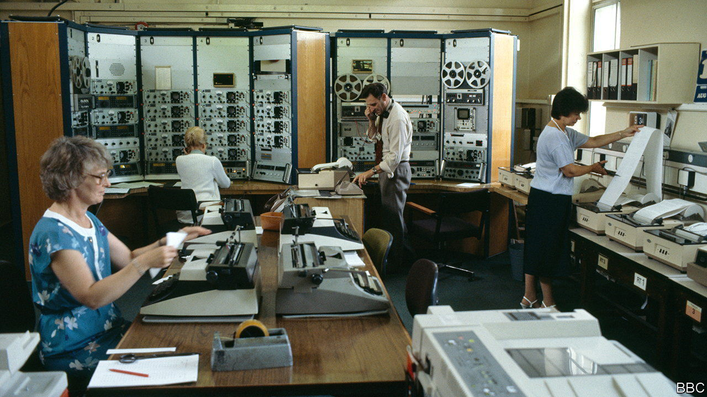

###### Found in translation

# A BBC monitoring station that listened in on the world is being sold 

##### The end of the Cuban missile crisis was first heard in a country house in Berkshire 

 

> Feb 20th 2023 

The denouement was undramatic. The  in 1962 might have begun with public declarations from President John F. Kennedy and the threat of nuclear annihilation for all, but its conclusion was much more muted. The West first realised that the end was not nigh after all when, in a charming country house in Berkshire in south-east England, a translator working for the  tuned in to Radio Moscow and listened as Nikita Khrushchev’s climbdown began. 

The wars of the 20th century offered two main ways for enemy nations to understand what the other was up to. One was to use  and derring-do. The other was to switch on the radio and let that nation simply tell you, sometimes twice daily, often with nice music in between. The radio led to few thrills and fewer thrillers (not many novels star someone sitting in headphones for eight hours a day) but it mattered. Joseph Goebbels was convinced that his department had been infiltrated; in truth, British translators had just been listening to Nazi broadcasts. 

Eavesdropping on the airwaves was a habit that was slow to begin in Britain. An initial government department, set up at the start of the second world war, comprised three people. But it was the BBC, which started its own service at around the same time, that won out. 

By 1943 BBC Monitoring—the branch of the broadcaster that doesn’t speak but listens—was operating in earnest. It took up residence in Caversham Park, bringing with it radios and receivers, typewriters and teleprinters, and numerous refugees from Nazi-occupied Europe to act as monitors. They set about building Babel by a lake in Berkshire. Over the years that followed their reports were used by the BBC itself, by other news agencies and by wartime and peacetime governments.

The radios have now fallen silent; the monitors have moved elsewhere (mainly to London); and Caversham Park itself is about to be sold to be turned into swanky retirement flats. The legacy remains, however. Over the static of the radio and the taka-taka of the teleprinters, the broadcasts of 40-odd countries were listened to by staff who produced briefings of half a million words daily, amounting to 15m pages of transcripts over eight decades. 

They include some of the scoops of the century, from the first, confused reports of the Chernobyl disaster in 1986 to the proclamation of the  against Salman Rushdie in 1989. (“Hold on,” the duty editor said to his Persian monitor, “what the fuck is a ?”) Monitoring of the most important broadcasts was a group effort, with speeches split up and given to different translators. The divisions on Khrushchev’s speech can, like a game of thermonuclear consequences, still be seen.

But Babels can cause problems—in wartime Britain as in the Bible. At an early incarnation of the monitoring station, the natives were variously alarmed by female monitors (who wore trousers); Russian ones (who wore Astrakhan coats); and Scandinavian ones (who wore nothing at all in front of their bedroom windows). 

BBC Monitoring still exists but, in the internet era, its purpose is less obvious, its uniqueness diminished. Its importance had already faded with the collapse of communism—which it also listened in on. On November 9th 1989 a teleprinter spat out a message about increasing freedom of movement in Berlin. A German monitor tore it off, read it and said: “That’s it.” Hours later the Berlin Wall started to fall. ■


