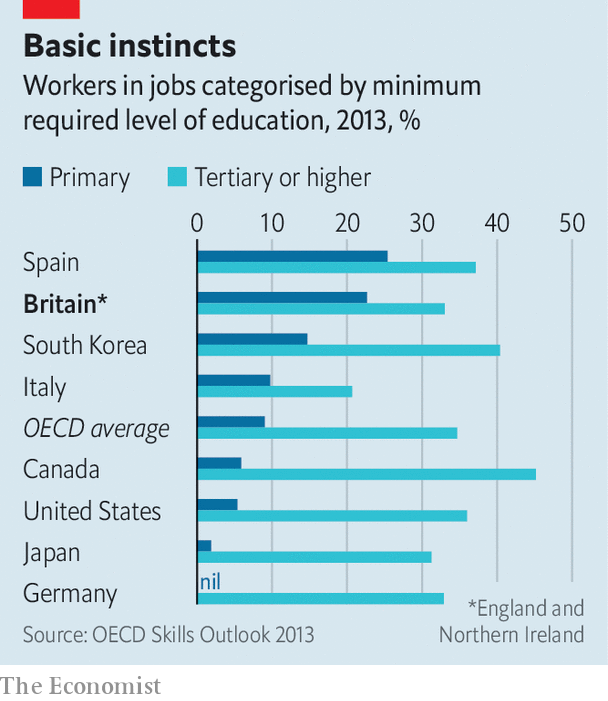

###### Nice to have

# Britain’s biggest skills problem is that many firms don’t value them 

##### Too many jobs require virtually no education 

 

> Feb 21st 2023 

Should you wish to know the best way to carry a hot coffee or avoid backache, Britain’s employers have you covered. But set your sights a bit higher than health-and-safety briefings—on courses that risk making you better at your job, say—and the chance of disappointment soars. 

According to data from Eurostat, the EU’s statistics agency, British firms spend only half as much on training per employee as European ones. They train fewer workers, and give each of them less time in class. Most of these metrics are going backwards. The Learning and Work Institute, a think-tank, reckons that in 2019 bosses in Britain spent 28% less in real terms training workers than they did in 2005 (while spending in Europe went up). 

Training can be wasteful. Informal learning may be filling some of the gap. Even so, these trends are surprising. At the last count, before the pandemic, a lack of skills was reported to be making almost a quarter of all vacancies hard to fill. The twin storms of covid-19 and Brexit have probably made that worse. So why do British firms do less than their peers? 

Bosses everywhere fret that expensively trained workers are more likely to flee to competitors. That may be a bigger worry in Britain, where a higher proportion of staff change jobs each year than in most other rich places. Plentiful access to low-skilled immigrant workers (in the past, at least) may have had an impact: British firms are more likely than EU ones to say that hiring, not training, has solved their skills problems. Britain’s employers also grouch that it is difficult to find affordable training providers, and that the government’s neglect of colleges and other peddlers of vocational education is partly to blame.

Tight labour markets have made “upskilling” a hotter topic but they have also made the task harder, says Matthew Percival of the Confederation of British Industry, a trade association. Firms have long sought to turn warehouse workers into lorry drivers, he says; but recently they have started worrying that they will struggle to fill the low-level vacancies that such promotions create. Workers have less time for training when labour markets are tight. Trainers who know their onions are getting hired back into industry themselves.

 


Yet alongside all this lies a problem that gets rather less attention. One-third of Britain’s firms say they employ staff who have higher skills and qualifications than their jobs require. Some 16% of bosses say this is true of more than half the people on their payroll. When companies are asked why they do not train workers they often say it is because their staff are smart enough. That would be good news, if their roles were more demanding. Some 23% of jobs in Britain require no more than a primary education, according to analysis last done in 2013 by the OECD, a rich-country think-tank. That is one of the loftiest rates in the developed world (see chart).

Some of this may be explained by red tape in other countries that requires more workers to have certain qualifications even for mundane jobs. But it may also reflect less effort in Britain to make such jobs more productive. In many European supermarkets, for example, electronic displays allow the prices on shelves to be adjusted remotely; workers in British stores are often required to ferry printed labels around the aisles. The OECD warns that in swathes of the country low demand for skills from employers is depressing Britons’ desire to better themselves.

Efforts to make companies keener on training have not come to much. Train to Gain, a wheeze of the last Labour government, burned through a lot of money setting up lessons that would probably have gone ahead anyway. The Tories have placed their chips on apprenticeships (which companies may offer both to new recruits and as a way of upskilling old hands). In 2017 the government began requiring big employers to set aside 0.5% of their annual wage bill to fund these. Any part of this “levy” that they do not spend is handed to the government, which uses it to help pay for apprenticeships at smaller firms.

The levy was supposed to help drive a big increase in the number of people doing apprenticeships each year. Instead numbers have actually fallen, from around 900,000 in 2016-17 to about 740,000 in 2021-22. Although it was never the plan that big companies would spend all the levy money themselves, they are leaving surprisingly large chunks of it on the table. Many of the new “apprenticeships” that they are funding look a lot like pre-existing training programmes, rebadged to qualify for the cash. Some courses have just become more expensive.

Few want the levy scrapped entirely. But lots of businesses want permission to spend it on different things. Currently apprenticeships must last at least a year and involve at least one day a week in a classroom, which is fine for complete beginners but can be overkill for people in the middle of their careers. Ideally, a revamp would give firms more incentive to help the 5m workers who are desperately bad at either reading or maths. When he was chancellor Rishi Sunak said he would examine whether the levy is prompting “the right kinds of training”. Nothing has yet come of that.

Any changes would also have to be accompanied by a big new effort to drive up employers’ demand for skilled staff, reckons Lizzie Crowley of the Chartered Institute of Personnel and Development. She says the government has “completely ignored” this part of the puzzle. Ms Crowley would like to see more in the way of business-support services and coaching for managers, which might spur companies to concoct zingier ways to grow. If they had smarter plans, she says, spending splurges on skills would follow in a flash. ■


