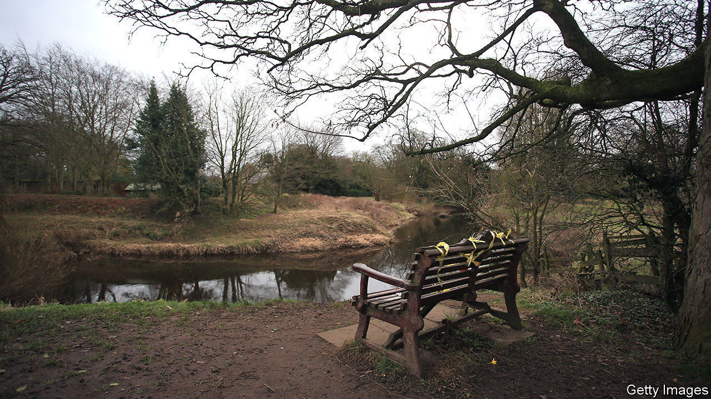

###### True crime

# Nicola Bulley and the era of the social-media sleuth 

##### The case of a missing Briton illustrates a big challenge for police 

 

> Feb 21st 2023 

Tens of thousands of people go missing in Britain every year. Many of them do not make it into the local press, let alone the national media. This can distress their relatives: press coverage helps police as they appeal for information and witnesses. Yet the family of Nicola Bulley, who was missing for 23 days before her body was found on February 19th in the River Wyre in Lancashire, may wish that her disappearance had attracted less attention. 

Perhaps because she was pretty, white and middle-class her case generated intense interest. On social media in particular, there was an unprecedented level of voyeuristic speculation. Detective Superintendent Rebecca Smith of Lancashire Police, who led the investigation, said she had “never seen anything like it”.

The case has highlighted one of the great downsides of the internet: the amplification of voices that are better left unheard. In the days after Ms Bulley dropped her children at school, took her dog for a walk and vanished, self-proclaimed body-language experts and psychics posted videos hypothesising about what could have happened. YouTube and TikTok broadcasters turned up to film the river bank where she disappeared and to quiz passers-by. Some tried to break into nearby buildings. 

All this was extremely upsetting for Ms Bulley’s family. But it was also potentially damaging to the investigation. Detective Smith said that the police had been “inundated with false information, accusations and rumours”. This had “significantly distracted the investigation”.

Social-media sleuthing presents a big new challenge for police conducting high-profile investigations. Paul Fullwood, a former assistant chief constable for Bedfordshire, Cambridgeshire and Hertfordshire Constabularies, says that in the past police working on missing-person cases had a “professional understanding” with journalists, which might include giving information on the understanding that it not be published. But the explosion of interest on social media meant police on the Bulley case “lost control of the media narrative”, he says. “Unhelpfully, some of the armchair detectives included former colleagues, many of whom have not been near major crime for many years.”

What can the police do to limit the damage done in such cases? Legislation gives them some powers. Lancashire police used the Public Order Act to arrest and fine one man who had posted numerous videos to YouTube and TikTok. (He then posted footage of his own arrest.) But that does not deal with the online rumour mill.

Better communication might help. The Lancashire Constabulary has come in for a lot of criticism, much of which may be groundless. Their initial supposition, that Ms Bulley had somehow fallen into the river, may well have been correct. Yet some reckon that the police provided too few progress reports, allowing others to fill the gap. After a diving expert (who was giving regular updates on his own search) said she could not have fallen in, online speculation—about everything from abduction to potential suspects—grew wilder. 

That seems to have prompted police to reveal new snippets of information, including that Ms Bulley had menopause-related alcohol problems. The revelation is thought to have followed discussion with her family; it may have been made to pre-empt a tabloid tell-all or a leak. But critics piled in, saying it was a shameful violation of her privacy. Unusually, they included the home secretary, Suella Braverman.

Some believe the police could exploit social media themselves, to counter false information. “They fail to recognise that their own channels don’t have the reach of even the most benign influencer and there’s a belief that using popular channels is somehow less credible,” says a former detective chief superintendent. He adds that too often the police misinterpret the rules about open cases to justify not sharing information. A bigger problem is lack of trust in police themselves, largely as a result of falling numbers of community officers. “They are no longer seen as a trusted part of society,” he says. That means people are more likely to look elsewhere for information—and, unfortunately, to find it. ■


