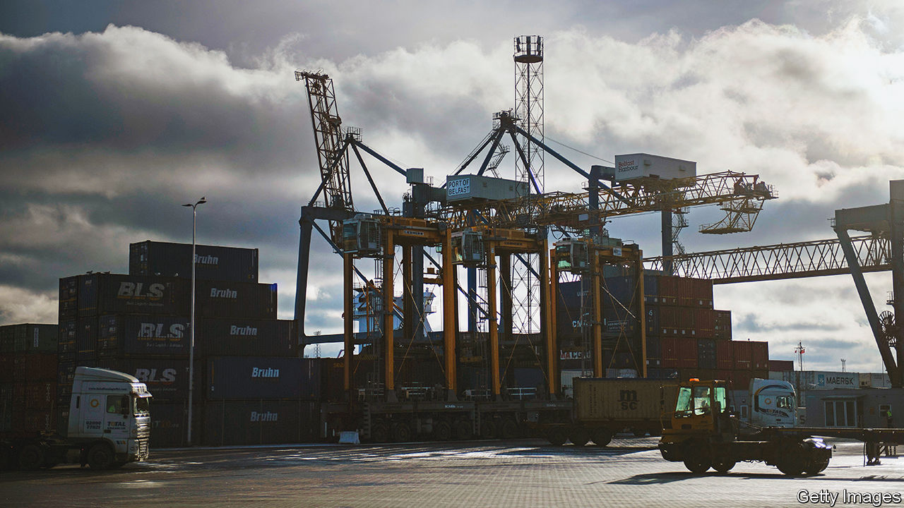

###### Protospasm

# Rishi Sunak’s uphill struggle to make Brexit work in Northern Ireland 

##### He faces familiar opposition from hardliners in Westminster and unionists in Belfast 

 

> Feb 22nd 2023 

The sense of déjà vu has been unavoidable this week. Rishi Sunak, the prime minister, has been grappling with the hardest problem created by Britain’s decision to leave the EU in 2016—the status of Northern Ireland. His efforts have prompted predictable opposition, from hardline Brexiteers in Westminster and from unionists in the province. As  went to press, Mr Sunak’s proposed deal to revise the Northern Ireland protocol was hanging in the balance and with it, the prospects for effective government on either side of the Irish Sea. 

The protocol was concocted by Boris Johnson in 2019. It left the province in the European single market for goods and required checks for products crossing the Irish Sea from Great Britain. In protest at this forced separation, the Democratic Unionist Party (DUP), the main unionist (pro-British) party, pulled out of the Northern Irish executive in February 2022. It said it would not return unless the protocol was in effect scrapped. The DUP’s intransigence was bolstered last May when Mr Johnson himself proposed a bill to allow Britain to unilaterally override the protocol if the EU did not soften it. He also demanded that the European Court of Justice (ECJ) lose any jurisdiction in the province. Relations between Britain and the EU markedly soured.

Mr Sunak’s elevation to Downing Street has changed the mood music for the better. The EU has admitted that it was too zealous in its border checks. The proposed deal envisages that goods that pass from Great Britain and stay in Northern Ireland will be able to go through a green channel with minimal inspections; only goods likely to cross into Ireland, and thus into the single market, must go through a red channel with full controls. This was facilitated by a British concession, which was to give the EU access to live data on the movement of goods. There will also be a system of trusted traders subject to few, if any, checks. 

On the governance of the protocol, too, a deal is emerging. Mr Sunak seems to have secured agreement to a mechanism whereby the EU promises to discuss with interested parties in Northern Ireland the application of new single-market laws. As for the ECJ, although it has to remain the ultimate arbiter of EU law, both sides have agreed that in practice disputes should be settled without the need to consult it. 

A compromise of this sort could give Northern Ireland the best of both worlds, with free access to both British and EU markets. As Katy Hayward of Queen’s University Belfast notes, public opinion in Northern Ireland consistently backs the protocol, as does a clear majority of the Northern Ireland Assembly (though almost all unionists are opposed). When Mr Sunak visited Belfast on February 17th to discuss his plans, the DUP leader, Sir Jeffrey Donaldson, displayed cautious optimism.

Caution has since had the upper hand over optimism. Others in the DUP, as well as hardline Tory Brexiteers, have spoken out against the deal. They object that the ECJ would still play a visible role on British territory, and that Northern Ireland would have no right of veto over changes to single-market rules. Mr Johnson, who blames Mr Sunak for his own ousting last year, let it be known that he was opposed to ditching the bill allowing the protocol to be overridden. Sir Jeffrey now sounds warier. 

What next? The British government and the European Commission continue to talk, though the scope for big changes is limited: EU negotiators have no mandate to rewrite the treaty. Mr Sunak could simply choose to push ahead in the teeth of opposition. A deal does not strictly even require parliamentary approval, precisely because it does not alter the text of the protocol. In a vote the Labour opposition has promised to support him if need be. 

Facing down the hardliners in Westminster is easier than it was, too. Public interest in Brexit has dissipated; unlike in 2019, there is no hard deadline to give Brexiteers real leverage. If Mr Sunak wants to placate them, he can push ahead with an ill-advised bill to scrap retained EU laws and with plans to speed up regulatory divergence from the bloc in some areas.

The harder problem is winning round the DUP, whose reluctance to endorse a deal is less about ideological purity than fear of its own voters. Two-thirds of unionist voters want the party to continue to veto devolved government unless the protocol is removed completely or radically rewritten. If Mr Sunak imposed a deal on the province but the DUP continued its boycott, Northern Ireland’s power-sharing arrangements mean that it could have no government of its own for years. Over the short term an intransigent DUP might do well at the ballot box. Over the long term, it might weaken support for unionism itself: what is the good of a political movement which is defined by refusing to govern? 

Even if the DUP went begrudgingly back into government, the Northern Irish conundrum remains. Increasing regulatory divergence between Britain and the EU could mean more, not fewer, controls in the Irish Sea. Mr Sunak is not proposing the one option that would do most to soften the protocol’s operation, which is aligning with EU veterinary standards. 

A potential Labour government, however, is likely to seek exactly that. If Mr Sunak cannot get his deal done, the current unsatisfactory application of the protocol and the DUP boycott will almost certainly continue until the next election, which is due by January 2025. If the Labour Party takes power then, it would seek to make a sweeping new deal with Europe and to resolve the Northern Ireland question once and for all. But waiting almost two more years for a rapprochement with Brussels would not be good for the British or Northern Irish economies. And Mr Sunak would be greatly weakened—another in a growing line of Tory prime ministers undone by Brexit. Déjà vu, indeed. ■


