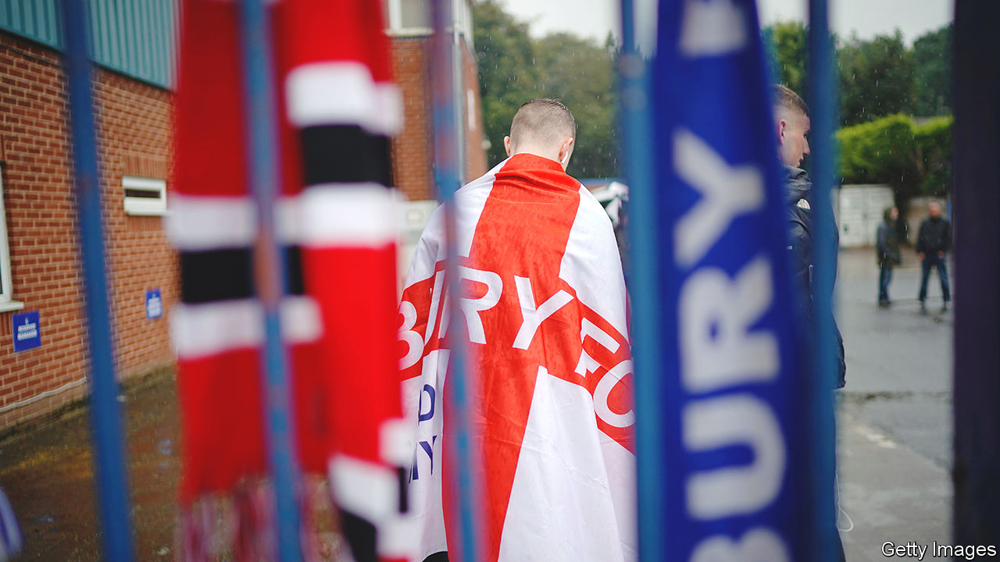
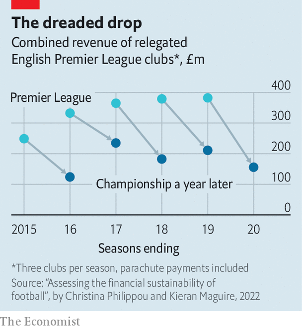

###### Referee!

# The British government hopes a regulator can save football from folly 

##### The English game’s finances are skewed and fragile 

 

> Feb 23rd 2023 

TO BE ENLIGHTENED—or just bewildered—about the febrile finances of English football, consider a small triangle in the north-west of the country. At one corner is Manchester United, the prize in a battle of billionaires. Sheikh Jassim bin Hamad al-Thani, a Qatari banker, and Sir Jim Ratcliffe, a British chemicals magnate, are vying to buy United from the American Glazer family. Whoever wins may have to stump up £5bn ($6bn).

A little to the east, Manchester City, owned by Abu Dhabi’s royal family, scooped the Premier League title last season—and £613m in revenue, the most of any European club. Its riches are drawing scrutiny as well as envy. This month the league alleged that City had broken its financial rules dozens of times over several years. If found guilty, City could lose league points or even be expelled. (It denies the charges.) A banner at a recent match lauded a new signing: not a striker, but a high-profile lawyer.

Fifteen kilometres north, and half a world away, is Gigg Lane, where Bury played for 134 years—until in 2019 the club, unable to pay its debts, was kicked out of the English Football League (EFL), which comprises the three tiers below the Premier League. A supporters’ group bought the ground from the administrator, helped by a government grant, but has no team. Another created a “phoenix” club, Bury AFC, but has no ground (home games are in nearby Radcliffe). Relations are not wholly cordial. One merger attempt has failed.

So skewed and rickety are football’s finances that the government has decided the game needs an independent regulator, established by law. Its proposals, published on February 23rd, largely match those made in 2021 by Tracey Crouch, a Conservative MP and former sports minister. Ms Crouch’s review was inspired by Bury’s collapse and an abortive attempt by 12 rich clubs, including City, United and four others from the Premier League, to set up a breakaway European Super League for which they would be guaranteed qualification—anathema in a sport where promotion and relegation is the rule.

The regulator would oversee a new licensing system for professional clubs. The government says they will have to show that their business models and corporate governance are sound; owners and directors will face stricter tests. The sale or relocation of a stadium—typically, a club’s biggest asset—will require the regulator’s approval and consultation with supporters. The regulator would also be able to stop clubs joining competitions such as the European breakaway.

Closer oversight may help prevent more failures, like those of Bury and Macclesfield Town, which folded in 2020, or near-misses, like those of Bolton Wanderers and Derby County (both, once upon a time, names to be reckoned with). But football’s finances are likely to remain lopsided—and probably more than a little scary.

The Premier League is where the money is. Its clubs’ combined revenues have soared from £200m in its first season, 1992-93, to perhaps £6bn in 2022-23, according to Deloitte, an accounting and consulting firm. Its rise has been fuelled mainly by broadcasting fees, now £3.5bn. Half of that comes from abroad, making the league a valuable cultural export.

The scariest part is in the EFL’s top tier, the Championship. Because clubs there make so much less than in the Premier League, promotion to the top flight is enormously valuable: worth £170m or more over three years, estimates Deloitte. That gives teams an incentive to spend lavishly on players. Kieran Maguire, of the University of Liverpool, and Christina Philippou, of the University of Portsmouth, calculate that in every season but one from 2012-13 to 2019-20, the average wage bill in the Championship outstripped revenue. In the other, it soaked up a mere 99%.

 


Some cash is redistributed from the Premier League to lower levels. Nearly £1bn went to the Championship between 2019 and 2022. But much of that is in “parachute” payments that soften the descent of the three Premier League teams relegated each season. The drop is still painful. Mr Maguire and Ms Philippou report that revenues at clubs demoted between 2014-15 and 2018-19 fell by an average of 47% in the next season (see chart).

But the payments do give relegated teams a financial advantage, raising the stakes for the rest. The two leagues have been negotiating a new settlement: the EFL both wants more money from the Premier League and wants parachute payments scrapped. Whether the new regulator might eventually be called on to impose an arrangement remains to be seen.

Although Championship finances are the most hair-raising, clubs at all levels are stretched. Profits are thin or non-existent pretty much from top to bottom. Even Premier League clubs see money gush out on wages and transfers, whether they are striving to stay up or to finish in the top four and thus qualify for the UEFA Champions League, Europe’s most prestigious tournament. Clubs in lower tiers depend more on match-day income, from tickets and catering, and on benevolent, competent owners. They too can find success hard to come by without spending a large slice of revenue on wages.

The wonder is that this should be the government’s job to fix. Football has plenty of its own authorities already. Unlike other regulated industries—banking, say, or energy—football is not particularly big. Even after its astonishing growth, says Adam Cox, also of Portsmouth, the Premier League represents a fraction of 1% of the economy. Yet when clubs go bust, whole towns grieve—even if, as in Bury, Macclesfield and elsewhere, phoenixes rise. The game’s emotional pull far exceeds its commercial weight. Truly, political football. ■


