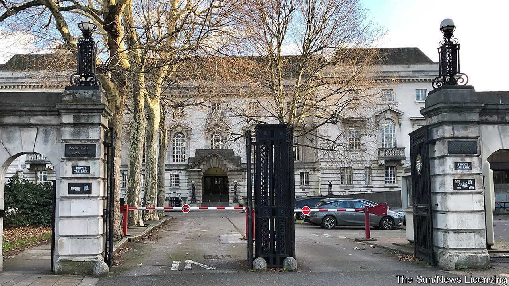

###### Courting disaster

# Why crumbling courts are worsening Britain’s trial backlog 

##### Broken boilers, leaking rooves and delayed proceedings 

 

> Feb 23rd 2023 

Grandiose rooms, antique benches, lawyers bedecked in wigs and gowns. As the set of a period legal drama, Inner London Crown Court looks the part. As a modern workplace, it’s struggling to fit the bill. The staff canteen, shut during the pandemic, has been abandoned. The basement is prone to flooding and the ceiling is prone to leaking. Like much of the court estate in England and Wales, it’s slowly falling apart. 

 


Delays and cancellations are rife across the justice system. Government figures to September 2022 show that 28% of crown-court cases have been outstanding for over a year, with a growing proportion of cases now waiting longer than two (see chart). Crunching through the backlog depends principally on the availability of barristers and judges: shortages of both are the most pressing constraints on progress. But the state of the courtrooms is not helping. 

A recent report from The Law Society, the professional body for solicitors, describes how a “crumbling” court estate is compounding a pandemic-induced backlog of more than 60,000 serious criminal cases. According to the report, 64% of lawyers surveyed had experienced delays within the past 12 months due to the state of the courts. The issues range from the banal to the farcical. Nick Barraclough, a criminal-defence lawyer, describes how, during a cold snap, his trial had to be postponed because there was no heating. “When you think of the expense and the delay…it’s just mad that we’re not sitting in court because they wouldn’t service the boiler,” he says. 

At another court, one judge lamented that a whole day was lost because, upon arrival, the prisoners couldn’t get off the prison van; the shutters of the loading bay were jammed and the defendants were driven back to their cells. No cases could be heard. “It all sounds very Fawlty Towers but actually, these things are not getting fixed,” says Lubna Shuja, the president of the Law Society. 

Money, inevitably, is to blame. The Ministry of Justice has been squeezed hard by a decade of austerity. Its budget was reduced by 25% in real terms between 2010 and 2019. Cuts have rippled throughout the system. Funding for criminal legal aid has fallen by 59% in real terms since 2010-11. Between 2010 and 2022, 244 courts and tribunals—roughly a third of courts in England and Wales—were closed. The maintenance budget has not been spared. 

Prolonging the wait for justice has serious implications. Lawyers describe how, for crimes with prison sentences of less than a year, the incentives to take plea deals become perverse once pleading guilty could mean giving up less time than proving innocence. At Inner London Crown Court, a tannoy snafu means James Oliveira-Agnew, a barrister and assistant secretary of the Criminal Bar Association, isn’t called to his hearing. “Everything’s getting delayed,” he says. ”It’s just really difficult to get things off the ground at the moment.”


