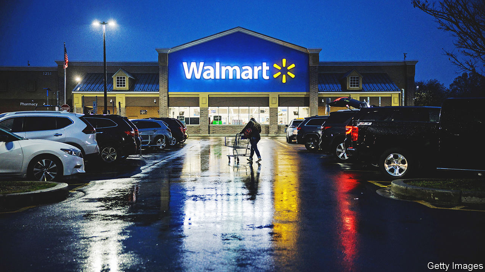

###### Everyday low profits

# A warning from Walmart about the health of the American consumer 

##### The retail giant forecasts weaker sales 

 

> Feb 21st 2023 

“Choiceful, discerning, thoughtful” is how  boss, Doug McMillon, described American consumers on February 21st, as he presented the retail behemoth’s quarterly results. That may be so. What they aren’t, at least in aggregate, is frugal. Last year consumer spending shot up even as real disposable incomes declined by more than 6%. America splurged on in January, shopping its way through a warm winter buoyed by 517,000 new jobs and a chunky inflation-linked bump in social-security cheques. Retail sales rose by 3% month on month, and consumer sentiment reached its highest level in more than a year. Those looking for evidence of a “soft landing”, where the economy avoids a recession despite tighter monetary policy,  in the American consumer.

On the surface, Walmart looks like exhibit A for the optimists. Its comparable sales in America grew by a brisk 8.3%, year on year. Look closer, though, and its results are full of warning signs. A big reason for its market-share gains in groceries was cash-strapped consumers, including high-income ones, trading down from fancier supermarkets. Its higher-margin discretionary range—toys, clothes, homeware and the like—did less well, despite heavy discounting to clear inventories overstocked as a result of a post-pandemic miscalculation about demand for certain goods. Worst of all, Walmart forecast sales growth of 2.5-3% for the current fiscal year, below analysts’ expectations.

Other retailers tell a similar story, more poignantly. The same day, Home Depot reported its seventh successive year-on-year drop in transaction volumes—and last quarter, for the first time, it was not offset by growth in the average size of transactions. The home-improvement firm’s share price fell by more than 7% on the day. And shoppers’ baskets may get lighter as the housing market wobbles: according to Barclays, a bank, the more the asking price for properties fall, the less consumers spend on an average trip to Home Depot.

Retailers’ margins were always likely to narrow after the covid-era blow-out. Although the worst labour shortages have subsided, wages remain high. In January Walmart announced pay rises that will raise its average hourly wage above $17.50. uBS, a bank, estimates that such moves will cost the company around $1bn a year. Home Depot said it would spend an extra $1bn on higher hourly wages for workers. 

A bigger worry is the potential drop-off in demand. The tailwind from strong household balance-sheets, fortified by covid-induced saving and government handouts, will not blow for ever. According to Goldman Sachs, another bank, households have spent a third of their excess savings and will have spent another third by the end of 2023. Firms that, like Home Depot and Walmart, flaunted their pricing power last year are now more careful, lest pricier wares scare shoppers away. Last week Kraft Heinz, a food giant, said it was mostly done raising prices this year. Even well-heeled buyers, who drove retailers’ sales growth in 2022, are feeling the heat, as Walmart’s success with them shows. It is all too easy to imagine Mr McMillon’s discerning shoppers turning into dispirited ones. ■


