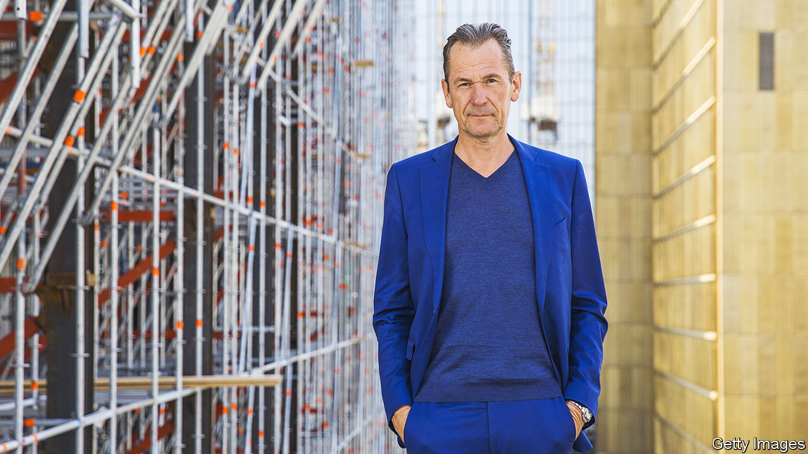

###### Mathias in the middle

# Axel Springer is going all in on America 

##### The controversial German publisher thinks it can conquer the digital news market 

 

> Feb 23rd 2023 

Mathias Döpfner is a polarising figure in Germany. Lefties loathe him for leading Axel Springer, a publishing giant, because of the aggressive gutter journalism of , its flagship tabloid that helps set the tone of the political debate. Conservatives take umbrage at his provocative pronouncements. And jealous types of all stripes envy his transformation from music critic to media mogul, who in 2020 received Springer shares worth a cool €1bn ($1.1bn) from Friede Springer, widow of the firm’s eponymous founder, as a gift. 

Across the Atlantic Mr Döpfner does not provoke similar passions. That is about to change, because his ambition is to turn his company into America’s top digital publisher, from number four today. “America has become the main heart chamber and the growth engine of our publishing business,” says Mr Döpfner. Springer already owns , an American website for political news junkies, , another news site, and , which offers business news. It is all part of Mr Döpfner’s plan to return to Springer’s origins as a news publisher, except mostly American, not German—and all digital. 

He can think boldly about expansion because Springer had a good 2022. Sales by the group, which owns 150 media brands in more than 40 countries, increased by 13% to €3.9bn, the second straight year of double-digit growth. Operating profit edged up to €750m. Digital activities accounted for 85% of revenues and more than 95% of profits. While many American rivals were shedding staff, the group hired 400 journalists in America in 15 months to shore up its newsrooms.

Mr Döpfner was an early convert to online business. He sold off some of Springer’s print newspapers and magazines. He used the proceeds for digital acquisitions, such as StepStone, one of Germany’s most-visited sites for jobseekers; Idealo, a price-comparison service; Awin, a marketing platform; and Aviv, a property portal. 

The next step is to take StepStone public, maybe this year, followed by Aviv, Idealo and Awin. The money from the sales could then be used to buy out kkr, the American private-equity giant which took Springer private in 2019 and became its biggest shareholder, with a 35.6% stake. This would make Mr Döpfner, who owns 21.9% and exercises the voting rights of Ms Springer’s remaining 22.5% stake, the firm’s incontrovertible owner. That, in turn, would give him free rein to pursue his digital American dream. 

“It’s a big bet,” says Douglas McCabe at Enders Analysis, a research firm. Digital news publishing is not yet a strong and sustainable business. Mr Döpfner paid more than $1bn for , Springer’s biggest-ever acquisition, and top dollar for , too. Although both made money last year, it may be a while before Springer sees a return on those investments.

As for party-neutrality, Mr Döpfner’s strategy is a response to the perception, shared by many readers, that American publishers have in recent years nailed their colours to the mast not just in their outlets’ opinion pages, which is nothing new, but in their reporting, too. There certainly is room in America for non-partisan news. However, it is unclear whether Mr Döpfner can pull it off. His German journalists agree to abide by the five “essentials” of Axel Springer’s constitution, which include support for the transatlantic alliance and the right of Israel to exist. In Germany he is renowned for his anti-woke, sometimes libertarian views, which in American eyes are bound up with the Republican Party. Mr Döpfner insists he does not interfere in the editorial process and encourages disagreements with his opinions. But his world view prevails both at and , a broadsheet. 

Springer’s American rivals will not cede ground to it willingly, either. Their journalists are already making him feel unwelcome. Two months after his acquisition, the  ran a story headlined “At Axel Springer, Politico’s New Owner, Allegations of Sex, Lies and a Secret Payments”, about trysts with employees of Julian Reichelt, editor-in-chief of . Mr Döpfner sacked Mr Reichelt the day after the story was published. But the saga has damaged Mr Döpfner more than earlier controversies. In spite of evidence of Mr Reichelt’s misdeeds unearthed by a compliance investigation, he hung on to the editor for months, and defended him privately as a courageous journalist who had the guts to rebel against woke conformism. 

After months of fierce criticism about his handling of the affair, last November Mr Döpfner resigned as head of the German association of publishers. He put this down to the need to focus on his “contrarian bet” on non-partisan journalism in democracies around the world, America chief among them, at a time of polarisation and populism. Given the scale of the task he has set himself, the media baron certainly needs all the time he can get. ■


