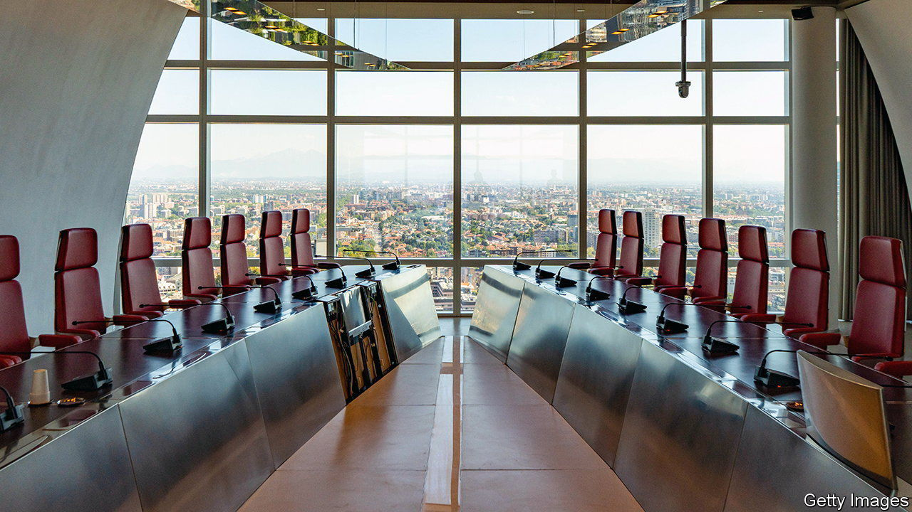
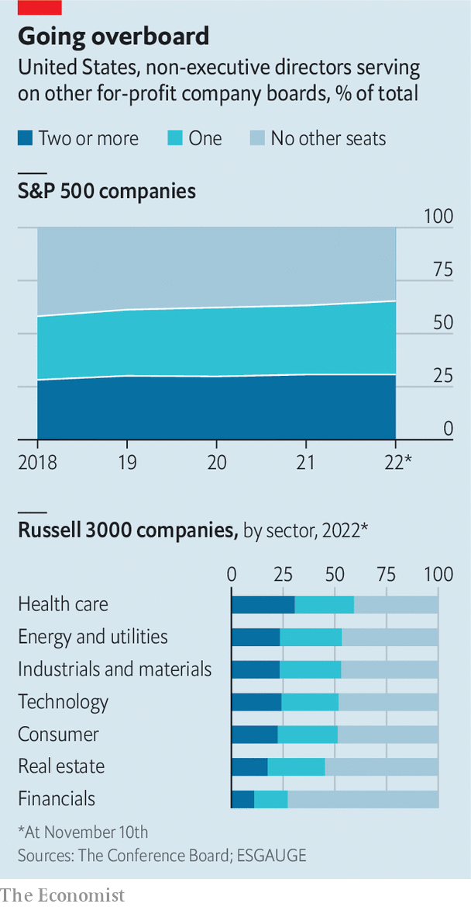

###### Refurbishing the boardroom

# Demands on corporate boards are more intense than ever 

##### And filling board seats has never been harder 

 

> Feb 23rd 2023 

IN THE POPULAR imagination, a corporate board seat looks like the cushiest sinecure in business. Board members appear to get paid—often handsomely—to attend a few meetings a year and to nod knowingly as the chief executive pontificates on strategy. They seldom make the news unless the occasional tut-tut results in the CEO being shown the door, or an activist investor campaigns for a seat at an iconic company (as has happened in recent months at Disney, Salesforce and Tesla). Once the errant boss is out or the activist campaign is over, either because it succeeded or, as in Disney’s case, the challenger is placated with concessions, the board slinks back into comforting obscurity.

In fact, these low-key shareholder representatives have never been busier. They are expected to help bosses navigate war, geopolitical strife, the return of high inflation, climate change and technological disruption, all in the aftermath of a once-in-a-century pandemic. Stricter corporate-governance rules have forced company directors to be more accountable. They are also more likely than in the past to be compensated in stock, aligning their incentives with those of other shareholders. 

Hot seats

Perhaps as a result, they are working harder and longer than before, often on top of their demanding day jobs as executives at other firms. “It’s not uncommon to have two-day meetings,” says Crawford Gillies, who chairs the board of Barclays, a British bank. “That would have been very unusual ten years ago.” At least they get dinner.

All the new demands on directors are reflected in what counts as a desirable make-up of a board. Thirty years ago directors amounted to little more than window dressing, recalls Charles Elson, a boardroom veteran and corporate-governance expert at the University of Delaware. Management teams “basically ran the show”, he says. Boards were stuffed with friends of the managers or of other board members. These days a self-respecting board ought to contain an expert on supply chains, the Federal Reserve, China, ESG, ai—the list goes on. Layer on top of that requirements for “diversity, equity and inclusion”—ie, ensuring that not everyone is a white male—and cobbling together a board has become high-stakes corporate sudoku.

Many directors agree that board performance is not up to snuff, according to a survey of more than 700 public company directors in America in 2022 by PwC, a consultancy. Asked to rate fellow board members, nearly half of directors said at least one needed to be replaced. One in five respondents would replace two or more. Less than half thought their peers had a strong grasp of environmental, social and governance issues (which is what ESG stands for) or cybersecurity. A fifth thought other board members were reluctant to challenge management, which is ostensibly one of their main jobs. 

 


Boards have also been acquitting themselves without distinction in another critical task: ensuring that the right person sits in the corner office. Directors hit the brakes on successions in recent years, first amid the uncertainty of the covid-19 pandemic and then amid rising geopolitical and economic concerns. The share of CEOs ousted by boards in 2021 from the Russell 3000 index of American companies was 1.4%, down from a historical average of nearly 6%, according to data from the Conference Board, a research organisation, and ESGAUGE, an analytics firm. No boss in the S&amp;P 500 index of America’s biggest firms got the boot that year. CEOs planning an exit were urged to postpone it. 

Where new chief executives were named, insider appointments soared. As of June 2022 around nine in ten CEO appointments in the S&amp;P 500 were of insiders, the highest rate since records began in 2011. In November Disney reappointed its retired longtime boss, Bob Iger, to bring some magic back to the Magic Kingdom (never mind that it was Mr Iger who hand-picked his mojo-less successor).

For boards, dealing with such challenges requires new blood. Injecting it is no easy task. One problem is making room for the newcomers. Few companies are willing to impose term limits on directors; only 6% of firms in the S&amp;P 500 do so. If anything, retirement policies are becoming a bit less less popular: 67% of large American firms had them in 2022, down from 70% in 2018. Over a quarter of directors who left S&amp;P 500 boards in 2019 had served for more than 15 years. Some stick around for decades. Charlie Munger, who last month turned 99, has served on the board of Berkshire Hathaway, an industrial conglomerate, since 1978. Easing out such old-timers is a delicate business. 

An alternative is to increase the board’s size. Between 2018 and 2022 the share of S&amp;P 500 companies with more than 12 directors has risen from less than 16% to nearly 18%. The obvious downside is that bigger boards can get unwieldy.

Directors’ cut

Where boards are actively recruiting substitutes or additions, they face another problem. Much of the newly relevant expertise concerns areas that are themselves, like ESG or ai, new. This means few prospective candidates possess it. Many companies therefore fish in the same talent pool. That may help explain why boards are getting more expensive: median compensation of Russell 3000 directors rose from $177,000 in 2019 to $205,000 in 2022. And more incestuous: around 65% of S&amp;P 500 non-executive directors sit on at least one other board, up from 58% in 2018 (see chart); one in ten sits on at least three. Ann Mather, former chief financial officer of Pixar Studios, an animation firm, sat on eight boards at the start of 2022. 

Experienced directors who are not white or male are in especially high demand. In Britain, a government-commissioned review into boardroom diversity at FTSE firms has found that most were still failing to appoint people of colour to boards. Moni Mannings, a former lawyer who has held various non-executive positions in big British firms, says she was inundated with calls from recruiters for months after the murder of George Floyd sparked racial-justice protests in America—and caused a hiring boom for directors from ethnic minorities on both sides of the Atlantic. “Do they not know anybody else?” she would wonder in exasperation. 

Investors are waking up to the risks of overstretched directors spreading their time too thinly. In May Twitter’s shareholders voted to strip Egon Durban, a venture capitalist, of his board seat after two proxy-advisory firms warned that the seven board positions he was juggling at the time may have been too many. (Twitter’s board problem was solved conclusively in October when its new owner, Elon Musk, disbanded it altogether.) In June BlackRock, the world’s biggest asset manager, voted against Ms Mather’s board appointment at Alphabet, Google’s parent company, as part of its campaign against “overboarding”. Ms Mather maintained her seat but has since stepped down from Airbnb, a home-rental service, and Arista Networks, a computer-networking firm. 

The upshot is that companies will have to cast their net more widely. Recruitment may take longer as a result, especially if you decline to enter a bidding contest with rival recruiters over directors’ compensation, notes Peter Voser, a seasoned chairman of multinational firms. ABB, a Swiss engineering giant Mr Voser chairs, took its time finding a director to fill one opening—two years to be precise. But in the end, it found the right person with the right skills and experience. And the board beavers away in the background. ■


