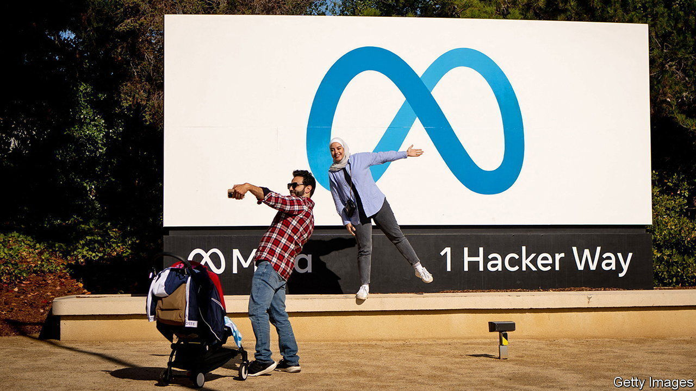

###### Pay as you post

# Facebook sells subscriptions as the ad business stumbles 

##### Meta joins Twitter and Snap in introducing a paid tier 

 

> Feb 22nd 2023 

“It’s free and always will be,” Facebook vowed on its landing page for nearly a decade. The world’s largest social network still is. But from this week its users and those of its sister app, Instagram, will have the option of paying $11.99 a month for a “verified” account, buying them better customer service, more widely distributed posts and a blue badge next to their name.

The subscription is the latest example of a growing trend. Last June , a messaging app popular among 20-somethings, launched a $3.99 plan called Snapchat+. In December Twitter relaunched Twitter Blue, an $8-per-month service. Like Meta’s offering, both offer an assortment of perks, the most significant being a more prominent place for the user’s posts in the feeds of others.

It is hardly surprising that ad-supported networks are looking to diversify their sources of revenue. After years of non-stop growth the  has hit a speed bump. The great one-off shift of ad budgets from offline locations, like newspapers, to the web is mostly complete. And since 2021 mobile advertising has been hampered by anti-tracking rules pioneered by Apple, which make it harder for apps like Facebook to target ads and measure their effectiveness.

The results have been painful. Meta, Facebook’s parent company, has reported falling revenue in each of the past three quarters. Despite a recent rally its stock is trading at less than half the value at its peak in 2021. Snap, which owns Snapchat, has lost nearly 90% of its market value in the same period. Twitter, which was bought last October by Elon Musk, a mercurial self-styled “technoking”, is “trending to breakeven” having previously faced bankruptcy, its owner tweeted this month.

Subscriptions are no substitute for ads. Snap said on February 17th that 2.5m people had signed up to Snapchat+, less than 1% of its app’s 375m daily users. That implies annual subscription sales of no more than $120m, or less than 3% of Snap’s total revenue last year. Though Twitter has not said how many have joined Blue (its entire press office seems to have been sacked), a recent leak put the figure at below 300,000. The product remains a work in progress, with promised features such as fewer ads still billed as “coming soon”. On February 17th Twitter adopted a new approach to driving sign-ups, announcing that two-factor authentication by text message, a security feature, would shortly be turned off for those who don’t cough up.

Meta says its offering is aimed at “creators”, who use its platforms for work and might be most willing to pay for verification and extra reach. Whereas “Elon has a plan for everyone to buy Twitter Blue (but has yet to give good reasons why), for Meta it is about a scalable way to prevent impersonation of businesses [and] celebs,” suggests Benedict Evans, a tech analyst. Rob Leathern, a former Facebook executive, rejects the idea that the plan is a copy of Snap’s and Twitter’s efforts: Facebook has been working on verification for years, he says, citing its acquisition in 2018 of Confirm.io, a biometric-ID startup.

To the extent that social networks embrace subscription it will mean a windfall for the mobile platforms that host their apps. Google, which runs the Android operating system, and Apple, which runs iOS, make no money from apps’ advertising revenue, but take a cut of consumers’ in-app purchases, including recurring subscriptions. Having whacked the mobile ad business with new privacy rules, Apple and Google stand to profit from the resulting move to subscriptions.

There may be a sting in the tail. Whereas Meta’s new service costs $11.99 for those signing up on the web, the price if paying via the app is $14.99. Similarly, Mr Musk, who has called Apple’s fees “a 30% tax on the internet”, charges $8 for Twitter Blue online and $11 in the app. Such two-tier pricing has proved controversial, with Apple blocking apps such as Fortnite, a video game which told users they could pay less in a browser. But as more large companies embrace differential pricing, consumers may learn that they can get a big discount by signing up outside Apple and Google’s ecosystems. ■


