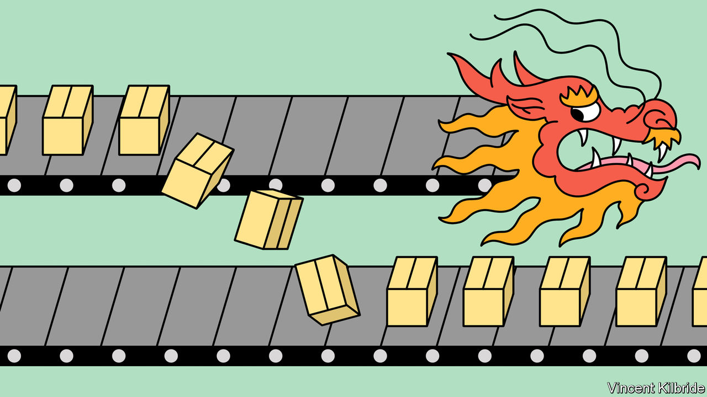
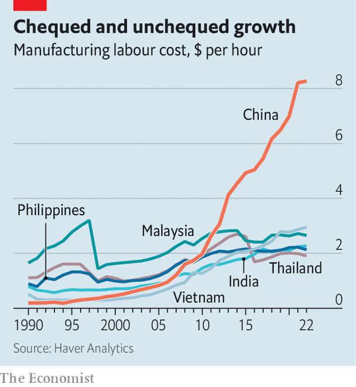
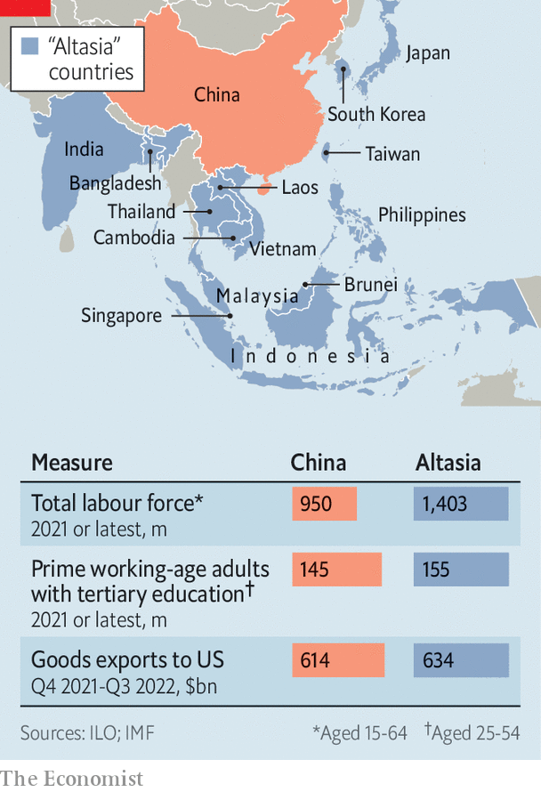

###### The Altasian option

# Global firms are eyeing Asian alternatives to Chinese manufacturing 

##### Can “Altasia” steal China’s thunder? 

 

> Feb 20th 2023 

IN 1987 PANASONIC made an adventurous bet on China. At the time the electronics giant’s home country, Japan, was a global manufacturing powerhouse and the Chinese economy was no larger than Canada’s. So when the company entered a Chinese joint venture to make cathode-ray tubes for its televisions in Beijing, eyebrows were raised. Before long other titans of consumer electronics, from Japan and elsewhere, were also  to take advantage of its abundant and cheap labour. Three and a half decades on, China is the linchpin of the . Its exports of electronic goods and components amounted to $1trn in 2021, out of a global total of $3.3trn. These days, it takes a brave firm to avoid China. 

 


Increasingly, however, under a weighty combination of commercial and political pressure, foreign companies are beginning to pluck up the courage if not to leave China entirely, then at least to look beyond it for growth. Chinese labour is no longer that cheap: between 2013 and 2022 manufacturing wages doubled, to an average of $8.27 per hour (see chart). More important, the deepening Sino-American techno-decoupling is forcing manufacturers of high-tech products, especially those involving advanced semiconductors, to rethink their reliance on China.

Between 2020 and 2022 the number of Japanese companies operating in China fell from around 13,600 to 12,700, according to Teikoku Databank, a research firm. On January 29th it was reported that Sony plans to move production of cameras sold in Japan and the West from China to Thailand. Samsung, a South Korean firm, has slashed its Chinese workforce by more than two-thirds since a peak in 2013. Dell, an American computer-maker, is reportedly aiming to stop using Chinese-made chips by 2024. 

The question for Dell, Samsung, Sony and their peers is: where to make stuff instead? No single country offers China’s vast manufacturing base. Yet taken together, a patchwork of economies across Asia presents a formidable alternative. It stretches in a crescent from Hokkaido, in northern Japan, through South Korea, Taiwan, the Philippines, Indonesia, Singapore, Malaysia, Thailand, Vietnam, Cambodia and Bangladesh, all the way to Gujarat, in north-western India. Its members have distinct strengths, from Japan’s high skills and deep pockets to India’s low wages. On paper, this is an opportunity for a useful division of labour, with some countries making sophisticated components and others assembling them into finished gadgets. Whether it can work in practice is a big test of the nascent geopolitical order.

 


This alternative Asian supply chain—call it Altasia—looks evenly matched with China in heft, or better (see map). Its collective working-age population of 1.4bn dwarfs even China’s 950m. Altasia is home to 155m people aged between 25 and 54 with a tertiary education, compared with 145m in China—and, in contrast to ageing China, their ranks look poised to expand. In many parts of Altasia wages are considerably lower than in China: hourly manufacturing wages in India, Malaysia, the Philippines, Thailand and Vietnam are below $3, around one-third of what Chinese workers now demand. And the region is already an exporting power: its members sold $634bn-worth of merchandise to America in the 12 months to September 2022, edging out China’s $614bn. 

Altasia has also become more economically integrated. All of it bar India, Bangladesh and Taiwan has, helpfully, signed on to the Regional Comprehensive Economic Partnership (RCEP, which also includes China). By harmonising the rules of origin across the region’s sundry existing trade deals, the pact has created a single market in intermediate products. That in turn has eased regulatory barriers to complex supply chains that run through several countries. Most Altasian nations are members of the Indo-Pacific Economic Framework, a newish American initiative. Brunei, Japan, Malaysia, Singapore and Vietnam belong to the Comprehensive and Progressive Agreement for Trans-Pacific Partnership (CPTPP), which also includes Canada, Chile, Mexico and Peru.

A model for the Altasian economy already exists, courtesy of Japanese companies, which have been building supply chains in South-East Asia for decades. More recently Japan’s rich Altasian neighbour, South Korea, has followed its example. In 2020 South Korean firms’ total stock of direct investments in Brunei, Cambodia, Indonesia, Laos, Malaysia, the Philippines, Singapore, Thailand and Vietnam—which together with unstable Myanmar make up the Association of South-East-Asian Nations (ASEAN)—and Bangladesh reached $96bn, narrowly outstripping Korean investments in China. As recently as a decade ago the stock of Korean companies’ investments in China was nearly twice as large as in Altasia. Samsung is the biggest foreign investor in Vietnam. Last year Hyundai, a South Korean carmaker, opened its first ASEAN factory, making electric vehicles in Indonesia. 

For most a link

Now more non-Altasian firms are eyeing the region, often via their Taiwanese contract manufacturers. Taiwan’s Foxconn, Pegatron and Wistron, which assemble gadgets for Apple, among others, are investing heavily in Indian factories. The share of iPhones made in India is expected to rise from around one in 20 last year to perhaps one in four by 2025. Two Taiwanese universities have teamed up with Tata, an Indian conglomerate with ambitious plans in high-tech manufacturing, to offer courses in electronics to Indian workers. Google is shifting the outsourced production of its newest Pixel smartphones from China to Vietnam. 

More sophisticated manufacturing, especially of geopolitically fraught semiconductors, is also moving to Altasia. Malaysia already exports around 10% of the world’s chips by value, more than America. ASEAN countries account for more than a quarter of global exports of integrated circuits, easily surpassing China’s 18%. And that lead is growing. Qualcomm, an American “fabless” chipmaker, which sells microprocessor designs for others to manufacture, opened its first research-and-development centre in Vietnam in 2020. Qualcomm’s revenues from Vietnamese chip factories, many of which belong to global giants like Samsung, tripled between 2020 and 2022. Earlier this month the local government of Ho Chi Minh City announced that it was courting a $3.3bn investment from Intel (though it later struck the American chip giant’s name from the statement online). 

China’s huge advantage has historically been its vast single market, knit together with decent infrastructure, where value could be added without suppliers, workers and capital crossing national borders. For Altasia to truly rival China, therefore, its supply chain will need to become far more integrated and efficient. Although RCEP has greased the wheels of intra-Altasian commerce somewhat, the flow of goods faces more obstacles than it does within China. Its member countries will need to play to their comparative advantage. 

For now the infrastructure that connects them is shabby, at best. Finicky regulations and national ambitions can easily gum up the alternative supply chain. Altasia’s poorer countries are not necessarily keen on the logical division of labour, which would see them play a bigger role in the more menial parts of the electronics supply chain. And forgoing all Chinese-made parts is next to impossible. Thamlev, an American electric-bike startup, moved production from China to Malaysia in 2022 in order to avoid a 25% American tariff, but still needed to import Chinese components. As a result, it took a month longer for its e-bikes to reach American riders. 

Prospects for deeper integration are hazy, within Altasia and with big consumer markets in the rich world. India, on whose 1.4bn people Altasia’s future may hinge, seems in no rush to join RCEP. Although India has, with its Altasian neighbours, signed up to America’s Indo-Pacific framework, it has opted out of the initiative’s trade provisions. These anyway lack bite: America is in a protectionist mood and has offered neither tariff cuts nor better access to its vast market. One ASEAN policymaker likens the pact to a doughnut, lacking substance in the middle. 

Altasia will certainly not replace China soon, let alone overnight. In January, for example, Panasonic announced a big expansion of its Chinese operations. But in time China is likely to become less attractive to foreign manufacturers. Chinese labour is not getting any cheaper and its graduates are not getting much more numerous. America may yet realise that reducing its reliance on China in practice requires closer ties with friendly countries, including membership of the CPTPP, the precursor of which collapsed after America pulled out in 2017. And as a budding alternative to China, Altasia has no equal. ■


