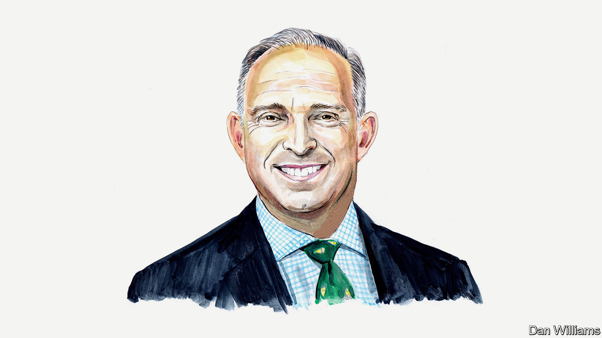

###### Russia and Ukraine

# Mark Sedwill on a year of fighting in Ukraine 

##### Britain’s former national-security adviser on the war’s valuable lessons 

 

> Feb 19th 2023 


A YEAR AGO, Vladimir Putin launched the first full-scale invasion of a sovereign European country since the second world war. Badly planned with badly led, badly equipped and badly motivated soldiers, Russia’s offensive stalled against Ukraine’s courageous resistance. The defenders were inspired by Volodymyr Zelensky, led with military flair, and supplied with American, British and allied intelligence, weaponry, training and bandwidth. 

Reeling from Ukrainian counter-offensives, Russia has dug in for an attritional campaign to exhaust Ukrainian capability and Western patience. Mr Putin is mobilising more troops and Russia’s defence industry, and has given his top general operational command. Valery Gerasimov’s doctrine is all-out war, involving everything from cyber-warfare to economic coercion. He will be determined to gain an advantage before NATO tanks arrive on the battlefield. Meanwhile, Russian forces have consolidated their grip on the land bridge to Crimea, thrown untrained reserves and brutal militias into the conflict, scraped around other rogue states for weapons and launched cruise missiles at Ukraine’s cities and infrastructure.

A year of offensives and counter-offensives awaits as Russia and Ukraine struggle for advantage. If the war is still a stalemate by late autumn, expect some Western governments to suggest that the time has come for talking as well as fighting. Mr Putin will already be comforted by the plans of some of America’s Republicans to restrict support to Ukraine and presumably hopes that the 2024 election will produce a president ready to concede land for peace. Mr Zelensky, however, will not cede Ukrainian territory after a life-and-death struggle for national survival. And Mr Putin’s disregard for the Minsk agreements, signed between Russia and Ukraine in September 2014, demonstrates that he would regard any deal as a tactical pause to regroup. 

Although the outcome of this war remains uncertain, Western governments can already draw five big lessons. 

First, like the Bond villains they resemble, autocrats often spell out their plans in advance. Saddam Hussein claimed Kuwait as Iraq’s 19th province. Mr Putin has always seen Ukraine (and Belarus) as part of Greater Russia. However reckless these declarations seem, we must take them seriously and provide vulnerable countries with the wherewithal to defend themselves, thereby deterring aggression. At the same time we should invest in our own defence industries so that, without maintaining huge inventories in peace time, we can quickly expand the production of ordnance to war-fighting levels when needed.

Second, NATO should rebalance to protect eastern Europe and Scandinavia with more effective conventional forces as well as the nuclear umbrella and extend deterrence of nuclear weapons beyond its borders. The accession of Sweden and Finland to NATO will double the alliance’s border with Russia and increase its military capabilities on the northern axis, which runs from the trade routes and internet cables of the north Atlantic to the newly accessible Arctic. I was recently with British commandos in northern Norway, training in small, agile, specialist units with guerrilla tactics similar to those used by Ukraine to disrupt Russia’s invasion. Britain would be the natural choice to lead a new NATO Northern Command as it is the biggest military power in the region. Likewise, more effective forces at higher readiness should be deployed forward in central and Eastern Europe. 

Although NATO leaders’ commitment to Article V, the collective defence of NATO territory, has been firm, our response to the use of nuclear weapons outside NATO territory remains ambiguous. We failed to respond in 2013, when the Syrian regime attacked its own people with chemical weapons. But a few years later, when the regime used them again in 2018, we took conventional military action under international law to destroy its chemical-weapons facilities and restore deterrence. That precedent should apply. NATO should signal to Russia that any use of nuclear weapons on Ukrainian soil could be met with force. Nuclear deterrence is terrifying, but more terrifying is an isolated, desperate autocrat misjudging our resolve and pressing the button. 

Much of the world is rediscovering the appeal of non-alignment. So as a third step the West should reinvest in its relationships with countries such as Brazil, India, South Africa, Turkey and the Gulf states. Although many countries fear aggressive neighbours and few support Mr Putin’s invasion, they also complain of Western arrogance and double standards. Old friends we have neglected welcome China’s investment and its boundless appetite for the raw materials on which the modern economy and green transition depend. More private Western investment in the “global south” could be unleashed if underwritten by political investment in sustained and stable relationships. 

Fourth, the crisis provides an opportunity to stabilise our relationship with China. Although China has echoed Mr Putin’s grievances about NATO, it is not the arsenal of autocracy: no weapons have been supplied to Russia. President Xi Jinping has warned against nuclear escalation. China has bought Russian oil and gas at bargain basement prices. And China has abstained in UN votes condemning Russia rather than supporting its “no-limits” ally. 

Observing the war in Ukraine, Mr Xi must realise that, whatever the military response to a Chinese invasion of Taiwan, inevitably, there would be economic sanctions, with severe consequences for both the Chinese and Western economies, as well as collateral damage to the global south in which China has invested so much. Just as military deterrence was the foundation of strategic stability in the cold war and, eventually, détente, a combination of economic and military deterrence could be the foundation of strategic stability and détente between the West and China in this century. And it need not mean decoupling. The row over spy balloons demonstrates that, unmanaged, the relationship is drifting towards confrontation. Washington and Beijing should start talking seriously about how to avoid that.

Finally, a united Western resolve is critical if we are to implement the lessons from Ukraine’s war. Despite admirable co-operation so far, Western unity is at risk. Protectionist measures, such as America’s Inflation Reduction Act, on-shoring rather than “friend-shoring” critical supply chains, using national-security provisions in trade and investment legislation against allies, and perpetual European underinvestment in defence are all frictions which our adversaries exploit. Our overlapping partnerships, including the G7, EU, NATO and the Five Eyes, represent half the global economy, and even more of the world’s investment in defence and development. That collective strength is decisive if coupled with unity of purpose. We should remember that in our dealings with Russia and China over the coming decade.■

_______________


